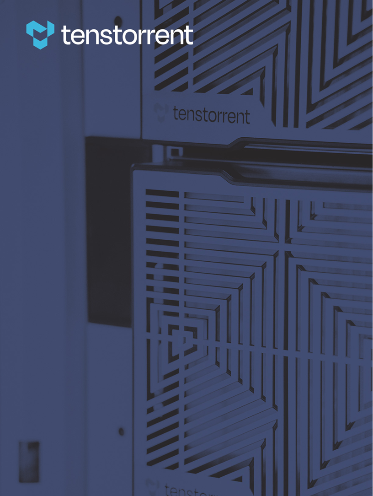

// SPDX-License-Identifier: CC-BY-4.0
// SPDX-FileCopyrightText: 2026 Tenstorrent USA, Inc.

= Open Chiplet Atlas Harness (OCAH): Application Notes
:doctype: book
:sectanchors:
:sectlinks:
:sectnums:
:source-highlighter: highlight.js
:xrefstyle: short
:revnumber: 0.0.1
:revdate: 2026-06-11
:title-page-background-image: 

[[appnotes-about]]
== About this Guide

These application notes describe how the OCA Harness subsystems work together
in complete system scenarios, across subsystem and chiplet boundaries.

ifdef::backend-html5[]
== Available notes

* xref:sip-secure-boot.adoc[System-in-Package Secure Boot] - How the SEP
  and the SMC on each chiplet coordinate, and how the primary chiplet delivers
  firmware to a secondary.
ifndef::release[]
* xref:revision.adoc[Revision History] - Major revisions and updates to the
  OCAH Application Notes
endif::release[]
endif::backend-html5[]

ifdef::backend-pdf[]
ifndef::release[]
include::revision.adoc[leveloffset=+1]
endif::release[]
include::sip-secure-boot.adoc[leveloffset=+1]
endif::backend-pdf[]
