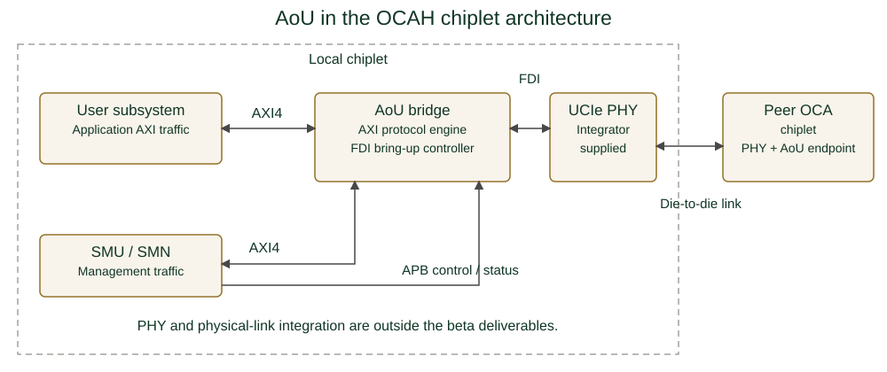

// SPDX-License-Identifier: Apache-2.0
// SPDX-FileCopyrightText: 2026 Tenstorrent USA, Inc.
= OCAH AoU Datasheet
:doctype: article
:notitle:
:datasheet-status: Beta
:product-short-name: AoU
:product-long-name: AXI-over-UCIe Bridge
:revnumber: Initial version
:revdate: 2026
:copyright-year: 2026
:copyright-holder: Tenstorrent USA, Inc.
:icons: font

[cols="60,40",frame=none,grid=none,stripes=none]
|===
a|
[.datasheet-brand]
OPEN CHIPLET ARCHITECTURE HARNESS
a|
image::../../ui-supplemental/img/tt_logo_color-yellow-black.png[Tenstorrent,pdfwidth=1.65in,align=right]
|===

[.datasheet-title]
{product-short-name}

[.datasheet-subtitle]
{product-long-name}

[.datasheet-status]
{datasheet-status} release | Open-source RTL | Apache 2.0

[cols="35,65",frame=none,grid=none,stripes=none]
|===
a|
// datasheet-section: highlights
[.datasheet-section]
HIGHLIGHTS

* Carries AXI system-management and application traffic between chiplets
* Supports 256-, 512-, or 1024-bit AXI data per resource plane
* Adapts bus width so chiplets with different AXI data widths interoperate
* Provides one to four independently flow-controlled resource planes
* Handles UCIe FDI wake, clock, and state handshakes after activation
* Provides Advanced Peripheral Bus (APB) control, status, error reporting, and
  AXI aggregation
* Slang and Verilator lint targets integrated into the OCAH CI workflow

// datasheet-section: system-role
[.datasheet-section]
SYSTEM ROLE

AoU sits between the OCAH AXI fabric and an adopter-supplied Universal Chiplet
Interconnect Express (UCIe) controller and PHY. It converts AXI transactions to
and from the AoU packet protocol carried over the controller's Flit-aware
die-to-die interface (FDI). OCAH supplies the protocol engine and bringup
controller; the adopter supplies the UCIe controller, PHY, and physical link.

a|
// datasheet-section: overview
[.datasheet-section]
OVERVIEW

The AXI-over-UCIe Bridge (AoU) is OCAH's die-to-die transport component. Each
of its one to four resource planes (RPs) presents a local AXI4 subordinate and a
peer-facing AXI4 manager. After software requests activation, the controller
performs the UCIe FDI handshakes and the engine exchanges AoU packets. Each
plane adapts between its local AXI data width and the peer's, so chiplets with
different bus widths interoperate.

The AoU RTL, developed jointly by Tenstorrent and BOS Semiconductors, provides
the protocol engine and optional FDI bring-up controller. AoU attaches to a
UCIe controller's FDI, not to a bare PHY; neither is a deliverable of this beta
release, and the integrator supplies and qualifies both.

// datasheet-section: system-context
[.datasheet-section]
SYSTEM CONTEXT

AoU occupies the always-on domain alongside the System Management Unit (SMU)
and System Management Network (SMN). The adopter owns the UCIe controller,
PHY, and physical link; the peer need only be OCA-compliant.

[.datasheet-small]
The integrator connects the APB CSR port to a suitable manager.

// datasheet-section: at-a-glance
[.datasheet-section]
AT A GLANCE

[cols="38,62",options="header"]
!===
!Feature !Description
!AXI interface (per RP) !512-bit data (reference; 256 or 1024 selectable); 64-bit address; 10-bit ID
!Outstanding transactions !32 reads and 32 writes per manager/subordinate path
!FDI !Single-PHY 32 B / 256-bit data (reference); up to 128 B / 1024-bit data
!APB CSR / IP version !32-bit address and data / major 1, minor 0
!===

[.datasheet-small]
The reference uses one resource plane, 512-bit AXI data, and
`FDI_CFG_SP_32B`. Aggregation and low-power controls are runtime-configurable;
FIFO depths are build-time parameters.

|===

<<<

[cols="52,48",frame=none,grid=none,stripes=none]
|===
a|
// datasheet-section: capabilities
[.datasheet-section]
CAPABILITIES

*Protocol bridge*

* Converts AXI4 read and write transactions to AoU packet protocol and
  back; supports INCR bursts (FIXED is not supported), split transactions,
  and write-response early-return mode
* Per-plane upsizer and downsizer adapt the local AXI data width to the
  peer's, so attached chiplets need not share a bus width
* Per-plane AXI aggregator packs narrow beats into full-width local AXI
  beats to improve local bus utilization (runtime-configurable)
* Request and response credit streams managed independently during link
  deactivation, enabling in-flight responses to complete before
  reactivation

*Link management*

* Integrated UCIe FDI bringup controller handles wake, clock, state, and
  receive-active handshake sequences after software requests activation
* Software-initiated link activation and deactivation via APB registers;
  status bits report FSM state and transaction completion
* Configurable deactivation timeout and low-power transmit mode with
  tunable heartbeat threshold

*Observability and error handling*

* Per-plane error information registers capture AXI response errors and
  ID-mismatch events
* Maskable interrupts for link-reset events (activation/deactivation ACK
  timeout, invalid activation message, message-credit timeout), early
  write-response errors, and master/slave ID mismatches
* Software-controlled reset of the AoU core logic

// datasheet-section: interfaces-and-configuration
[.datasheet-section]
INTERFACES AND CONFIGURATION

[cols="38,62",options="header"]
!===
!Feature !Integration options
!Clocks and resets !Core and APB clock/reset domains
!AXI subordinate (per RP) !AXI4 subordinate accepting traffic from the local fabric
!AXI manager (per RP) !AXI4 master issuing transactions toward peer chiplet
!FDI data plane !To the UCIe controller; PHY0 always present, PHY1 with `+define+TWO_PHY`
!APB CSR !32-bit APB subordinate for link control, status, and error registers
!Build-time !`RP_COUNT` (1-4), `FDI_CONFIG`, per-plane `AXI_DATA_WD`, FIFO depths, outstanding counts
!===

[.datasheet-small]
`FDI_CONFIG` selects the single-PHY width or two-PHY width pair using one of
five values: `FDI_CFG_SP_32B`, `FDI_CFG_SP_64B`, `FDI_CFG_SP_128B`,
`FDI_CFG_TP_32B_64B`, `FDI_CFG_TP_64B_128B`). Two-PHY builds require
`+define+TWO_PHY`; selecting a `FDI_CFG_TP_*` value without this define
(or vice versa) is the integrator's responsibility to prevent.

a|
// datasheet-section: integration-dependencies
[.datasheet-section]
INTEGRATION DEPENDENCIES

* Supply and qualify the UCIe controller, PHY, and physical link; AoU cannot
  drive a bare PHY. Keep their power domain stable before FDI bringup.
* Match `FDI_CONFIG` to `+define+TWO_PHY`; RTL does not check this combination.
* Connect the AXI ports and Advanced Peripheral Bus (APB) CSR subordinate to
  the product fabrics, and define address decoding and peer routing.
* Account for asynchronous core/APB clocks using the included bridge, and
  activate the link in software before issuing AXI traffic.

// datasheet-section: verification-and-maturity
[.datasheet-section]
VERIFICATION AND MATURITY

The vendored package passes the OCAH Slang and Verilator lint targets. The
current OCAH SMU RTL and simulation environment do not instantiate AoU, and no
OCAH-specific functional simulation, formal verification, or coverage results
are claimed. Upstream verification is described in the AoU TRM.

No throughput, latency, area, power, frequency, or silicon-characterization
results are claimed.

// datasheet-section: deliverables-and-further-information
[.datasheet-section]
DELIVERABLES

* SystemVerilog protocol-engine and FDI controller RTL with dependency filelists
* SystemRDL CSR source and generated register RTL
* OCAH lint and synthesis integration collateral
* Apache License 2.0 repository distribution

[.datasheet-section]
RESOURCES

Documentation: https://tenstorrent.github.io/tt-oca-harness/[OCAH documentation] +
Protocol: https://cdn.sanity.io/files/jpb4ed5r/production/25de1707769f21e4a3916103371d1fb419cadac0.pdf[AoU TRM] +
RTL and registers: `vendor/tenstorrent/aou-rtl/upstream/` +
OCAH flow: `vendor/tenstorrent/aou-rtl/overlay/flow.mk`

// datasheet-section: terms
[.datasheet-section]
TERMS

[.datasheet-small]
AoU: AXI-over-UCIe bridge. APB: Advanced Peripheral Bus. FDI: Flit-aware
die-to-die interface. RP: resource plane.
SMN: System Management Network. SMU: System Management Unit.

// datasheet-section: document-control
[.datasheet-section]
DOCUMENT CONTROL

[cols="18,20,30,32",options="header"]
!===
!Version !Date !Author !Change
! ! ! !
!===
|===
