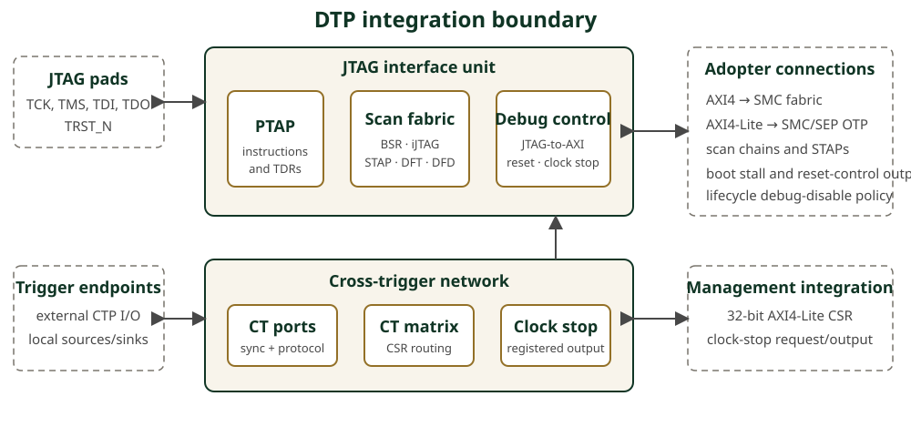

// SPDX-License-Identifier: Apache-2.0
// SPDX-FileCopyrightText: 2026 Tenstorrent USA, Inc.
= OCAH DTP Datasheet
:doctype: article
:notitle:
:datasheet-status: Beta
:product-short-name: DTP
:product-long-name: Debug and Test Ports
:revnumber: Initial version
:revdate: 2026
:copyright-year: 2026
:copyright-holder: Tenstorrent USA, Inc.
:icons: font

[cols="60,40",frame=none,grid=none,stripes=none]
|===
a|
[.datasheet-brand]
OPEN CHIPLET ARCHITECTURE HARNESS
a|

|===

[.datasheet-title]
{product-short-name}

[.datasheet-subtitle]
{product-long-name}

[.datasheet-status]
{datasheet-status} release | Open-source RTL | Apache 2.0

[cols="35,65",frame=none,grid=none,stripes=none]
|===
a|
// datasheet-section: highlights
[.datasheet-section]
HIGHLIGHTS

* JTAG TAP and boundary-scan infrastructure implementing IEEE 1149.1-2013
* iJTAG instrument networks implementing IEEE 1687-2014
* Configurable secondary TAP topology for local and downstream chiplet access
* JTAG-to-AXI paths for SMC fabric, SMC OTP, and SEP OTP debug access
* Cross-trigger routing between chiplet-local and external trigger endpoints
* Lifecycle-controlled disable inputs for scan and memory-mapped debug paths
* Integrated debug clock-stop, boot-stall, and multi-target reset controls

// datasheet-section: integration-fit
[.datasheet-section]
INTEGRATION FIT

For SoC and chiplet teams that need a reusable test-access hub, controlled
memory-mapped debug, and coordinated triggers across die boundaries. DTP is
integrated in the OCAH SMU reference subsystem and can also serve as a
subsystem-level integration boundary when its lifecycle, fabric, reset, clock,
scan, and pad connections are supplied by the adopter.

a|
// datasheet-section: overview
[.datasheet-section]
OVERVIEW

OCAH DTP brings scan access, debug transactions, cross-trigger routing, and
debug clock control together at one explicit integration boundary. A primary
JTAG TAP selects boundary-scan, iJTAG, secondary-TAP, debug-control, capability,
and JTAG-to-AXI data registers. Optional bridges expose the SMC system fabric
and the SMC and SEP OTP interfaces to an authorized debugger. Active-high
lifecycle disable fields are synchronized into the scan domain and gate the
corresponding paths; the adopter remains responsible for generating the policy
inputs and for securing downstream address maps.

The cross-trigger network connects external Cross Trigger Ports (CTPs) and
chiplet-local trigger sources and sinks through a software-controlled matrix.
It supports pulse and four-phase request/acknowledge signaling and combines
debug and chiplet-local requests into a registered clock-stop output. Compile-
time controls let adopters remove selected instructions, TAPs, bridge paths,
and reset-control outputs for SMC, SEP, and adopter logic.

// datasheet-section: architecture
[.datasheet-section]
ARCHITECTURE

// datasheet-section: at-a-glance
[.datasheet-section]
AT A GLANCE

[cols="42,58",options="header"]
!===
!Item !DTP RTL top-level configuration
!External / internal triggers !16 CTPs / 10 internal interfaces
!Clock-stop request inputs !9
!Cross-trigger CSR port !32-bit address, 32-bit data AXI4-Lite
!SMC debug manager !56-bit address, 64-bit data AXI4
!OTP debug managers !32-bit address, 32-bit data AXI4-Lite
!Primary instruction register !6 bits
!===

[.datasheet-small]
The default SMU uses two of the 10 internal trigger interfaces and one of the
nine clock-stop request inputs for SMC connections. Its external boundary
therefore exposes eight internal trigger interfaces and eight clock-stop
request inputs; all 16 CTPs remain externally visible.
|===

<<<

[cols="52,48",frame=none,grid=none,stripes=none]
|===
a|
// datasheet-section: capabilities
[.datasheet-section]
CAPABILITIES

*JTAG and scan*

* Primary TAP with IDCODE, BYPASS, SAMPLE/PRELOAD, and EXTEST
* Compile-time optional INTEST, CLAMP, HIGHZ, RUNBIST,
  EXTEST_PULSE, EXTEST_TRAIN, TMP, and CLAMP hold/release functions
* Boundary-scan host interface plus separate DFD, secure DFT, non-secure DFT,
  extended iJTAG, I/O STAP, SMC STAP, SEP STAP, and extra-STAP connections
* Capability registers report enabled functions and JTAG-to-AXI limits

*Debug and control*

* Single and series JTAG-to-AXI transactions, including incrementing and
  fixed-address series operations and target error reporting
* Independent lifecycle disable fields for three bridge paths and eight
  scan-side paths
* Independently enabled reset-control outputs for SMC, SEP, and adopter logic
* Debugger-controlled boot-stall and functional clock-stop requests

*Cross trigger*

* Bidirectional external CTP signaling and chiplet-local trigger interfaces
* Software-controlled source/destination routing with point-to-point and
  wire-OR behavior
* Pulse synchronization or four-phase request/acknowledge mode per internal
  trigger interface

// datasheet-section: interfaces-and-configuration
[.datasheet-section]
INTERFACES AND CONFIGURATION

[cols="38,62",options="header"]
!===
!Boundary !Integration-visible controls
!Clocks and resets !System clock/reset, JTAG TCK/TRST_N, JTAG power-on reset,
scan reset, test enable
!Debug security !`dbg_disable_i` lifecycle disable structure
!Scan !PTAP pins; BSR/iJTAG scan controls; I/O, SMC, SEP, and extra STAPs
!Fabric !One AXI4 manager, two AXI4-Lite managers, one AXI4-Lite subordinate
!Cross trigger !External pad controls, internal source/sink interfaces,
clock-stop requests and output
!Build-time !Instruction/path enables, extra STAP count, IDCODE/version fields,
reset-control output types, trigger protocol modes, AXI type parameters
!===

a|
// datasheet-section: integration-dependencies
[.datasheet-section]
INTEGRATION DEPENDENCIES

* Generate lifecycle debug-disable policy outside DTP and connect the current
  active-high `dbg_disable_i` contract.
* Replace the zero-valued IDCODE manufacturer, part, revision, and OCH version
  defaults with release-specific values.
* Provide safe clock, reset, CDC, pad, and clock-gating integration. Establish
  project-specific TCK constraints; this beta sheet does not specify a
  characterized operating frequency.
* Configure the SMC, SEP, and adopter reset-control output types and enables
  (`IC_RESET` in the RTL), and connect or correctly bypass every enabled scan
  and secondary-TAP chain.
* Connect enabled AXI manager ports only to address maps permitted by the
  product security policy. Disabled and unused interfaces require documented
  tie-offs.
* Integrate the cross-trigger CSR subordinate into the management address map
  and connect the required local, external, and clock-stop endpoints.

// datasheet-section: verification-and-maturity
[.datasheet-section]
VERIFICATION AND MATURITY

[.beta-note]
--
OCAH DTP is beta RTL. The repository's open-source PyUVM environment exercises
TAP operation, standard and optional instructions, JTAG-to-AXI data and error
paths, backpressure/reset cases, iJTAG and STAP routing, cross-trigger modes,
clock controls, and lifecycle-disable matrices. Scoreboards, reference models,
coverage intent, and deliberately corrupted-checker tests guard against vacuous
passes. A smaller SV-UVM scenario set is available for VCS.

No third-party standards certification, silicon characterization, or portable
frequency, area, and power figures are claimed. Those results depend on the
selected configuration, libraries, constraints, physical implementation, and
target process.
--

// datasheet-section: deliverables-and-further-information
[.datasheet-section]
DELIVERABLES AND FURTHER INFORMATION

* SystemVerilog RTL and Bender dependency manifests
* SystemRDL-derived cross-trigger register collateral
* Integration, architecture, interface, and verification-plan documentation
* Open-source cocotb/PyUVM tests, reusable JTAG/AXI agents, scoreboards,
  reference models, functional coverage, and fault-injection checks
* Synthesis and timing-constraint starting points
* Apache License 2.0 repository distribution

[.datasheet-small]
Technical detail: `hw/sys/dtp/doc/` +
RTL: `hw/sys/dtp/rtl/` +
Verification: `hw/sys/dtp/dv/` +
Synthesis collateral: `hw/sys/dtp/synth/` +
Integrator Guide: `doc/integrator/` +
Project: https://github.com/tenstorrent/tt-oca-harness[github.com/tenstorrent/tt-oca-harness]
|===
