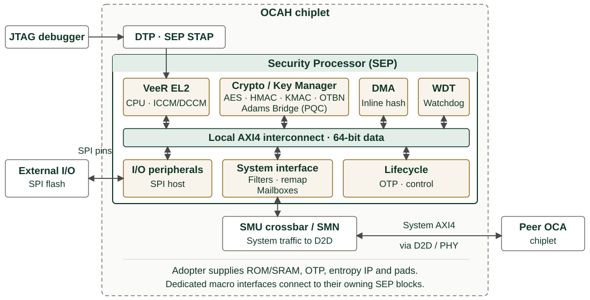

// SPDX-License-Identifier: Apache-2.0
// SPDX-FileCopyrightText: 2026 Tenstorrent USA, Inc.
= OCAH SEP Datasheet
:doctype: article
:notitle:
:datasheet-status: Beta
:product-short-name: SEP
:product-long-name: Security Processor
:revnumber: Initial version
:revdate: 2026
:copyright-year: 2026
:copyright-holder: Tenstorrent USA, Inc.
:icons: font

[cols="60,40",frame=none,grid=none,stripes=none]
|===
a|
[.datasheet-brand]
OPEN CHIPLET ATLAS HARNESS

[.datasheet-title]
{product-short-name}

[.datasheet-subtitle]
{product-long-name}

[.datasheet-status]
{datasheet-status} release {vbar} Open-source RTL {vbar} Apache 2.0

a|
image::../../ui-supplemental/img/tt_logo_color-yellow-black.png[Tenstorrent,pdfwidth=1.65in,align=right]
|===

[cols="48,4,48",frame=none,grid=none,stripes=none]
|===
a|
// datasheet-section: highlights
[.datasheet-section]
HIGHLIGHTS

* VeeR EL2 RV32 processor with external interfaces for boot ROM, ICCM, DCCM,
  and scratch SRAM macros
* Integrated AES, HMAC, KMAC, OTBN, Adams Bridge, key-management, and entropy
  hardware
* OTP/eFuse-backed lifecycle controller with debug- and security-control outputs
* Filtered and remapped inbound and outbound system-fabric paths
* Secure DMA with inline hashing, quad-SPI host, watchdog, and mailboxes
* Open RTL, generated register collateral, firmware, and PyUVM verification

// datasheet-section: system-role
[.datasheet-section]
SYSTEM ROLE

The Security Processor (SEP) is the Root of Trust (RoT) of the chiplet with
the highest security privilege. The SEP provides a physically isolated
execution environment for highly sensitive security services such as secure
boot, secure lifecycle control, device attestation, cryptography service and
user authentication. The SEP is responsible for ensuring that the chiplet
and overall packaged system composed of multiple chiplets remains secure
from adversaries.

A primary chiplet's SEP provides system-level security management. Secondary
chiplets may include their own SEP to enforce a local chiplet-owner security
domain.

// datasheet-section: overview
[.datasheet-section]
OVERVIEW

SEP combines a 32-bit VeeR EL2 processor, local memories, peripherals, and a
crypto complex on a 64-bit local AXI4 fabric. Its lifecycle controller derives
debug and security controls from eFuse-backed state. The 56-bit-address,
64-bit-data system AXI4 paths provide filtering and remapping. ROM, SRAM,
OTP/eFuse, and entropy macros are supplied by the integrator. Boot firmware
and crypto software are provided; their presence does not by itself establish
a product secure-boot policy, certification, or complete system assurance case.

a|
a|
// datasheet-section: at-a-glance
[.datasheet-section]
AT A GLANCE

[cols="32,68",options="header"]
!===
!Feature !Description
!Processor !One VeeR EL2, RV32IMC plus configured bit-manipulation extensions
!Crypto accelerators !Cipher AES; HMAC-SHA2; KMAC-SHA3;
OTBN (programmable crypto engine); Adams Bridge (ML-DSA-87 and ML-KEM-1024)
!TRNG !True Random Number Generator
!PCR Vault !Deferred; not in the current RTL
!Local memory apertures !256 KiB ICCM; 128 KiB DCCM; 64 KiB boot ROM;
256 KiB scratch SRAM
!System / local AXI4 !56-bit address, 64-bit data / 32-bit address, 64-bit data
!Interrupt controller !255 sources: 43 internal and 212 external inputs
!Fabric policy entries !32 outbound filters; 16 inbound filters
!Mailboxes !8 mailboxes, depth 8 entries each
!External entropy streams !3 AXI-Stream inputs, selected by default
!===

[.datasheet-small]
The memory capacities and VeeR features are configurable at integration time.
The properties of the associated technology macros, initialization images,
timing, and physical characteristics depend on the selected instances and their
configuration.

|===

// datasheet-section: system-context
[.datasheet-section]
SYSTEM CONTEXT

<<<

[cols="48,4,48",frame=none,grid=none,stripes=none]
|===
a|
// datasheet-section: capabilities
[.datasheet-section]
CAPABILITIES

*Processing and data movement*

* VeeR EL2 CPU with instruction/data tightly coupled memories, programmable
  interrupt controller, timers, physical memory protection, and JTAG debug
* One secure-DMA instance supporting memory transfers; inline SHA2-256,
  SHA2-384, and SHA2-512 hashing;
  and the instantiated peripheral low-speed-I/O trigger path
* One single/quad-SPI host with one chip select; watchdog timer; and separate
  warm- and cold-reset scratch-register banks

*Cryptographic and entropy hardware*

* AES with 128-, 192-, and 256-bit keys; HMAC/SHA-2; KMAC/SHA-3/SHAKE; and
  programmable OTBN big-number computation
* Adams Bridge post-quantum accelerator instantiated with masking enabled in
  the reference configuration (ML-DSA-87 and ML-KEM-1024)
* Key Manager with private accelerator key paths and external ROM/SRAM ports
* Entropy source, CSRNG, EDN distribution, external-source selection, and a
  fabric-visible entropy pool

*Lifecycle and fabric control*

* eFuse sense/program interface, lifecycle-state logic, and lifecycle-derived
  controls for DTP and SMC integration
* Inbound access filtering; outbound filtering; alias remapping for CPU, DMA,
  and debug masters; and AP/STEE output-remap register banks
* Eight bidirectional mailbox paths and an external AXI extension port

// datasheet-section: interfaces-and-configuration
[.datasheet-section]
INTERFACES AND CONFIGURATION

[cols="38,62",options="header"]
!===
!Feature !Integration options
!Clocks and resets !System, reference, entropy-sample, and watchdog clocks;
cold, debug, watchdog, scan, and software-controlled resets. The CPU reset is
released after fuse sensing completes rather than as a separate controllable reset
!System fabric !Inbound and outbound 56-address/64-data AXI4; SEP-to-SMC AXI4;
32-address/64-data external AXI extension
!Debug and lifecycle !CPU JTAG; OTP-debug AXI4-Lite; lifecycle, debug-disable,
security-disable, test-mode, and status signals
!Memory macros !ICCM, DCCM, boot ROM, scratch SRAM, OTBN IMEM/DMEM, Adams
Bridge SRAM, and Key Manager ROM/SRAM request/response interfaces
!OTP and entropy !eFuse command and CSR interfaces; three external entropy
AXI-Stream inputs, selected at reset, and one external-source AXI4-Lite control
path
!I/O and events !Quad-SPI pins, timer/software/external interrupts, watchdog
reset request, mailbox interrupts, and error/status outputs
!Build-time !Adams Bridge masking and SRAM latency, Key Manager read latency,
vendor eFuse shim CSR block size, and security-disable token. The external
entropy-stream count is fixed at three
!===

a|
a|
// datasheet-section: integration-dependencies
[.datasheet-section]
INTEGRATION DEPENDENCIES

* Supply qualified ROM, SRAM, OTP/eFuse, and entropy IP matching the required
  interfaces, timing, integrity, reset, and images. Reset selects all three
  external entropy streams; their source IP is not supplied. Internal entropy
  sources require silicon validation.
* Replace the zero-valued default security-disable token during implementation
  and define lifecycle encodings, provisioning, debug authorization, recovery,
  and ownership policy for the complete product.
* Review firmware trust anchors, manifests, rollback, and update policy;
  source availability does not establish product approval.
* Integrate the inbound/outbound filters and remappers so configuration
  apertures cannot be exposed by an unsafe allow-list. Record the final address
  map and unmatched-access behavior.
* Provide clock, reset, CDC, scan, pad, interrupt, and fabric integration;
  connect DTP/SMC lifecycle handoffs and terminate unused ports.
* The integrator must qualify entropy and all cryptographic use in the target
  environment; the base system makes no certification, side-channel,
  fault-resistance, or implementation performance claims.

// datasheet-section: verification-and-maturity
[.datasheet-section]
VERIFICATION AND MATURITY

[.beta-note]
--
The OCAH https://tenstorrent.github.io/tt-oca-harness/ocah-docs/latest/dashboard.html[verification dashboard]
publishes the current verification and maturity status.
The open-source cocotb/PyUVM environment runs against the SEP integration
wrapper, combining the SEP RTL with memory macros and a generic eFuse model.
It exercises CPU and ROM access, the address map, filters/remappers, DMA and
SPI paths, mailboxes and interrupts, crypto modes and key paths, entropy
distribution, lifecycle/eFuse behavior, reset isolation, and error handling.
No-CPU tests use a CPU stub for direct bus stimulus; CPU firmware tests use the
full VeeR core. Production Boot ROM firmware has a separate verification owner.

The behavioural OTP array does not prove physical OTP properties, and the
Verilator build replaces the Adams Bridge key-register block with a
compatibility stub. Published code coverage excludes the CPU subtree. No
third-party algorithm or standards certification, production security
assessment, silicon characterization, or portable frequency, area, power,
latency, or throughput result is claimed.
--

// datasheet-section: deliverables-and-further-information
[.datasheet-section]
DELIVERABLES

* SystemVerilog RTL, dependency filelists, and integration wrapper
* SystemRDL sources plus generated RTL, C headers, and documentation
* Architecture, memory-map, interface, and integration documentation
* Boot/DV firmware and cryptographic software source collateral
* cocotb/PyUVM environment, tests, checkers, and verification plan
* Apache License 2.0 repository distribution

[.datasheet-section]
RESOURCES

Documentation: https://tenstorrent.github.io/tt-oca-harness/[tenstorrent.github.io/tt-oca-harness] +
SEP source documentation: `hw/sys/sep/doc/` +
RTL and registers: `hw/sys/sep/rtl/`, `hw/sys/sep/regs/` +
Boot firmware: `hw/sys/sep/bootrom/` +
Verification: `hw/sys/sep/dv/` +
Integrator Guide: `doc/integrator/` +
Project: https://github.com/tenstorrent/tt-oca-harness[github.com/tenstorrent/tt-oca-harness]

// datasheet-section: terms
[.datasheet-section]
TERMS

[.datasheet-small]
RoT: root of trust. TRNG: true random number generator. OTBN: OpenTitan
big-number accelerator. HMAC: keyed-hash message authentication code.
KMAC: KECCAK message authentication code. CSRNG: cryptographically secure
random number generator. EDN: entropy distribution network. ICCM/DCCM:
instruction/data closely coupled memory. OTP: one-time programmable.

// datasheet-section: document-control
[.datasheet-section]
DOCUMENT CONTROL

[cols="18,20,30,32",options="header"]
!===
!Version !Date !Author !Change
! ! ! !
!===
|===
