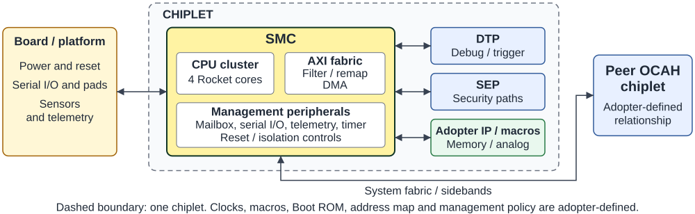

// SPDX-License-Identifier: Apache-2.0
// SPDX-FileCopyrightText: 2026 Tenstorrent USA, Inc.
= OCAH SMC Datasheet
:doctype: article
:notitle:
:datasheet-status: Beta
:product-short-name: SMC
:product-long-name: System Management Controller
:revnumber: Initial version
:revdate: 2026
:copyright-year: 2026
:copyright-holder: Tenstorrent USA, Inc.
:icons: font

[cols="60,40",frame=none,grid=none,stripes=none]
|===
a|
[.datasheet-brand]
OPEN CHIPLET ATLAS HARNESS
a|
image::../../ui-supplemental/img/tt_logo_color-yellow-black.png[Tenstorrent,pdfwidth=1.65in,align=right]
|===

[.datasheet-title]
{product-short-name}

[.datasheet-subtitle]
{product-long-name}

[.datasheet-status]
{datasheet-status} release | Open-source RTL | Apache 2.0

[cols="35,65",frame=none,grid=none,stripes=none]
|===
a|
// datasheet-section: highlights
[.datasheet-section]
HIGHLIGHTS

* Four-core Rocket RV64GC management processor subsystem
* 56-bit-address, 64-bit-data AXI fabric with programmable filtering and remap
* Clock, reset, power-good, interrupt, mailbox, and subsystem-control integration
* GPIO, I2C, UART, SPI, AVSBus, telemetry, watchdog, and timer peripherals
* DMA controller with linear and 2D transfers
* Direct integration paths for OCAH DTP and SEP subsystems
* Typed boundaries for adopter memories, OTP, pads, PVT, PLL, and trace macros

// datasheet-section: system-role
[.datasheet-section]
SYSTEM ROLE

The System Management Controller (SMC) is a subsystem in a chiplet that takes
on system management tasks, including managing clock, voltage, and reset,
configuring the hardware platform, bringing up the system, and reporting
system status. Each chiplet's essential functions are managed by its own SMC.
SMCs are arranged hierarchically within a multi-chiplet device, with one SMC
assigned a primary management role.

a|
// datasheet-section: overview
[.datasheet-section]
OVERVIEW

The System Management Controller combines a four-core Rocket CPU cluster,
local memories, AXI and AXI4-Lite fabrics, interrupt handling, reset controls,
and management peripherals. The supported configuration supplies 1 MiB of
banked scratch memory, a 128 KiB boot-ROM interface, and 256 external interrupt
inputs.

Inbound system, JTAG-debug, and SEP traffic reaches SMC resources through the
input fabric. SMC-generated traffic leaves through programmable filter and
remap stages. Dedicated interfaces connect DTP control and cross-trigger paths,
SEP traffic and mailbox events, external management registers, subsystem reset
and isolation controls, and adopter-supplied physical or memory macros. The
release does not prescribe macro implementations, a final address map, or
chiplet-management policy.

// datasheet-section: at-a-glance
[.datasheet-section]
AT A GLANCE

[cols="42,58",options="header"]
!===
!Feature !Description
!Processor cluster !4 Rocket RV64GC cores
!System AXI !56-bit address, 64-bit data
!Scratch memory !1 MiB across 32 banks
!Boot ROM !128 KiB interface
!External interrupt inputs !256
!Platform I/O !65 GPIO wrappers (61 bonded, 4 unbonded); 3 I2C; 4 UART
!Telemetry inputs !3 receivers
!Control fanout !32 mailboxes with 32 mailbox interrupts; 32 subsystem reset/isolation slots
!===

[.datasheet-small]
Values summarize the default `smc_pkg::SMC_4CORE` selection. Memory instances,
pad cells, analog functions, and clock implementation are integration-specific.

|===

// datasheet-section: system-context
[.datasheet-section]
SYSTEM CONTEXT

<<<

[cols="49,2,49",frame=none,grid=none,stripes=none]
|===
a|
// datasheet-section: capabilities
[.datasheet-section]
CAPABILITIES

*Management compute and memory*

* Rocket RV64GC cluster with local interrupt controllers and bus-error reporting
* External boot-ROM, scratch, cache, and trace-memory macro interfaces
* One instantiated DMA controller
* Memory zeroer for initialization and zeroing

*Fabric and control*

* Independent system, JTAG-debug, and SEP AXI inputs
* Outbound AXI path with configurable address filtering, privilege-aware remap,
  alias remap, isolation, and error handling
* Mailboxes, watchdogs, a 64-bit Open Chiplet Time Synchronization (OCTS) timer,
  cross-trigger connections, and 32 subsystem reset/isolation control slots

*Management peripherals*

* GPIO; I2C, UART, SPI, and AVSBus controller integration
* Telemetry receivers and interfaces for OTP, PVT, PLL, clock-generation,
  trace, and pad-ring functions

// datasheet-section: interfaces-and-configuration
[.datasheet-section]
INTERFACES AND CONFIGURATION

[cols="38,62",options="header"]
!===
!Feature !Integration options
!Clocks and resets !SMC, reference, peripheral, and telemetry clocks; power-good,
primary-reset, warm-reset, scan/test, and synchronized reset connections
!System fabric !56-bit/64-bit AXI system input and output; separate JTAG and SEP
inputs; 32-bit local AXI4-Lite register boundaries
!OCAH subsystems !DTP CSR/reset/cross-trigger paths and SEP AXI, mailbox, and
watchdog paths
!Platform controls !External interrupts, mailbox interrupts, OCTS count,
reset/isolation fanout, serial interfaces, GPIO, and telemetry
!Technology macros !Boot ROM, scratch/cache/trace memories, OTP, pad ring,
PVT, PLL, and clock-generation interfaces
!Build-time !Checked-in four-core cluster build, AXI types, memory types,
peripheral configuration, and technology-specific cell implementations
!===

[.datasheet-section]
RESOURCES

Documentation: https://tenstorrent.github.io/tt-oca-harness/[tenstorrent.github.io/tt-oca-harness] +
SMC source documentation: `hw/sys/smc/doc/` +
RTL: `hw/sys/smc/rtl/` +
Verification: `hw/sys/smc/dv/` +
Boot-ROM collateral: `hw/sys/smc/bootrom/prod/` +
Synthesis collateral: `hw/sys/smc/synth/` +
Integrator Guide: `doc/integrator/` +
Project: https://github.com/tenstorrent/tt-oca-harness[github.com/tenstorrent/tt-oca-harness]

|
a|
// datasheet-section: integration-dependencies
[.datasheet-section]
INTEGRATION DEPENDENCIES

* Record the supported four-core CPU cluster, memory implementations, peripheral
  instances, and all generated register collateral used by the build.
* Provide clock, reset, power-good, CDC, test, and clock-gating integration;
  verify reset completion and isolation handshakes for every connected subsystem.
* Integrate the boot ROM, scratch/cache/trace memories, OTP, pads, PVT, PLL,
  and other technology-dependent boundaries, including initialization and repair
  behavior required by the selected macros.
* Define the system address map and program the outbound filters, remap regions,
  privilege policy, error handling, and unused-interface tie-offs.
* Integrate and validate the checked-in production Boot ROM image for the
  selected memory implementation and product boot policy.
* Connect DTP, SEP, platform interrupts, reset/isolation controls, and
  external peripherals according to the product's lifecycle and security policy.

// datasheet-section: verification-and-maturity
[.datasheet-section]
VERIFICATION AND MATURITY

[.beta-note]
--
The OCAH https://tenstorrent.github.io/tt-oca-harness/ocah-home/latest/dashboard.html[verification dashboard]
publishes the current verification and maturity status.
The checked-in open-source cocotb/PyUVM environment runs against the SMC
integration wrapper, which combines SMC RTL, adopter-facing IP shims, and CPU
memories. Credited scenarios exercise reset and power-good behavior, CSRs,
mailboxes, local fabric, function-level reset, I2C, iJTAG, CPU-to-SEP traffic,
OTP observation, GPIO interrupts, AVSBus registers, UART/SPI/log-engine
registers, DMA timeout, filter/remap paths, and multi-reset persistence.

A candidate traceability matrix is available. The silicon integrator must
select the detailed peripheral configuration and update DV accordingly.
No silicon characterization or portable frequency, performance, area, or
power figures are claimed.
--

// datasheet-section: deliverables-and-further-information
[.datasheet-section]
DELIVERABLES

* SystemVerilog RTL, generated Rocket-cluster RTL, wrappers, and dependency filelists
* SystemRDL-derived register collateral and configuration packages
* Architecture, interface, memory-map, integration, and verification documentation
* Open-source cocotb/PyUVM tests plus a smaller SV-UVM scenario set
* Production Boot ROM source, build flow, and documentation
* Synthesis and CDC/timing-constraint starting points
* Apache License 2.0 repository distribution

// datasheet-section: terms
[.datasheet-section]
TERMS

[.datasheet-small]
OCTS: open chiplet time synchronization. OTP: one-time programmable.
AVSBus: adaptive voltage scaling bus. PVT: process, voltage, temperature.

// datasheet-section: document-control
[.datasheet-section]
DOCUMENT CONTROL

[cols="18,20,30,32",options="header"]
!===
!Version !Date !Author !Change
! ! ! !
!===

|===
