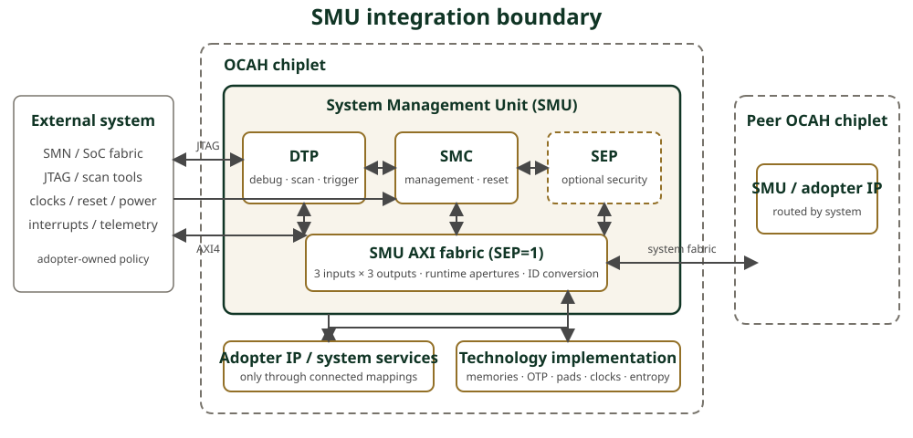

// SPDX-License-Identifier: Apache-2.0
// SPDX-FileCopyrightText: 2026 Tenstorrent USA, Inc.
= OCAH SMU Datasheet
:doctype: article
:notitle:
:datasheet-status: Beta
:product-short-name: SMU
:product-long-name: System Management Unit
:revnumber: Initial version
:revdate: 2026
:copyright-year: 2026
:copyright-holder: Tenstorrent USA, Inc.
:icons: font

[cols="60,40",frame=none,grid=none,stripes=none]
|===
a|
[.datasheet-brand]
OPEN CHIPLET ARCHITECTURE HARNESS
a|
image::../../ui-supplemental/img/tt_logo_color-yellow-black.png[Tenstorrent,pdfwidth=1.65in,align=right]
|===

[.datasheet-title]
{product-short-name}

[.datasheet-subtitle]
{product-long-name}

[.datasheet-status]
{datasheet-status} release | Open-source RTL | Apache 2.0

[cols="40,60",frame=none,grid=none,stripes=none]
|===
a|
// datasheet-section: highlights
[.datasheet-section]
HIGHLIGHTS

* Coordinates OCAH clock/reset/power/thermal management, debug/test, and optional
  security subsystems
* Full reference configuration integrates SMC, SEP, DTP, and a 3-by-3 AXI4 fabric
* Alternate no-SEP configuration preserves SMC, DTP, and external AXI interfaces
* Runtime-programmed SMC/SEP address apertures with fixed, loop-free connectivity
* Integrated reset, clock-stop, lifecycle, mailbox, interrupt, and debug handoffs
* Technology-neutral core plus an open reference wrapper for macro substitution

// datasheet-section: system-role
[.datasheet-section]
SYSTEM ROLE

SMU is the composed management boundary between the chiplet system fabric,
external debug and test equipment, adopter implementation resources, and the
OCAH SMC, DTP, and optional SEP. It supplies their integration wiring and
control handoffs; the adopter owns chiplet-level address assignment,
non-vendor-neutral IPs, firmware policy, and product security authorization.

// datasheet-section: at-a-glance
[.datasheet-section]
AT A GLANCE

[cols="34,66",options="header",grid=rows,stripes=even]
!===
!Feature !Description
!Main configuration !SMC + SEP + DTP
!Alternate configuration !SMC + DTP
!Full-config fabric !3 AXI4 inputs by 3 outputs; 2 runtime address rules
!AXI4 boundary !56-bit address, 64-bit data, 12-bit user
!AXI IDs !8-bit input; 10-bit crossbar output; 6-bit SMC/SEP target
!External interrupts !256 to SMC; 212 to SEP when present
!Mailbox instances !32 SMC; 8 SEP when present
!External cross-trigger interfaces !16 CTPs; 8 internal trigger interfaces;
8 clock-stop request inputs
!===

a|
// datasheet-section: overview
[.datasheet-section]
OVERVIEW

The System Management Unit (SMU) is a composite module providing a standardized
OCAH compliant chiplet interface combining SEP, SMC, and DTP sub-blocks into a
single instantiable subsystem with standardized interfaces to a user defined
subsystem. The SMU provides chiplet functions such as clock, voltage and reset
management in addition to Root of Trust (RoT) services in a physically isolated
environment.

The composed subsystems include the debug and test ports (DTP), which provide
standardized debug and test access across heterogeneous chiplets; the System
Management Controller (SMC), responsible for clock, reset, voltage, and power
management plus platform bootstrap and initialization; and the optional Security
Processor (SEP), a physically isolated block providing Root of Trust (RoT)
services.

SEP inclusion is selected independently for each SMU instance. A multi-chiplet
system may contain SEP-equipped primary and secondary chiplets, together with
secondary chiplets that omit SEP. The integrator defines the security hierarchy
and the propagation of lifecycle and debug controls between chiplets.

// datasheet-section: system-context
[.datasheet-section]
SYSTEM CONTEXT

|===

<<<

[cols="51,49",frame=none,grid=none,stripes=none]
|===
a|
// datasheet-section: capabilities
[.datasheet-section]
CAPABILITIES

*Composition and control*

* SMC and DTP always instantiated; SEP selected at elaboration
* Internal wiring for DTP-to-SMC debug fabric and OTP, DTP-to-SEP debug and OTP,
  SEP-to-SMC mailbox/reset/security status, and SMC-to-DTP cross-trigger control
* SMC-owned primary reset sequencing, 32 subsystem reset/isolation slots,
  external boot/repair gate, watchdog handoffs, and DTP clock-stop output
* The SEP lifecycle controller enables or disables DTP debug and test paths

*Full-configuration fabric*

* Legal routes: SEP reaches SMC or the external output; SMC reaches SEP or the
  external output; the external input reaches SEP or SMC. Same-port loops and a
  direct external-input-to-external-output path are excluded (loop-free)
* Runtime SMC and SEP aperture base/size rules select the target for each access
* Unmatched SMC/SEP outbound traffic uses the external output; unmatched
  external inbound traffic receives a decode error
* AXI ID-width conversion at SMC/SEP targets; atomic operations disabled
* The checked-in RTL fixes a 1 GiB window that aliases SEP accesses to the SMC
  local address region

*No-SEP behavior*

* Direct external-to-SMC and SMC-to-external AXI paths retain the public widths
* DTP and its primary JTAG interface remain present with the debug-disable vector
  tied to all-enabled: STAPs, DFT/DFD scan access, and the SMC JTAG-to-AXI
  bridge are open, and no SMU input accepts lifecycle controls from another
  chiplet
* SEP memory, entropy, I/O, mailbox, lifecycle-error, and status ports are tied
  to defined inactive values; the SEP aperture reports zero size
* SEP OTP debug accesses receive DECERR and the SEP secondary TAP has no target

// datasheet-section: interfaces-and-configuration
[.datasheet-section]
INTERFACES AND CONFIGURATION

[cols="23,77",options="header",grid=rows,stripes=even]
!===
!Feature !Integration options
!Clocks and resets !SMU, reference, peripheral, telemetry, SEP watchdog, and
entropy-sample clocks; cold reset, power-good, boot/repair, DFT, and reset outputs
!System fabric !Inbound and outbound 56-address/64-data AXI4; programmable SMC
and SEP aperture status; adopter AXI/AXI4-Lite extensions
!Debug and triggers !Primary JTAG, boundary/iJTAG/secondary scan chains, external
reset-control slice, and current-reference counts of 16 CTPs, 8 local trigger
paths, and 8 clock-stop requests
!Management !256 SMC and 212 SEP external interrupts; 32 reset/isolation
controls of chiplet resources; 32 SMC and 8 SEP mailbox interrupts; GPIO/UART
events, telemetry, timer, straps, and RAS status. SEP resources apply only when
SEP is present
!Technology interfaces !SMC/SEP ROM and SRAM, eFuse/OTP, I3C table memory,
trace memory, GPIO pads, PLL/PVT, entropy, and SEP crypto-memory boundaries
!Build-time !SEP configuration, external entropy sources, JTAG
functions/identity, and SEP memory/Adams Bridge options
!===

a|
// datasheet-section: integration-dependencies
[.datasheet-section]
INTEGRATION DEPENDENCIES

* Decide whether or not to include SEP.
* Assign non-overlapping chiplet envelopes and program non-overlapping SMC/SEP
  memory apertures. Change memory apertures only after outstanding transactions
  have completed.
* If SEP is not configured, feature-control bits are not forwarded over the
  die-to-die interface and access is open by default. Protect the chiplet by
  routing all debug and test access through, and gating it with, a primary
  chiplet's SEP-controlled DTP path; define this no-SEP security policy.
* Replace zero-valued JTAG identity and SEP security-token fields; supply
  reviewed firmware, provisioning, recovery, and update policy.
* Provide the non-vendor-neutral IPs and production integration: PLL/FLL clock
  control, reset/CDC constraints, power sequencing, pads, SRAM macros, OTP
  banks, PVT sensors, entropy, I/O, and physical implementation. Reference-
  wrapper models and error-slave terminations are examples only.
* Connect or terminate every external fabric, scan, trigger, interrupt,
  mailbox, reset/isolation, macro, and adopter-extension interface.

// datasheet-section: verification-and-maturity
[.datasheet-section]
VERIFICATION AND MATURITY

[.beta-note]
--
The OCAH https://tenstorrent.github.io/tt-oca-harness/ocah-docs/latest/dashboard.html[verification dashboard]
publishes the current verification and maturity status.
Hosted cocotb/PyUVM smoke and regression exercise the no-SEP configuration,
covering SMC/DTP composition, direct external AXI, filters, ID conversion,
atomic rejection, JTAG-to-AXI/OTP, reset, mailbox, cross-trigger, and
clock-stop scenarios. The SEP-present configuration is also verified, spanning
no-SEP and real-SEP profiles including firmware and SEP boot-readiness
observations.

There is no agreed functional-coverage closure target or SMU RTL code-coverage
configuration. No standards certification, silicon characterization, product
security assessment, or portable frequency, area, power, latency, or throughput
result is claimed.
--

// datasheet-section: deliverables-and-further-information
[.datasheet-section]
DELIVERABLES

* SMU RTL assets, packages, and dependency filelists
* Reference integration wrapper and open IP-integration examples
* SystemRDL/generated registers and interface documentation
* Integrator guidance, specification, and synthesis constraints
* cocotb/PyUVM core and wrapper environments, firmware, and verification plans
* Apache License 2.0 repository distribution

[.datasheet-section]
RESOURCES

Documentation: https://tenstorrent.github.io/tt-oca-harness/[tenstorrent.github.io/tt-oca-harness] +
SMU documentation: Technical Reference Manual +
Core and reference wrapper RTL: `hw/sys/smu/rtl/`, `hw/top/` +
Verification: `hw/sys/smu/dv/` +
Integrator Guide: `doc/integrator/` +
Project: https://github.com/tenstorrent/tt-oca-harness[github.com/tenstorrent/tt-oca-harness]

// datasheet-section: terms
[.datasheet-section]
TERMS

[.datasheet-small]
RoT: root of trust. CTP: cross trigger port. DECERR: decode error.
OTP: one-time programmable. RAS: reliability, availability, and serviceability.

// datasheet-section: document-control
[.datasheet-section]
DOCUMENT CONTROL

[cols="14,16,25,45",options="header"]
!===
!Version !Date !Author !Change
! ! ! !
!===
|===
