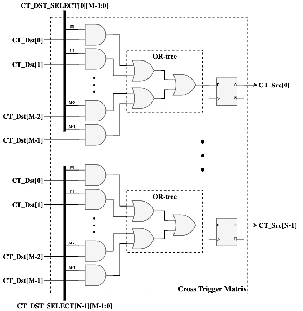

========
Overview
========

The Cross Trigger Matrix (CTM) is a crossbar that aggregates and statically routes cross trigger pulses between various sources and sinks. Typical connections to the CTM include Core Logic Analyzers (CLAs) and Cross Trigger Ports (CTPs), including other miscellaneous devices. The CTM is compatible with CTPs operating in either of the two signaling modes, point-to-point or wire-OR. Typically, each device or logic module connected to the CTM will act as both a source and a sink for cross trigger pulses.

System Requirements
===================

The CTM is designed to meet the following requirements:

Functionality
-------------

* Support configurable routing of M source ports (CT_Dst) to N sink ports (CT_Src)
* Allow each CT_Src to select multiple CT_Dst sources and OR them together
* Provide runtime configuration via register interface
* Support parameterized design with 1-64 CT_Src and 1-64 CT_Dst ports
* Ensure glitch-free operation with all outputs registered

Performance
-----------

* Low latency: 1 cycle from CT_Dst pulse to CT_Src output (registered)
* Static routing configuration minimizes trigger latency
* Support for simultaneous pulses on multiple CT_Dst ports
* Efficient OR aggregation of selected sources

Interface
---------

* AXI4-Lite register interface for configuration
* CT_Dst input ports: M pulse inputs (sources)
* CT_Src output ports: N pulse outputs (sinks)
* Parameterized bus interface types for flexibility

Block Diagram
=============

The CTM block diagram shows the high-level structure:

The diagram illustrates:

* **CT_Dst Inputs**: M cross trigger pulse input signals from CLAs, CTPs, or other cross trigger generating devices
* **CT_Src Outputs**: N cross trigger pulse output signals to CLAs, CTPs, or other cross trigger sinking devices
* **Register Interface**: AXI4-Lite bus for runtime configuration
* **Selection Logic**: Per-CT_Src configuration registers and selection/OR logic

Key Components
==============

Register Interface
------------------

The CTM provides two configuration registers per CT_Src port (when NUM_CT_DST > 32) or one register (when NUM_CT_DST <= 32):

* **CTM_CT_SRC[i]_CONFIG_0**: Selects which CT_Dst port(s) to forward on CT_Src[i] for CT_Dst[31:0]
* **CTM_CT_SRC[i]_CONFIG_1**: Selects which CT_Dst port(s) to forward on CT_Src[i] for CT_Dst[63:32] (only when NUM_CT_DST > 32)
* CONFIG_0 contains CT_DST_SELECT field [31:0] for CT_Dst[31:0]
* CONFIG_1 contains CT_DST_SELECT field [NUM_CT_DST-33:0] for CT_Dst[63:32]
* Multiple CT_Dst ports can be selected (OR'd together)
* Setting both CT_DST_SELECT fields to all-zero disables the CT_Src output
* Register definitions are generated from templates based on NUM_CT_SRC and NUM_CT_DST parameters

Source Selector Modules
-----------------------

Each CT_Src port has an associated selector module that:

* Takes all CT_Dst inputs and a selection mask from the register
* ANDs each CT_Dst with its corresponding select bit
* ORs all selected pulses together
* Registers the output to prevent glitches

Design Principles
=================

* **Glitch-Free Operation**: All combinatorial outputs registered
* **Common Primitives**: Uses standard modules from hw/common when applicable
* **Generic Bus Interface**: Parameterized types for flexibility, AXI4-Lite with request/response structures
* **Static Configuration**: Runtime configuration via registers minimizes latency
* **Parameterized Design**: Supports 1-64 ports for both CT_Src and CT_Dst

Use Cases
=========

The CTM is typically used to:

* Connect multiple CLAs and CTPs in a chiplet
* Route cross triggers between debug modules
* Aggregate triggers from multiple sources to a single sink
* Broadcast triggers from a single source to multiple sinks
* Create complex trigger networks with minimal latency
