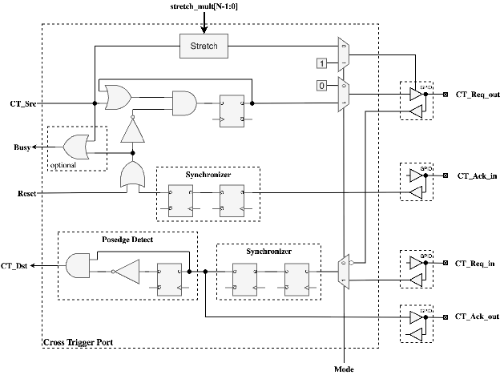
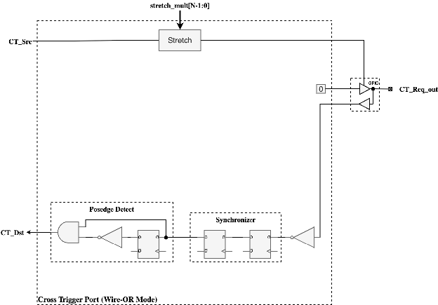
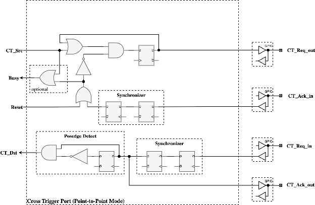
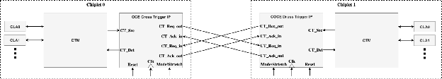
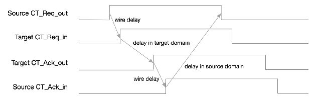

=============
Architecture
=============

The Cross Trigger Port (CTP) architecture consists of several key modules working together to provide reliable cross-chiplet triggering capabilities.

Block Diagram
=============

The following diagram illustrates the logical behavior of the CTP core:

   CTP core logical behavior

Module Hierarchy
================

The CTP top module (cross_trigger_port) instantiates the following sub-modules:

* **ctp_synchronizer**: Synchronizes asynchronous GPIO inputs
* **ctp_pulse_stretcher**: Stretches pulses for Wire-OR mode
* **ctp_edge_detector**: Detects positive edges for Point-to-Point mode
* **ctp_handshake_ctrl**: Implements four-phase handshaking protocol
* **cross_trigger_port_reg**: Generated register module (from SystemRDL)

Signal Descriptions
====================

Core-Side Interface
-------------------

* **ct_src_i**: Cross trigger source pulse (synchronous to clk_i)
* **ct_dst_o**: Cross trigger destination pulse (registered output)
* **busy_o**: Optional signal indicating transfer in progress

GPIO Pad Interface
-----------------

**CT_Req_out Pad**:
* **ct_req_out_dout_en_o**: Output enable control
* **ct_req_out_din_en_o**: Input enable control
* **ct_req_out_dout_o**: Output data
* **ct_req_out_din_i**: Input data (asynchronous)

**CT_Req_in Pad** (Point-to-Point mode only):
* **ct_req_in_din_en_o**: Input enable control
* **ct_req_in_din_i**: Input data (asynchronous)

**CT_Ack_in Pad** (Point-to-Point mode only):
* **ct_ack_in_din_en_o**: Input enable control
* **ct_ack_in_din_i**: Input data (asynchronous)

**CT_Ack_out Pad** (Point-to-Point mode only):
* **ct_ack_out_dout_en_o**: Output enable control
* **ct_ack_out_dout_o**: Output data

Wire-OR Mode Architecture
========================

The following diagram illustrates Wire-OR mode operation:

   Wire-OR mode logical behavior

In Wire-OR mode:

1. Core-side pulse (ct_src_i) triggers pulse stretcher
2. Pulse stretcher generates stretched pulse on CT_Req_out pad output enable
3. Pad output is driven static-low (or high if inverted)
4. Any chiplet can pull the shared wire low to assert cross trigger
5. Synchronized pad input triggers ct_dst_o pulse on positive edge

Point-to-Point Mode Architecture
=================================

The following diagram illustrates Point-to-Point mode operation:

   Point-to-Point mode logical behavior

The following diagram shows chiplet interconnection:

   Chiplet cross-coupling example

The following diagram shows handshake timing:

   Four-phase handshake timing

In Point-to-Point mode:

**Sender Side**:
1. CT_Src asserts → CT_Req_out asserts
2. CT_Req_out remains asserted until CT_Ack_in asserts
3. CT_Ack_in asserts → CT_Req_out deasserts
4. CT_Req_out deasserts → wait for CT_Ack_in to deassert

**Receiver Side**:
1. Positive edge of CT_Req_in → CT_Dst pulse generated, CT_Ack_out asserts
2. CT_Req_in deasserts → CT_Ack_out deasserts
3. Wait for CT_Req_in to fully deassert before returning to idle

Mode Multiplexing
=================

The top module implements mode multiplexing to switch between Wire-OR and Point-to-Point operation:

* Pad control signals are multiplexed based on MODE bit
* Wire-OR mode uses pulse stretcher and bidirectional CT_Req_out pad
* Point-to-Point mode uses handshake controller and separate req/ack pads
* All mode-specific signals are properly isolated

Signal Inversion
================

The INVERT bit in CONFIG register inverts all I/O signals:

* **Wire-OR mode**: Active-low (default) or active-high (with INVERT)
* **Point-to-Point mode**: Active-high (default) or active-low (with INVERT)
* Applied to both inputs and outputs
* Status register readback reflects inverted values
