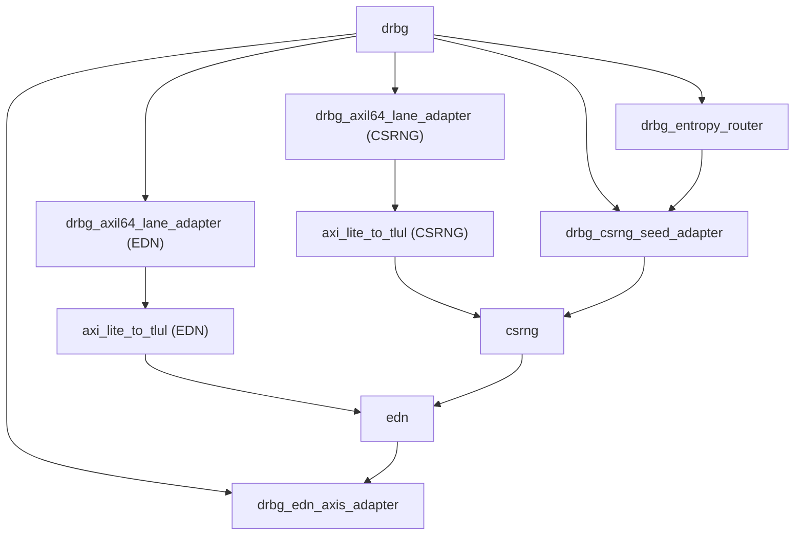

# DRBG Wrapper Implementation

## Implementation Summary

The DRBG wrapper is a composition of three wrapper-local modules plus the
wrapped `csrng` and `edn` instances:

| Module | Role |
|---|---|
| `drbg_entropy_router` | Captures producer-driven entropy words, routes them by priority, and drives the external entropy AXI-Stream |
| `drbg_csrng_seed_adapter` | Converts accepted 32-bit entropy words into queued 384-bit CSRNG seeds |
| `drbg_edn_axis_adapter` | Converts EDN endpoint req/rsp traffic into AXI-Stream outputs |
| `drbg_axil64_lane_adapter` | Narrows supported 64-bit AXI-Lite transactions into one-lane 32-bit accesses |
| `csrng` | Wrapped entropy consumer and DRBG engine |
| `edn` | Wrapped endpoint distribution engine |

The wrapper top level, `drbg.sv`, is mostly structural. It instantiates the
submodules, connects the bridge paths, and adds top-level assertions.

## Datapath Breakdown

### 1. Entropy ingress and routing

`drbg_entropy_router` accepts the producer-driven ingress pulse stream and
implements the routing policy:

- if the distribution FIFO has space, the word is captured there,
- else if the CSRNG-word FIFO has space, the word is captured there,
- else the word is dropped.

The module also exposes observability pulses used by the testbench:

- distribution accept,
- CSRNG accept,
- drop.

The entropy-distribution FIFO is exported as a conventional AXI-Stream source
with downstream backpressure.

### 2. Seed formation for CSRNG

`drbg_csrng_seed_adapter` consumes the CSRNG-routed 32-bit words and forms one
complete CSRNG seed from every 12 accepted words:

- `12 * 32 = 384` bits,
- one queued `es_fips` bit accompanies each seed,
- seeds are held in a FIFO until CSRNG asserts `es_req`.

This adapter transforms a producer-driven stream into the request/ack model
expected by CSRNG's `entropy_src_hw_if`.

Conceptually, the adapter performs:

```text
32-bit word stream
  -> 12-word accumulation
  -> {es_fips, es_bits[383:0]} seed queue
  -> es_req/es_ack service toward CSRNG
```

### 3. EDN endpoint export

The wrapped EDN instance still uses its normal endpoint request/response
interface internally. `drbg_edn_axis_adapter` bridges that contract into one
AXI-Stream channel per endpoint:

- endpoint request remains driven into EDN,
- endpoint response data is buffered per endpoint,
- buffered endpoint data is exported as AXI-Stream with per-endpoint `tready`.

This keeps the external consumer contract simpler than the internal EDN
req/ack-style interface.

## Control-Plane Path

Each wrapped block has the same control-plane shape:

```text
64-bit AXI-Lite
  -> drbg_axil64_lane_adapter
  -> 32-bit AXI-Lite
  -> axi_lite_to_tlul
  -> wrapped TL-UL register file
```

`drbg_axil64_lane_adapter` enforces the wrapper's access policy:

- one aligned 32-bit lane at a time,
- lower or upper lane only,
- no spanning accesses.

If a transaction violates those rules, the adapter returns `SLVERR` and the
downstream TL-UL request remains idle.

## Top-Level Instance Topology



## Important Implementation Decisions

### Distribution-first routing

The wrapper chooses to prioritize external entropy distribution over CSRNG seed
collection. This is a policy decision, not a primitive limitation. It affects
how quickly CSRNG can collect seeds under sustained downstream backpressure.

### No wrapper-owned register map

The top level deliberately avoids creating a synthetic DRBG register block. This
keeps software interaction aligned with the wrapped CSRNG and EDN register maps
and makes the wrapper mostly transparent on the control plane.

### Fixed-width external streams

Both the entropy-distribution output and the EDN endpoint outputs are exported
as 32-bit AXI-Stream channels with `tstrb = 4'hF` on valid transfers. There is
no partial-byte behavior in the current contract.

### Provisional FIPS policy

The wrapper currently hard-wires provisional policy for seed and endpoint FIPS
handling in `drbg_pkg.sv` rather than deriving that policy dynamically in the
datapath. This keeps policy centralized and easy to revise.

## Assertions and Observability

The top level uses `prim_assert.sv` macros to check:

- parameter validity,
- no TL-UL request on unsupported AXI-Lite accesses,
- `tstrb == 4'hF` on valid entropy output transfers,
- provisional seed FIPS policy consistency, and
- known-value behavior on key output signals.

The testbench also depends on several wrapper-observable debug signals such as:

- unsupported-access pulses,
- forwarded read/write pulses,
- entropy route pulses,
- FIFO full/depth signals, and
- seed queue visibility.

These are useful for directed verification even though they are not part of the
external production contract.

## Current Limitations

The current implementation intentionally leaves several possible future features
out of scope:

- no ingress backpressure,
- no externally visible EDN FIPS metadata,
- no wrapper-managed CSR sequencing,
- no multi-clock support,
- no local register map summarizing wrapper status.

Those limits are consistent with the current feature goal: provide a thin,
typed, verifiable integration wrapper around the existing CSRNG and EDN blocks.
