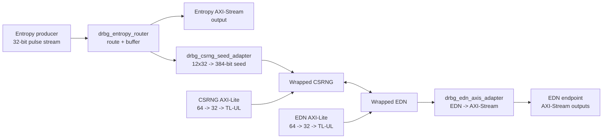

# DRBG Wrapper Overview

## Purpose

`hw/comp/drbg` packages the existing `csrng` and `edn` components behind a
single-clock wrapper that is easier to integrate into a subsystem as a DRBG
service. The wrapper does not replace the internal OpenTitan-originated CSRNG
or EDN behavior. Instead, it adds the glue required to:

- accept a producer-driven 32-bit entropy word stream,
- forward a copy of accepted entropy words to an external observation stream,
- repack entropy words into complete CSRNG seed transactions,
- expose EDN endpoint output as AXI-Stream channels, and
- preserve separate CSRNG and EDN control-plane access through 64-bit AXI-Lite
  slave ports.

The wrapper is intentionally narrow in scope. It adds no autonomous command
sequencing, no policy engine for CSR programming, and no extra clock or reset
domains.

## Top-Level Role

At a system level, the DRBG wrapper sits between three classes of interfaces:

- an upstream entropy producer,
- downstream consumers that want raw accepted entropy words or EDN-distributed
  random words, and
- software or firmware that configures the wrapped CSRNG and EDN blocks through
  their native register maps.

The component is useful when the integrator wants one block that owns the
entropy ingress adaptation and EDN streaming boundary rather than wiring
`entropy_source`, `csrng`, and `edn` together manually.

## High-Level Behavior

The wrapper implements the following top-level behavior:

1. Sample one 32-bit input word whenever `entropy_stream_vld_i` pulses.
2. Route the accepted word first to the entropy-distribution FIFO if space is
   available.
3. Otherwise route the word to the CSRNG seed-packing path if space is
   available.
4. Otherwise drop the word.
5. Accumulate 12 accepted CSRNG-path words into one 384-bit seed and queue that
   seed until CSRNG requests entropy.
6. Convert EDN endpoint request/response traffic into per-endpoint AXI-Stream
   outputs.
7. Forward software control-plane traffic to CSRNG and EDN only when the
   external AXI-Lite access is a supported aligned single-lane 32-bit transfer.

## Architectural Boundaries

The wrapper intentionally keeps several responsibilities out of scope:

- It does not generate CSRNG `instantiate`, `generate`, or `reseed` commands on
  its own.
- It does not merge CSRNG and EDN control planes into one shared register map.
- It does not propagate an external FIPS bit on the entropy ingress stream.
- It does not propagate EDN FIPS state onto the external AXI-Stream contract.
- It does not add CDC handling; all wrapper logic is in one `clk_i` /
  `rst_ni` domain.

## Block Structure

## Configuration Summary

The wrapper exposes only a small set of structural parameters:

| Parameter | Default | Meaning |
|---|---:|---|
| `INGRESS_FIFO_DEPTH` | `12` | Shared depth for the entropy-distribution FIFO and the CSRNG-word FIFO |
| `SEED_FIFO_DEPTH` | `1` | Number of complete 384-bit seeds that can wait for CSRNG |
| `EDN_ENDPOINT_COUNT` | `1` | Number of exposed EDN endpoint streams |
| `ENDPOINT_FIFO_DEPTH` | `8` | FIFO depth per exposed EDN endpoint stream |

The control-plane types are also parameterized so the wrapper can be instantiated
with compatible AXI-Lite typedefs instead of being hard-wired to one specific
request/response type.

## Current Policy Choices

Two policy choices are currently fixed in `drbg_pkg.sv` for this feature
release:

- queued CSRNG seeds are marked with provisional `es_fips = 1'b1`,
- EDN FIPS information is intentionally not surfaced on the external
  AXI-Stream outputs.

These choices are isolated in the package so they can be revisited without
rewriting the wrapper datapath.
