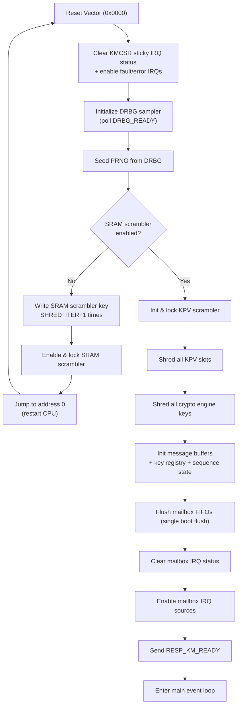

# Key Manager Application ROM

Bare-metal C/assembly firmware for the PicoRV32-based Key Manager subsystem.
Manages the full key lifecycle: generation, loading, transfer to
crypto engines (HMAC, KMAC, AES, OTBN, Adams Bridge seeds), and revocation. Also
captures the Adams Bridge ML-KEM shared key into the KPV. Communicates with the
host SEP through a structured command/response protocol over shared mailbox FIFOs.

The image lives in the KM ROM but is not only a boot loader: it is the Key
Manager's runtime until the SEP loads alternative firmware into KM SRAM and hands
over to it.

## Boot Flow



## Memory Layout

| Region | Address Range | Size | Contents |
|--------|--------------|------|----------|
| ROM | 0x0000_0000 – 0x0000_3FFF | 16KB | Boot code + constants |
| Reserved | 0x0000_4000 – 0x0000_7FFF | 16KB | Unmapped (DECERR) |
| SRAM | 0x0000_8000 – 0x0000_FFFF | 32KB | Runtime `.data`, `.bss`, main stack, IRQ stack, `rom_persist` |
| Mailbox | 0x0001_0000 – 0x0001_001F | 32B | Mailbox FIFOs |
| OTP/eFuse | 0x0001_1000 – 0x0001_1FFF | 4KB | eFuse pass-through, remapped by hardware |
| KPV | 0x0001_2000 – 0x0001_3FFF | 8KB | Key Provisioning Vault |
| KMCSR | 0x0001_4000 – 0x0001_47FF | 2KB | KM Control/Status |
| DRBG | 0x0001_5000 – 0x0001_500F | 16B | DRBG Sampler |
| OTBN | 0x0001_8000 – 0x0001_807F | 128B | OTBN key wrapper |
| AES | 0x0001_9000 – 0x0001_907F | 128B | AES key wrapper |
| KMAC | 0x0001_A000 – 0x0001_A07F | 128B | KMAC key wrapper |
| HMAC | 0x0001_B000 – 0x0001_B07F | 128B | HMAC key wrapper |
| ABR | 0x0001_C000 – 0x0001_C7FF | 2KB | ABR key wrapper |

Each peripheral window is only as wide as its register block decodes, so no
register is reachable from a second address. An address between two windows is
routed nowhere and answers DECERR; an unmapped offset inside a window reaches
its register block and answers SLVERR.

### SRAM Packing

`link/km_production.ld` packs runtime SRAM from the top down, through the shared
`link/km_sram_layout.ld`:

- `.bss` is placed at the top of SRAM.
- `.data` is placed immediately below `.bss`.
- `_stack` is set to `ADDR(.data)`, so the main stack grows downward below `.data`.
- The IRQ path uses a separate IRQ frame plus a 256-byte IRQ stack allocated in `.bss`; `crt0.s` switches `sp` to `irq_stack_top` on IRQ entry.

This means the main C stack and the IRQ stack are distinct:

- Main stack: below `.data`, grows downward toward `0x0000_8000`
- IRQ stack: inside `.bss`, near the top of SRAM

```text
0x0001_0000  +--------------------------------------+
             | .rom_persist (region 31, 1KB)        |
0x0000_FC00  +--------------------------------------+
             | .bss                                 |
             | - zero-initialized globals           |
             | - irq_frame                          |
             | - IRQ stack                          |
             |   irq_stack_top                      |
             |   grows downward within .bss         |
             +--------------------------------------+
             | .data                                |
             | - initialized globals                |
             +--------------------------------------+
             | _stack = ADDR(.data)                 |
             | main stack grows downward            |
             | toward lower SRAM addresses          |
             |                                      |
             | free SRAM / stack space              |
             |                                      |
             +--------------------------------------+
             | Base of SRAM                         |
0x0000_8000  +--------------------------------------+
```

## File Organization

### Headers (include/)

| File | Description |
|------|-------------|
| `rom_defs.h` | Memory map, version, command/response/fault enums, message header layout |
| `rom_state.h` | Global firmware state symbol declarations (`rom_prng_state`, `rom_rx_msgbuf`, `rom_tx_msgbuf`, `rom_keyreg_state`, sequence counters) |
| `rom_crc.h` | Public CRC-8/ROHC and CRC-32C APIs backed by PicoRV32 PCPI helpers |
| `rom_sha256.h` | Software SHA-256 API |
| `rom_hmac.h` | Software HMAC-SHA256 API |
| `rom_kdf.h` | Key derivation built on HMAC-SHA256 |
| `rom_secutil.h` | Side-channel/fault-hardened helpers |
| `rom_picorv32.h` | Low-level PicoRV32 helper wrappers, including custom instructions |
| `rom_prng.h` | xoshiro128++ PRNG |
| `rom_xoshiro_asm.h` | `XOSHIRO128PP_STEP` assembler macro, for the stack-less shred/handover paths |
| `rom_shuffle.h` | Fisher-Yates shuffle with bit-masked rejection sampling |
| `rom_shred.h` | Generic pseudorandom-order region shred |
| `rom_drbg.h` | DRBG hardware sampler driver |
| `rom_kpv.h` | KPV driver (scrambler, shred, read/write key, lock) |
| `rom_sideload.h` | HMAC/KMAC/AES/OTBN and Adams Bridge seed sideload drivers (dual XOR-masked shares); ML-KEM shared-key read + IRQ accessors |
| `rom_msgbuf.h` | Linear message buffer (single frame at a time, each frame at index 0) |
| `rom_mailbox.h` | Mailbox FIFO accessors |
| `rom_keyreg.h` | Key registry (handle ↔ KPV slot mapping) |
| `rom_msg_rx.h` | Incoming message handler (ordered validation) |
| `rom_msg_tx.h` | Outgoing message handler (buffer + direct FIFO) |
| `rom_cmd.h` | Command dispatch |
| `rom_boot.h` | Boot sequence (`rom_boot_init`) |
| `rom_main_step.h` | One iteration of the main event loop, callable from a test `main()` |
| `rom_keymgmt.h` | Key lifecycle operations (generate, transfer, revoke) |
| `rom_isr.h` | ISR dispatch, fault triggers, wipe handler, ABR shared-key notify flag |
| `irq_common.h` | KMCSR and mailbox IRQ register accessors |
| `rom_kmcsr.h` | KMCSR helpers: version, recoverable error, SRAM scrambler, SRAM write-lock (`rom_kmcsr_sram_lock_set`/`rom_kmcsr_sram_lock_read`), IRQ entry address/lock |
| `rom_otp.h` | OTP readout driver: life-cycle/demotion readers, dual-rail 256-bit field readers, warm-reset read-lock (`OTP_READ_LOCK`), cold-reset read-lock (`OTP_READ_LOCK_COLD`), change-status |
| `rom_persist.h` | ROM warm-persistent SRAM region (`rom_persist_t` at `0xFC00–0xFFFF`, region 31): cold-init, `sram_fw_size` accessors, write-lock helper |
| `rom_handover.h` | ROM-to-SRAM handover declarations |
| `key_manager_fw.h` | Umbrella include for the generated register collateral |

### Sources (drivers/)

| File | Description |
|------|-------------|
| `rom_boot.c` | Boot sequence (`rom_boot_init`) |
| `rom_main_step.c` | One iteration of the main event loop |
| `rom_boot_sram_restart.S` | Enable + lock the SRAM scrambler, then restart at address 0 |
| `rom_cmd.c` | Command dispatch and the command handlers |
| `rom_keymgmt.c` | Key management: generate, check, transfer, revoke |
| `rom_isr.c` | ISR entry point, KMCSR dispatch, mailbox ISR, ABR shared-key ISR, fault triggers |
| `rom_msg_rx.c` | Inbound frame processing with strict validation ordering |
| `rom_msg_tx.c` | Outbound frame construction (buffered + direct) |
| `rom_wipe.S` | SRAM shred assembly (xoshiro128++ in registers, noreturn) |
| `rom_handover.c` | ROM-to-SRAM handover: bounds check, direct confirmation, FIFO image stream, CRC-32C verify, sensitive-data locking, SRAM write-lock mask, IRQ disable + vector, PRNG seed capture |
| `rom_handover_jump.S` | Stack-less assembly handoff: scrambles entire SRAM with xoshiro128++, clears GPRs, jumps to 0x8000 (noreturn) |
| `rom_crc.c` | Public CRC-8/ROHC + CRC-32C drivers routed through PCPI update helpers |
| `rom_sha256.c` | Software SHA-256 with length/overflow hardening |
| `rom_hmac.c` | Software HMAC-SHA256 |
| `rom_kdf.c` | Key derivation built on HMAC-SHA256 |
| `rom_secutil.c` | Constant-time compare, pointer-equality check, and non-elided secure memzero |
| `rom_picorv32.c` | Low-level PicoRV32 helper wrappers and custom-instruction shims |
| `rom_prng.c` | xoshiro128++ seed + next |
| `rom_shuffle.c` | Fisher-Yates shuffle with bit pool |
| `rom_shred.c` | Generic pseudorandom-order region shred (static shuffle-order buffer) |
| `rom_drbg.c` | DRBG init, get_word, get_block |
| `rom_kpv.c` | KPV scrambler, shred, key I/O, locking |
| `rom_sideload.c` | HMAC/KMAC/AES/OTBN and Adams Bridge seed sideload |
| `rom_msgbuf.c` | Linear buffer operations |
| `rom_mailbox.c` | Mailbox FIFO accessors |
| `rom_keyreg.c` | Handle allocation, lookup, destruction |
| `rom_state.c` | Definitions for the global firmware state declared in `rom_state.h` |
| `rom_memcpy.c` | Word-aligned rom_memcpy (and memcpy alias) |
| `rom_memset.c` | Word-aligned rom_memset (and memset alias) |
| `rom_kmcsr.c` | KMCSR drivers for version, recoverable error, scrambler, IRQ entry address and lock |
| `rom_otp.c` | OTP readout driver implementation (dual-rail readers, warm read-lock triple-write, cold read-lock triple-write, change-status W1C, `rom_otp_on_change` weak hook) |
| `rom_persist.c` | ROM warm-persistent region driver: cold-init, `sram_fw_size` accessors, `rom_persist_lock()` |
| `irq_common.c` | `rom_kmcsr_irq_*` / `rom_mailbox_irq_*` IRQ path |

### Startup

| File | Description |
|------|-------------|
| `startup/crt0.s` | Reset vector, IRQ vector, BSS clear, calls `main()` |
| `src/rom_main.c` | Production entry: `rom_boot_init()`, then loop on `rom_main_step()` |

### Linker scripts (link/)

| File | Description |
|------|-------------|
| `km_production.ld` | All-in-ROM layout: vectors, code, constants and the `.data` load image in the 16 KB ROM |
| `km_sram_layout.ld` | Top-down SRAM packing, warm-persistent region, mutable firmware load limit and overflow assertions |

## Build Instructions

The `Makefile` here is self-contained. It builds `rom_main` from the sources
above and writes every output to `BUILD_DIR` (default `build/`):

```bash
cd hw/ip/key_manager/approm/prod

make                                  # rom_main.{elf,map,dis,sym,rom.hex,rom.parhex}
make KM_BOOT_WIPE=0 KM_UNREC_WIPE=0 BUILD_DIR=build/nowipe
make clean
```

`rom_main.rom.parhex` is the ROM image with parity, the form the KM ROM model
loads. `rom_main.sym` is the `nm` listing beside it.

`KM_BOOT_WIPE` and `KM_UNREC_WIPE` set the compile-time defaults of the boot and
unrecoverable-fault SRAM wipes in `drivers/rom_boot.c`; both default to 1. A
testbench that boots `rom_main` without either wipe clears them. Changing either
knob, or any compile flag, rebuilds every object in that `BUILD_DIR`.

`make` compiles in the OCAH toolchain container (`scripts/docker-run.sh
run-here`) unless `RISCV_TOOLCHAIN` points at a directory of
`riscv64-unknown-elf-*` tools whose compiler has `picolibc.specs`. A caller that
already runs inside the container uses `make build`, which compiles with the
toolchain in reach. `toolchain.mk` holds the compiler, assembler and linker flags.

## Code size optimization

The build is tuned for minimum ROM footprint:

- **Compiler:** `-Os`, `-ffreestanding`, `-fno-builtin`, `-fno-tree-loop-distribute-patterns`, `-fdata-sections`, `-ffunction-sections`, `-Wl,--gc-sections`, `-fno-unwind-tables`, `-fomit-frame-pointer`, `-flto`.
- **CRC:** Public CRC APIs use PicoRV32 PCPI custom instructions for CRC-32C word/byte updates and CRC-8/ROHC byte updates, avoiding ROM-resident CRC lookup tables in the production image.
- **Binary analysis:** Use `riscv64-unknown-elf-nm -S --size-sort` and `riscv64-unknown-elf-size -A` on `build/rom_main.elf` to inspect section and symbol sizes. `scripts/km_stack_analyze.py` bounds the worst-case ROM stack depth of an image; run it on the
production image against the ROM stack budget:

```bash
python3 scripts/km_stack_analyze.py build/rom_main.elf \
  --objdump riscv64-unknown-elf-objdump --root main --limit 0x600
```

## CRC acceleration

The public firmware entry points stay the same:

- `rom_crc32c(const uint8_t *data, uint32_t len_bytes)`
- `rom_crc8_rohc(const uint8_t *data, uint32_t len_bytes)`

Under the hood, the hot update loops use three PicoRV32 custom instructions exposed
through `rom_picorv32.c`:

- `rom_picorv32_crc32c_word_update(state, word)`
- `rom_picorv32_crc32c_byte_update(state, byte)`
- `rom_picorv32_crc8_rohc_update(state, byte)`

`rom_crc32c()` handles unaligned entry by consuming leading bytes until the buffer is
4-byte aligned, processing the aligned bulk with word updates, and finishing any tail
bytes with byte updates. `rom_crc8_rohc()` stays byte-oriented and routes every update
through the CRC-8 PCPI helper.

## Toolchain

| Setting | Value |
|---------|-------|
| Compiler | `riscv64-unknown-elf-gcc` |
| Architecture | `rv32emc` (16 registers, multiply, compressed) |
| ABI | `ilp32e` |
| Optimization | `-Os`, LTO and the size flags above |
| Warnings | `-Wall -Wextra` |
