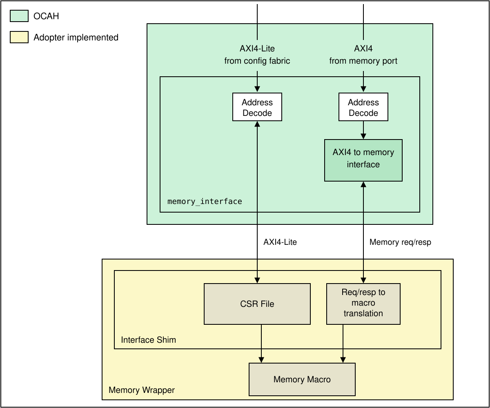

// SPDX-License-Identifier: Apache-2.0
// SPDX-FileCopyrightText: 2026 Tenstorrent USA, Inc.

= Memory Interface

This directory holds `memory_interface`, a reusable AXI4-to-memory bridge, together with
SRAM and ROM example collateral that shows how a complete memory block is assembled
around it.

== Overview

`memory_interface` is the OCAH-owned half of a memory block. It takes a system AXI4
memory port and an AXI4-Lite config port, converts the AXI4 port into a simple
request/response memory stream, and rebases both ports from system addresses to
block-local offsets. It contains no memory macro and no registers of its own.

Everything below it is adopter-owned: an _interface shim_ holding the CSR file and the
translation from the memory stream to whatever the macro expects, and the _memory macro_
itself. Together those form the memory wrapper.

The bridge is memory-agnostic. The SRAM and ROM collateral here are examples, not the
only supported shapes.

== Directory contents

[cols="1,2"]
|===
|Path |Contents

|`rtl/memory_interface.sv`
|The bridge itself.

|`rtl/examples/sram/example_sram_pkg.sv`, `rtl/examples/rom/example_rom_pkg.sv`
|Example widths and type definitions: the memory stream structs, plus AXI4, AXI4-Lite and
APB4 typedefs. Both set a 64-bit data width to match the SEP AXI bus.

|`rtl/examples/rom/generate_rom_init.py`
|Generates a VMEM initialisation file of test patterns and seeded random data for a ROM
example.

|`regs/sram_example/`, `regs/rom_example/`
|Example SystemRDL for a memory, its macro CSRs, and a wrapper address map combining the
two.

|`doc/`
|The block diagram above.
|===

The interface shim, the memory wrapper and the memory macro are not in this tree. An
adopter writes them; the packages and RDL here are the reference for what they have to
line up with.

== Build integration

`Bender.yml` lists `rtl/memory_interface.sv` and both example packages under the `sep`
target, so they compile as part of that subsystem's filelist. There is no standalone
testbench in this directory.

== Ports and parameters

The module has one fixed port set: struct AXI4 for the memory
port, and struct AXI4-Lite for the config port on both its inbound and outbound side.

[source,systemverilog]
----
input  logic            clk_i,
input  logic            rst_ni,

// AXI4 memory port from the system
input  mem_axi_req_t    mem_axi_req_i,
output mem_axi_resp_t   mem_axi_resp_o,

// AXI4-Lite config port from the system
input  csr_axil_req_t   csr_in_axil_req_i,
output csr_axil_resp_t  csr_in_axil_resp_o,

// AXI4-Lite config port out to the shim's CSR file
output csr_axil_req_t   csr_out_axil_req_o,
input  csr_axil_resp_t  csr_out_axil_resp_i,

// Memory stream out to the shim
output mem_req_t        mem_req_o,
input  mem_rsp_t        mem_rsp_i,
output                  busy_o
----

`busy_o` asserts while an AXI request is in flight.

Every parameter defaults to `0` or `logic`, so all of them have to be overridden.

[cols="1,1,2"]
|===
|Parameter |Constraint |Purpose

|`MEM_ADDR_WIDTH`
|`<= 64`
|Memory port address width. Must match the address fields of `mem_axi_req_t`.

|`MEM_DATA_WIDTH`
|`32`, `64`, `128`, `256`, `512` or `1024`
|Memory port data width. Must match the data and strobe fields of `mem_axi_req_t`.

|`MEM_ID_WIDTH`
|—
|AXI ID width. Must match the `id` fields of `mem_axi_req_t` and `mem_axi_resp_t`.

|`mem_axi_req_t`, `mem_axi_resp_t`
|—
|AXI4 request/response structs, from `axi/typedef.svh`.

|`mem_req_t`, `mem_rsp_t`
|—
|Memory stream structs; see <<memory-stream>>.

|`CSR_ADDR_WIDTH`
|`<= 64`
|Config port address width. Must match the address fields of `csr_axil_req_t`.

|`CSR_DATA_WIDTH`
|`32` or `64`
|Config port data width. Must match the data and strobe fields of `csr_axil_req_t`.

|`csr_axil_req_t`, `csr_axil_resp_t`
|—
|AXI4-Lite request/response structs. The same types serve both the inbound and the
outbound side, so the shim's CSR file sees the system port's widths.

|`MEM_BASE_ADDR`
|Aligned to `MEM_DATA_WIDTH/8`
|Base of the memory region in system address space.

|`CSR_BASE_ADDR`
|Aligned to `CSR_DATA_WIDTH/8`
|Base of the CSR region in system address space.

|`NUM_BANKS`
|`1`
|Bank count passed to `axi_to_mem`. The assertion admits `1` to `16`, but `mem_req_t` and
`mem_rsp_t` carry a single bank's signals, so only `1` connects correctly.
|===

== Address translation

Both ports are rebased by unsigned subtraction: the memory port's `aw.addr` and `ar.addr`
lose `MEM_BASE_ADDR`, and the config port's lose `CSR_BASE_ADDR`.

The module assumes the address has already been decoded to this block. It does no range
checking and never generates an error response, so an address below its base wraps.
Apart from that subtraction the config port is a pass-through, with
`csr_in_axil_resp_o` driven straight from `csr_out_axil_resp_i`.

[[memory-stream]]
== Memory stream protocol

`mem_req_t` and `mem_rsp_t` are supplied by the integrator; the example packages define
them as:

[source,systemverilog]
----
typedef struct packed {
  logic           req;      // Request valid
  mem_addr_t      addr;     // Byte address, aligned to MEM_DATA_WIDTH/8
  mem_data_t      wdata;    // Write data
  mem_strb_t      strb;     // Byte strobe
  axi_pkg::atop_t atop;     // Atomic operation type
  logic           wenable;  // Write enable
} mem_req_t;

typedef struct packed {
  logic           gnt;      // Memory is ready to accept the request
  logic           rvalid;   // Response valid
  mem_data_t      rdata;    // Response data
} mem_rsp_t;
----

Three constraints the shim has to respect:

* `addr` is a *byte* address with its low `$clog2(MEM_DATA_WIDTH/8)` bits cleared. A macro
  indexed by words needs the shim to shift it right by that amount.
* `rvalid` is expected for *every* request, write as well as read, so the shim has to
  acknowledge writes too. `rdata` is response data rather than read data for the same
  reason.
* The `axi_to_mem` instance fixes `BufDepth` at `1`, which upstream documents as the
  memory's response latency. A macro that answers later than one cycle after the grant
  needs that value raised.

== Parameter validation

Parameter ranges, base address alignment and the struct field widths are checked with
`OCAH_ASSERT_STATIC`, so a bad parameter, or a mismatch between a parameter and the struct
it describes, fails elaboration in simulation, lint and synthesis alike.

== Register examples

The RDL under `regs/` is a specification sketch, not generated collateral. It sits in
`regs/<example>/` rather than `regs/<block>.rdl`, so the repo's register flow does not
discover it and `make regen-regs` emits nothing for this block. Copy it into your own
block's `regs/` tree to generate from it, or ignore it and describe your registers however
your flow prefers.

Each example is three files: the memory itself (`mem`, defaulting to 1024 entries of
32 bits), a macro CSR map (a status register with maskable level interrupts for busy,
error and alert, plus a scratch register), and a wrapper address map placing the memory at
offset `0x0` and the CSRs at `0x2000`.

== ROM initialisation

`generate_rom_init.py` writes a VMEM file to seed a ROM example:

[source,bash]
----
python3 rtl/examples/rom/generate_rom_init.py [output_file] \
    [--entries N] [--width W] [--seed S]
----

It defaults to `example_rom_init.vmem`, 1024 entries of 32 bits, and seed 42. The output
is known patterns at the start, seeded random data through the middle, and end markers at
the top of the range, so it is reproducible for a given seed.
