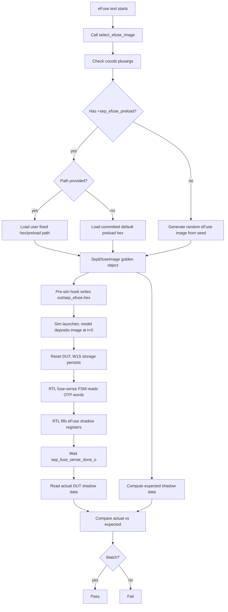

<!-- SPDX-License-Identifier: Apache-2.0 -->
# SEP OSS DV

Open-source DV environment for the SEP (Security Processor) subsystem. DUT =
`sep_wrapper` (`hw/.bos/wrapper/sep/`), which instantiates the bare `sep`
core plus its IP integration (real memory macros, the generic eFuse model, and
the OpenTitan SPI mux). Flow = cocotb/PyUVM on Verilator and VCS, driven by
`dv/oss/tools/dv/run_dv.py` (`--dut sep`). The environment is kept self-contained
under this tree so the build, tests, shims, and docs are easy to review and reuse.

## Layout

```
hw/sys/sep/dv/
├── cocotb/              # flow-first: cocotb owns env + stimulus + tests
│   ├── assertions/      #   (cocotb Python checkers — empty for now)
│   ├── env/             #   PyUVM env: agents, scoreboards, config
│   ├── seq_lib/         #   sequences (scenarios)
│   └── tests/           #   @pyuvm.test() entries
│                        # uvm/  — future sibling, not created
├── cov/                 # cov/config/<tool>/ + cov/sv/   (scaffold)
├── docs/                # feasibility / bring-up notes
├── fw/                  # OSS-owned firmware (build/ drivers/ tests/) — see fw/README.md
├── shims/               # SEP-local behavioral sim-models (kept, accepted shims)
│   ├── prim/            #   prim_sync2 → prim_flop_2sync override
│   ├── cpu/             #   sep_cpu_stub (no_cpu build: LSU demux, no VeeR)
│   ├── crypto/          #   abr_wrapper_key_reg_stub (Verilator ABR CSR shim)
│   └── analog/          #   entropy_ring_oscillator
├── tb/                  # DUT-only top + helper RTL
│   ├── tb_top.sv        #   module sep_uvm_top (wraps sep_wrapper) + tb_backdoor_mem
│   ├── sep_outbound_mbx.sv  # outbound mailbox responder + console/PASS monitor
│   └── interfaces/      #   (SV interfaces — empty for now)
├── testlists/           # native TOML testlists
├── sep_sim_cfg.toml     # block build/filelist manifest, run modes, tool knobs
└── README.md
```

## Two Run Modes

The run mode selects who owns the CPU master buses:

**No-CPU AXI** (`run_modes.no_cpu`, tag `smoke`) — the CPU is held off
(`mpc_reset_run_req=0`) and a cocotbext-axi `AxiMaster` is force-spliced onto the
CPU LSU bus (`u_dut.sep_cpu.lsu_xbar_axi_req_o`, bridged to `s_axi_*`). Tests:
- `sep_axi_smoke_test` — read `sep_cpu_ctrl.CLOCK_GATE_CTRL` + write/readback RW regs.
- `sep_address_map_test` — field-aware `sep_cpu_ctrl` sweep + a SEP-local fabric
  walk (ported from OCAH `sep_reg_walk_seq`) across the LSU-reachable, OSS-clean
  blocks (DMA, WDT, reset_ctrl, OTBN/AES/HMAC/KMAC, CSRNG/EDN/entropy, lifecycle,
  KM/AXIL mailbox, eFuse shadow, alias/output-remap, OT SPI host).

**CPU firmware boot** (`run_modes.cpu`, tag `boot`) — `+cpu_boot` runs the
full-CPU build, so the core owns its buses and runs firmware from the wrapper's
real TCM macros, backdoor-loaded by `tb_backdoor_mem` in `tb/tb_top.sv`:
- `sep_hello_world_test` — backdoor-loads the OSS `fw/tests/hello_world` image into
  ICCM/DCCM, passes `rst_vec=0xC0000000` to `tb_top.sv`, which programs the EL2
  reset-vector TDR through JTAG before reset releases, and sets
  `mpc_reset_run_req=1`. The test boots VeeR EL2 and checks PC advance
  (`sep_cpu_trace`) plus the firmware banner and PASS magic on the outbound
  mailbox (`tb/sep_outbound_mbx.sv`).
- `sep_rom_non_secure_boot_test` — OSS port of the internal ROM non-secure boot
  test (target `rom_boot`). Boots VeeR EL2 from the **real production Boot ROM**
  (`fw/bootcode`, at ROM_BASE 0x10040000) and runs the full non-secure boot: the
  ROM reads the manifest, validates it (real SHA256), DMA-copies the `bl1_pass_test`
  BL1 to SRAM, jumps, and BL1 signals PASS. SPI is stubbed (the OSS `sep` has only
  the OpenTitan Quad `spi_host`, not the Cadence xSPI); instead a behavioral SMC
  responder (`axi_sim_mem`, `SEP_SMC_MEM_MODEL`) serves the SMC scratch regs +
  the manifest+BL1 image from SMC memory, so the ROM takes its non-SPI (SMC-SRAM)
  manifest path. A TEST_DEV eFuse image satisfies the lifecycle check. Checks: EL2
  PC-advance + `fw_done && fw_pass` (BL1 `0xA5A55A5A`→`0xCAFEBABE` mailbox magic);
  the ROM/BL1 console (SCRATCH2 virt-console) is decoded to the log. See
  `dv/oss/docs/sep-rom-non-secure-boot-design.md` and `-handoff.md`.

Boot/reset invariant: `ext_boot_seq_done_i=1`. Fuse-sense policy is testcase
metadata, not a run mode: non-eFuse tests usually add `+skip_fuse_sense` in
their testlist `plusargs` to bypass the slow sense path. Real eFuse tests omit
that bypass and use the generic eFuse model inside `sep_wrapper`
(`hw/.bos/models/efuse/`) to let the RTL fuse-sense FSM finish.

### eFuse Content Selection

All eFuse tests select their contents through `sep_base_test.select_efuse_image()`.
The shared helper uses `+sep_efuse_preload` as the selector for fixed contents;
without that plusarg, it generates constrained-random eFuse contents from the
test seed.

- `+sep_efuse_preload=<path>` loads a specific fixed `.hex`/`.preload` image.
- `+sep_efuse_preload` with no path loads the committed default preload image.
- No `+sep_efuse_preload` generates a random image from the test seed.
- `+sep_efuse_hex=<path>` is a special model-file override; normal eFuse tests use
  the generated `out/sep_efuse.hex` path.

The selected `SepEfuseImage` is the single source of truth. Because the generic
eFuse model deposits its image once at t=0 (not on every reset), the per-seed image
is staged BEFORE the simulator launches by the pre-sim hook
(`cocotb/dv_sim_prestage.py`, driven from `run_dv.py`), which writes
`out/sep_efuse.hex`; the model `$readmemh`s it at t=0 and its persistent W1S storage
retains programmed bits across resets. The same `SepEfuseImage` object computes the
expected shadow-register data for comparison.



### eFuse tests and readout

Two tests run the sense flow above. **Readout method and image source are
independent axes** — backdoor is the default readout, exactly one test uses the
AXI front door, and either readout can run any source:

- `sep_efuse_sense_test` — **backdoor** shadow compare (the default), reading the
  sensed array directly from the top-level `efuse_shadow_probe_o` port. Enrolled
  with `+sep_efuse_preload` (committed default preload).
- `sep_efuse_image_test` — the **one** test that reads the shadow over the **AXI
  front door** (exercising the real software read datapath), plus a resense cycle
  with a fresh image. Runs the default (random) source.

## Memory / eFuse / SPI models (inside `sep_wrapper`)

The memory, eFuse, and SPI-mux integration is now RTL inside `sep_wrapper`
(`hw/.bos/wrapper/sep/sep_ip_integration.sv`), not TB responders. The six
bare-`sep` behavioral responders that used to back these ports were retired when
the DUT moved to `sep_wrapper` (see `docs/SEP_OSS_WRAPPER_MIGRATION_PLAN.md`):

- **Memory macros** — real `prim_ram_1p` / `prim_rom` / EL2 TCM (`ram_16384x39`)
  macros. They have no runtime init, so `tb_backdoor_mem` (in `tb/tb_top.sv`)
  pre-fills correct power-up patterns (KM ROM NOP+parity, KM SRAM zero+valid
  parity, OTBN SECDED-valid zero) and backdoor-loads images: boot-ROM / SEP-SRAM /
  KM-ROM via the `+sep_boot_rom_hex` / `+sep_sram_hex` / `+km_rom_hex` plusargs
  (with a CWD-default fallback to `sep_boot_rom.hex` / `sep_sram.hex` /
  `km_rom.parhex`), and the ICCM/DCCM firmware on `tcm_load_i` (de-interleaved with
  per-word Hsiao ECC). These backdoor writes require the target arrays to be public
  under Verilator (`sep_public_scope.vlt`: `prim_ram_1p.mem`, `prim_rom.mem`,
  `ram_16384x39.ram_core`).
- **Generic eFuse model** (`hw/.bos/models/efuse/`) — backs the eFuse
  bank-control and fuse-command datapath so fuse sense runs without Samsung OTP
  macros. Self-preloads its OTP image at t=0 via `+sep_efuse_hex`
  (default `out/sep_efuse.hex`, staged by the pre-sim hook) and persists W1S
  programs across reset. It can inject opt-in OTP program failures with
  `+sep_efuse_prog_fail_count`, `+sep_efuse_prog_fail_percent`, and
  `+sep_efuse_prog_fail_seed`.
- **OpenTitan SPI mux/host** — internal to the wrapper; its pads come out as scalar
  cocotb ports in `tb_top.sv` so tests can attach the Apache-2.0 `OcahSpiFlash`
  Python BFM. Flash tests clear `SPI_MUX_CTRL.cs_force_high` (resets to 1) before
  driving transactions.

Kept TB shims (`shims/`): the `sep_cpu` stub (no_cpu build), `prim_sync2`, the ABR
key-CSR Verilator stub, and the entropy ring-oscillator. `tb/sep_outbound_mbx.sv`
(the fw console / PASS monitor) is also kept — it services a real wrapper output
port, not a memory model.

## Run

```bash
# One-time setup: generate the VeeR EL2 config snapshot. It is gitignored (a
# generated artifact), so a fresh clone has no
# vendor/chipsalliance/Cores-VeeR-EL2/overlay/snapshots/sep/. Without it the build fails
# with `Define or directive not defined: '`TEC_RV_ICG'` in
# vendor/chipsalliance/Cores-VeeR-EL2/upstream/design/lib/beh_lib.sv. Needs `perl`; the
# vendored vendor/chipsalliance/Cores-VeeR-EL2/ tree must be present first.
sh tools/sep_el2_config.sh
# verify: grep TEC_RV_ICG vendor/chipsalliance/Cores-VeeR-EL2/overlay/snapshots/sep/common_defines.vh  -> `define TEC_RV_ICG clockhdr

# Build the OSS firmware first (RISC-V GCC on PATH; no picolibc) — only for boot:
make -C dv/oss/hw/sys/sep/dv/fw/tests/hello_world

# For sep_rom_non_secure_boot_test, build the Boot ROM + manifest + BL1 image.
# This compiles bl1_pass_test (fw/tests/bl1_pass_test) and packs it with the
# vendored tt-boot-manifest packer (fw/bootcode/tools) -> build/smc_mem.hex,
# entirely from source (no internal prebuilt blob). Packer needs Python
# 'cryptography' + 'ruamel.yaml' (pip3 install --user cryptography ruamel.yaml).
make -C dv/oss/hw/sys/sep/dv/fw/bootcode

# Then run (model rebuilds on SV/config change; python-only changes reuse it).
# `all` is the maximum group; tags select subsets.
PY=dv/oss/tools/dv/run_dv.py
python3 $PY --dut sep --items sep_axi_smoke_test sep_address_map_test sep_hello_world_test --stage flist --stage sim
python3 $PY --dut sep --items all --tag smoke --stage sim  # no-CPU smoke subset
python3 $PY --dut sep --items all --tag boot  --stage sim  # firmware-boot subset
python3 $PY --dut sep --items all --stage sim --regress    # all SEP OSS tests, fresh seed per leaf
```

The cocotb sim stage runs in `run_dv.py`'s own interpreter, so launch it from a
Python 3.11+ env with the OSS DV BFM package installed
(`pip install -e dv/oss/hw/common/dv` → cocotb + pyuvm + cocotbext-axi), Verilator on
PATH, and a C++20 toolchain (g++ ≥10, for Verilator `--timing`/`-fcoroutines`;
e.g. `source /opt/rh/gcc-toolset-11/enable`) for the model build. The default
RHEL-8 g++ 8.5 is too old and fails with `unrecognized command line option
'-fcoroutines'`.

Regression/group runs assign fresh random seeds per simulation leaf without
changing the Verilator build. For a randomized test that should run multiple
seeds in one regression, set `reseed = N` in that test's TOML entry. Reproduce a
single failing leaf with `--stage sim --seed N`.

## OSS hygiene

The bender filelist uses targets `["sep", "sep_el2"]` only — never `"simulation"`
(it pulls Cadence + Samsung padring). FIXME(transition): the licensed Cadence SPI
wrapper is dropped via `build.exclude_files` until it is absent from the OSS
checkout upstream. Verify vendor-clean with
`dv/oss/tools/dv/check_no_vendor_paths.py`. PASS/FAIL requires positive
evidence from `results.xml` — a clean simulator exit alone is not enough.
