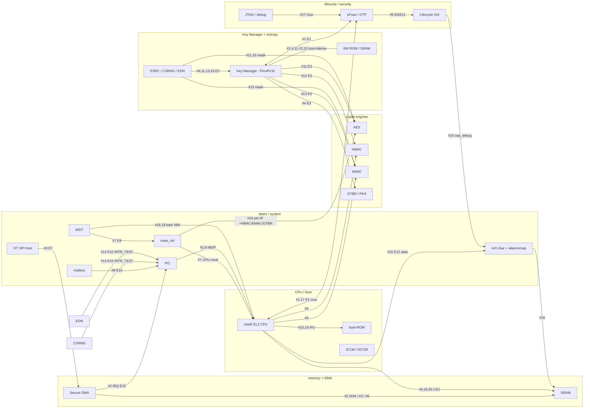

<!-- SPDX-License-Identifier: Apache-2.0 -->
# SEP OSS VPLAN — Phase 1 (smoke + TOP-20): selection, coverage, and port readiness

> **Phase 1 — COMPLETE.** This is the density-first compression plan: the smoke/bring-up
> suite plus the cumulative TOP-5 ⊂ TOP-10 ⊂ TOP-20 representative ports (31-test baseline).
> Phase-2 breadth-first basic-feature planning (toward 100+ tests, ≥60% of OCAH basic
> intent) lives in `SEP_OSS_VPLAN_PHASE2.md` + `SEP_OSS_VPLAN_PHASE2_DETAIL.txt`. The
> creation rules for both phases are in `VPLAN_CREATION_RULES.md`.

> **DUT-MIGRATION NOTE — 2026-07-18 (sep_wrapper).** Part B below and the per-test
> "responder" references were written for the bare-`sep` DUT + TB behavioral responders,
> which have been **RETIRED**. The DUT is now `sep_wrapper` (real `prim_ram_1p`/`prim_rom`/
> EL2 TCM macros + generic `efuse_bank_model` + OpenTitan SPI mux); memory content is
> supplied by `tb_backdoor_mem` in `tb_top.sv` and eFuse by the model's RTL preload
> (+ a pre-sim `dv_sim_prestage.py` image stage). Read "responder" in the per-test
> evidence and in Part B as the **historical** infra that produced that evidence — the
> tests and their checks are unchanged; only the memory/eFuse backing moved from TB
> responders to the real macros/model. See `SEP_OSS_WRAPPER_MIGRATION_PLAN.md`.

> **OCAH main-sync — 2026-07-15 (#3711 SEP Local/Global Alias remap cleanup).**
> Main moved `SEP_LOCAL_BASE_ADDR` reset `0xC000_0000 → 0xD000_0000` and made the CPU
> local-alias window a fixed 768 MiB (`sep_pkg::SEP_LOCAL_ALIAS_REGION_SIZE`, target
> `SEP_LOCAL_ALIAS_REGION_BASE = 0x1000_0000`; the `SEP_REGION_SIZE` CSR no longer sizes
> it). Two Phase-1 tests were re-synced: `sep_cpu_ifu_lsu_alias_remap_matrix_test` (fw
> now programs `0xD000_0000`; old code translated the alias to `0x2000_0308` and wedged
> the CPU) and `sep_address_map_test` (`SEP_LOCAL_BASE_ADDR` reset READ_CHECK
> `0xC000_0000 → 0xD000_0000`, which had scoreboard-FAILed). Both failures were
> reproduced then confirmed green on VCS. A renamed RTL file
> (`axi_local_alias_remap.sv → axi_window_remap.sv`) also required a fresh flist for
> both build variants. See the Phase-2 doc's main-sync note for the FAB-2 inbound-filter
> ownership hardening landed in the same PR.

The OSS SEP verification plan: pull the **fewest tests for the most coverage**, where every selected
behavior already exists in the OCAH SEP golden DV suite (the trusted reference), and track what DV-infra
each needs to stand up on the bare `sep` OSS DUT.

The executable inventory is defined by the public TOML testlists and source
trees. This plan selects **20** scenarios in three **cumulative** stages:
**TOP-5 ⊂ TOP-10 ⊂ TOP-20** (run the 5 first, expand to 10, then 20). Cross-module / superset tests are
preferred, and firmware tests are weighted heavily because they exercise the real CPU→fabric→IP path that
register-only tests cannot reach.

This doc has two halves: **(A) the selection** (which tests, why) and **(B) port readiness** (which
behavioral responders each test needs, what is built, what is blocked). They are different kinds of work —
*test selection* vs *DV-infra* — kept in one place for traceability.

---

# Part A — selection

## Hard constraint — no licensed IP

Every selected test must run on the bare `sep` OSS DUT, which **excludes** the Cadence xSPI controller,
the DWC/Synopsys TRNG, and the Samsung OTP macro. A licensed-IP audit (reading each source) confirmed all
20 entries are **OSS-clean**:
- **SPI** uses the OpenTitan SPI host (`sep_ot_spi_wrap`, ~`0x10B0_0000`), never the Cadence xSPI path
  (`0x2000_xxxx`/`0x3000_xxxx` XIP, `OCH_SEP_CDNS_SPI_CTRL_*`).
- **KM / DRBG entropy** comes from the OpenTitan entropy stack (`entropy_source`/CSRNG/**EDN**, via
  `chk5_edn_enable=1`), never the DWC TRNG (`ext_trng_*`, tied off in bare `sep`).
- **eFuse** tests touch only the eFuse CSR + shadow-register path (OSS-clean), never the Samsung OTP
  program/sense macro.

The one Cadence-xSPI test in the first draft (`firmware_spi_dma_test`) was **dropped and replaced** by the
OpenTitan-SPI DMA test (now `#3`); the alias/output-remap coverage it carried moved to `#16`.

## Coverage universe

**Blocks (21):** CPU/VeeR, boot-ROM, SRAM, TCM/DCCM, AES, HMAC, KMAC, OTBN/PKA, Key Manager (KM),
DRBG/ESRC/EDN/TRNG, eFuse/OTP, Lifecycle ctrl (LCC), Secure DMA, WDT, mailbox (KM + AXIL),
PIC/interrupts, reset_ctrl, SPI (OpenTitan), AXI fabric/xbar, inbound/outbound filter +
alias/output remap, JTAG/debug.

**Interconnect edges (E1–E13):**
E1 eFuse↔KM · E2 DRBG/EDN→KM · E3 KM→{AES,HMAC,KMAC,OTBN} sideload · E4/E11 eFuse lc_state→LCC ·
E7 DMA→SRAM/DCCM (+inline-SHA) · E8 CPU/DMA→target contention · E9 WDT→reset_ctrl→CPU ·
E10 IP-IRQ→aggregator→PIC→CPU · E12 alias/output-remap→egress · E13 reset/JTAG→crypto.
(E5 lc_state→KM-KDF = **BLOCKED**, no real test; E6 KM-scrambler→SRAM = **N/A**, KM-internal.)

## TIER 1 — TOP-5 (4 FW + 1 UVM; widest density)

| # | OCAH test (verified) | Type | Blocks | Edges | Why |
|---|---|---|---|---|---|
| 1 | `sep_efuse_km_axil_cpu_mux_coexist_test` (C-dir `sep_km_efuse_coexist_test`) | FW | CPU/EL2 + **KM-CPU** + eFuse/OTP + KM + mailbox(KM) + reset_ctrl | E1, mailbox→KM, reset→KM | Widest superset: two real CPUs contend on eFuse via the KM↔SEP mailbox; EL2 releases KM from reset. |
| 2 | `sep_dma_hash_test` (C-dir `dma_hash_test`) | FW | CPU + Secure DMA + SRAM + TCM/DCCM + inline-SHA + PIC | E7, E10 | Real CPU→DMA→memory with inline hash + interrupt delivery to ISR. |
| 3 | `sep_spi_ot_dma_rx_test` (C-dir `spi_ot_dma_rx_test`) | FW | CPU + DMA + SPI (OpenTitan host) + SRAM + fabric + lsio_trigger | E7 (SPI-FIFO→DMA), E10 | OpenTitan-SPI RX FIFO drained by DMA over the HW lsio_trigger — SPI + DMA + fabric + memory, fully OSS-clean. (Replaces the Cadence-xSPI `firmware_spi_dma_test`.) |
| 4 | `sep_km_otbn_sideload_kat_test` | UVM (`uvm_tests/subsystem/`) | KM + OTBN/PKA + DRBG/EDN | E3 (KM→OTBN), E2 | Widest single sideload KAT: real DRBG→KM→OTBN key chain (security headline). |
| 5 | `sep_efuse_lcc_lc_state_stitch_test` | UVM (`uvm_tests/subsystem/`) | eFuse/OTP + LCC + feat_ctrl/inbound-filter | E4/E11 | Only edge that brings LCC + lifecycle decode into the set. |

*Leaves uncovered (→ TOP-10/20):* boot-ROM, AES/HMAC/KMAC engines, WDT, reset→CPU, mailbox→PIC→CPU, DMA↔CPU contention, alias/output-remap, JTAG.

## TIER 2 — TOP-10 (= TOP-5 + 5)

| # | OCAH test | Type | Adds | Edges |
|---|---|---|---|---|
| 6 | `sep_dma_cpu_contention_test` (C-dir `dma_cpu_contention_test`) | FW | CPU+DMA concurrent at shared SRAM (only true contention) | E8 |
| 7 | `sep_clock_uvm_wdt_rst_input_reset_path_test` | UVM (subsystem) | WDT + reset_ctrl + CPU-reset isolation | E9 |
| 8 | `sep_mailbox_plic_test` | FW | mailbox(AXIL)→PIC→**CPU MEIP→ISR** (UVM cannot reach this) | completes E10 to CPU |
| 9 | `sep_hmac_kmac_cpu_crypto_smoke_test` (combined from C-dirs `hmac_test`, `kmac_test`) | FW | HMAC + KMAC engines via real CPU path | engine datapath |
| 10 | `sep_rom_sanity_test` (C-dir `rom_sanity_test`) | FW | boot-ROM IFU fetch/execute | CPU IFU→ROM |

## TIER 3 — TOP-20 (= TOP-10 + 10)

| # | OCAH test | Type | Adds | Edges |
|---|---|---|---|---|
| 11 | `sep_km_aes_sideload_kat_test` | UVM | AES via DRBG→KM→AES | E3 (KM→AES), E2 |
| 12 | `sep_km_hmac_sideload_kat_test` | UVM | HMAC sideload consume | E3 (KM→HMAC) |
| 13 | `sep_km_kmac_sideload_kat_test` | UVM | KMAC sideload consume | E3 (KM→KMAC) |
| 14 | `sep_irq_ip_to_aggregator_test` | UVM | real CSRNG/EDN INTR_TEST -> sep_interrupts aggregator | **E10** breadth |
| 15 | `sep_drbg_real_sink_multi_km_aes_test` | UVM (`uvm_tests/drbg/`) | DRBG/ESRC/EDN entropy explicit | E2 (multi-rand) |
| 16 | `sep_cpu_ifu_lsu_alias_remap_matrix_test` | UVM (`uvm_tests/fabric/`) | CPU IFU/LSU through the alias/output-remap matrix (fabric) | **E12** (alias/output remap egress) |
| 17 | `sep_efuse_jtag_axil_el2_cpu_mux_test` (C-dir `sep_efuse_jtag_el2_cpu_mux_test`) | FW | JTAG/debug + eFuse AXIL mux arbitration | E13-adjacent |
| 18 | `sep_nmi_sanity_test` (C-dir `nmi_sanity_test`) | FW | NMI mechanism + WDT bark | NMI→CPU |
| 19 | `sep_reset_wdt_sanity_test` (combined from `sep_reset_ctrl_csr_test`, `sep_wdt_sanity_test`) | FW | reset_ctrl CSRs + WDT bark/bite/pet | WDT-bark→NMI |
| 20 | `sep_lcc_uvm_inbound_filter_gating_test` | UVM | LCC feat_ctrl.sep_debug -> inbound-filter skip + external AXI allow/block | inbound filter security |

## Testlist / Tracker Ownership

The local testlist category is the runlib entry point; the GitHub parent is the
Project 335 tracker bucket. They usually match. When they differ, the local
category reflects required execution infrastructure, while the tracker parent
reflects the coverage owner.

| Test | GitHub issue | Local testlist | GitHub parent | Run mode |
|---|---|---|---|---|
| `sep_axi_smoke_test` | #3097 | `system.toml` | `system` | `no_cpu` |
| `sep_address_map_test` | #3098 | `system.toml` | `system` | `no_cpu` |
| `sep_hello_world_test` | #3099 | `cpu.toml` | `cpu` | `cpu` |
| `sep_boot_rom_smoke_test` | #3101 | `memory.toml` | `memory` | `cpu` |
| `sep_sram_smoke_test` | #3102 | `memory.toml` | `memory` | `no_cpu` |
| `sep_km_mem_smoke_test` | #3103 | `km.toml` | `km` | `no_cpu` |
| `sep_otbn_mem_smoke_test` | #3104 | `crypto.toml` | `crypto` | `no_cpu` |
| `sep_efuse_sense_test` | #3105 | `efuse_lcc.toml` | `efuse_lcc` | `no_cpu` |
| `sep_efuse_image_test` | #3106 | `efuse_lcc.toml` | `efuse_lcc` | `no_cpu` |
| `sep_spi_flash_jedec_smoke_test` | #3108 | `spi.toml` | `spi` | `no_cpu` |
| `sep_efuse_lcc_lc_state_stitch_test` | #3107 | `efuse_lcc.toml` | `efuse_lcc` | `no_cpu` |
| `sep_dma_hash_test` | #3100 | `cpu.toml` | `cpu` | `cpu` |
| `sep_mailbox_plic_test` | #3114 | `cpu.toml` | `cpu` | `cpu` |
| `sep_dma_cpu_contention_test` | #3112 | `system.toml` | `system` | `cpu` |
| `sep_clock_uvm_wdt_rst_input_reset_path_test` | #3113 | `system.toml` | `system` | `no_cpu` |
| `sep_spi_ot_dma_rx_test` | #3110 | `spi.toml` | `spi` | `cpu` |
| `sep_esrc_e2e_smoke_test` | #3141 | `crypto.toml` | `crypto` | `no_cpu` |
| `sep_efuse_km_axil_cpu_mux_coexist_test` | #3109 | `km.toml` | `efuse_lcc` | `cpu` |
| `sep_km_otbn_sideload_kat_test` | #3111 | `km.toml` | `km` | `no_cpu` |
| `sep_hmac_kmac_cpu_crypto_smoke_test` | #3115 | `crypto.toml` | `crypto` | `cpu` |
| `sep_rom_sanity_test` | #3116 | `memory.toml` | `memory` | `cpu` |
| `sep_km_aes_sideload_kat_test` | #3117 | target `km.toml` | `km` | `no_cpu` |
| `sep_km_hmac_sideload_kat_test` | #3118 | target `km.toml` | `km` | `no_cpu` |
| `sep_km_kmac_sideload_kat_test` | #3119 | target `km.toml` | `km` | `no_cpu` |
| `sep_irq_ip_to_aggregator_test` | #3133 | target `system.toml` | `system` | `no_cpu` |
| `sep_drbg_real_sink_multi_km_aes_test` | #3121 | target `crypto.toml` | `crypto` | `no_cpu` |
| `sep_cpu_ifu_lsu_alias_remap_matrix_test` | #3122 | `cpu.toml` | `cpu` | `cpu` |
| `sep_efuse_jtag_axil_el2_cpu_mux_test` | #3123 | target `efuse_lcc.toml` | `efuse_lcc` | `cpu` |
| `sep_nmi_sanity_test` | #3124 | `cpu.toml` | `cpu` | `cpu` |
| `sep_reset_wdt_sanity_test` | #3125 | target `system.toml` | `system` | `cpu` |
| `sep_lcc_uvm_inbound_filter_gating_test` | #3134 | target `system.toml` | `system` | `no_cpu` |

Phase-2 CPU-complex follow-ons are tracked separately under CPU parent #3091 and
Project 335: `sep_cpu_dbg_reset_independence_test` (#3218),
`sep_pic_irq_source_map_delivery_test` (#3219), and
`sep_warm_cold_reset_scratch_test` (#3220). They are VPLAN/planned items with
unchecked checker boxes until implemented and proven by kept logs.

## Checker contracts before implementation

Every selected testcase issue carries a `## Checkers` checklist. These are the
pre-implementation contracts: do not mark a testcase Done until the kept log has
positive evidence for every checker box. If the test implements a check but the
log does not name the proof, add positive-evidence logging before marking `[x]`.

| Test | Required evidence before Done |
|---|---|
| `sep_address_map_test` | **DONE (Verilator merge-gate proven; VCS strengthen green).** Full `sep_cpu_ctrl` reset-value sweep; hw-driven/non-deterministic registers are readable with OKAY response; pure-RW registers write/read/restore; write-only timeout registers accept benign writes; SEP-local fabric walk reaches one readable CSR per block; scoreboard has nonzero checks and 0 errors. VCS strengthen evidence (`20260624_152734__vcs`): `CHK-REFCNT-READ PASS` proves both 64-bit REFERENCE_COUNTER words are frontdoor-readable; `CHK-BASEADDR-RW PASS` proves 3 SEP base/size CSRs (`SEP_GLOBAL_BASE_ADDR`, `SEP_LOCAL_BASE_ADDR`, `SEP_REGION_SIZE`) write->readback->restore; scoreboard 82 checks (41 value-verified), 0 errors; AXI monitor 60 R beats + 22 B responses, 0 errors; `TESTS=1 PASS=1`. Accepted delta: REFERENCE_COUNTER advance is not asserted because `sep_system_csr` ties the counter sample-done pulse low, so the latched CSR value is not architecturally expected to advance in the bare-SEP build. SEP_STRAPS non-zero readback remains infra-gated (`sep_straps_i` tied 0 in `tb_top`). |
| `sep_efuse_km_axil_cpu_mux_coexist_test` | Real eFuse sense and CHIPLET_UID image match; EL2 banner/PASS; KM READY/EL2 GO handshake; host loop reaches 512; `bad_uid==0`; KM tags/order correct; payload monotonic; KM progress `changes>0`. |
| `sep_efuse_lcc_lc_state_stitch_test` | **DONE (Verilator merge-gate proven; VCS strengthen green).** Real eFuse sense; each LC_STATE step is programmed through `EFUSE_PROGRAM_CTRL`; RMA token-gated program steps perform the matching token operation first; cold reset/resense updates the sensed shadow; LC_STATE and LCC `FEAT_CTRL` match the Python golden after each state. The testlist intentionally enables seeded 30% physical OTP program-failure injection (`+sep_efuse_prog_fail_percent=30`, `+sep_efuse_prog_fail_seed=3`). VCS strengthen evidence (`20260625_015445__vcs`): responder injected two physical program failures at OTP bit 66; sequence observed `program_status` error twice, cleared/retried twice, then logged `CHK-OTP-RETRY PASS`; scoreboard 70 checks (12 value-verified), 0 errors; AXI monitor 26 R beats + 44 B responses, 0 errors; `TESTS=1 PASS=1`. |
| `sep_km_otbn_sideload_kat_test` | **OSS port = known-key frontdoor variant, ≥ OCAH.** CHK0 boot→RESP_KM_READY; CHK-A `CMD_KEY_LOAD` known key (replaces OCAH `CMD_KEY_GENERATE`+share backdoor); CHK-B `CMD_KEY_TRANSFER` rc=0; CHK-C OTBN IDLE + `ERR_BITS==0`; CHK-D/E OTBN DMEM == **exact known** 384b key + pad==0; CHK-F mask non-degeneracy proven **frontdoor** (OTBN dumps its own KEY_S0/S1 WSRs to DMEM → shares non-trivial/distinct, neither==key, share0^share1==K); CHK1–CHK4 strict DRBG golden; **CHK5_km alive/observed** via real post-mux KM `tvalid&&tready` beats (bit-exact compare intentionally skipped — rom_main entropy-pull order is firmware-driven); **CHK5_otbn_urnd alive/observed** via real post-adapter OTBN-URND `edn_req&&edn_ack` beats (OTBN secure-wipe refresh on the crypto EDN leg → two real consumers off one DRBG); key-bus isolation by construction (transfer dest=OTBN only + AES/KMAC/HMAC parked) + CHK-D. Deltas documented in the test header; no silent skips. |
| `sep_dma_cpu_contention_test` | Mid-loop DMA busy and not done proves overlap; final DONE/!ERROR and `ERROR_CODE==0`; DMA STATUS RW1C clear; DMA destination equals source; CPU contention region equals expected CPU pattern; no master starvation. |
| `sep_clock_uvm_wdt_rst_input_reset_path_test` | CPU reset baseline high; asserting `wdt_rst_ni` drives CPU reset low; main SEP reset remains released; releasing `wdt_rst_ni` returns CPU reset high; HDL/probe guards are present. |
| `sep_mailbox_plic_test` | Mailbox write fires CPU ISR before timeout; PIC claim/source is captured and equals mailbox source 1; ISR count stabilizes; `IRQS/IRQP` read back 0 after W1C clear; boot scoreboard sees firmware PASS. |
| `sep_hmac_kmac_cpu_crypto_smoke_test` | HMAC empty/`abc`/`Hello OTBN.` digests match expected vectors; HMAC no timeout/error; KMAC completes without error; KMAC digest proof is exact SW/reference or the smoke-only nonzero delta is documented. |
| `sep_rom_sanity_test` | CPU IFU fetches from boot-ROM responder; all seven ROM function calls return expected values; I/U/R/J/NOP code executes without trap/timeout; boot scoreboard sees firmware PASS. |
| `sep_km_aes_sideload_kat_test` | **DONE: Frontdoor known-key variant, ≥ OCAH incl. updated P6b; Verilator full regression proven.** CHK0 KM boot; CHK-A CMD_KEY_LOAD known 256b key (dest=AES); CHK1–CHK4 strict DRBG golden + CHK5_km & CHK5_aes observed beats; CHK-B transfer rc=0; CHK-ISO key-bus isolation by SW_RESET_N read-back (only AES of the four sideload targets released; OTBN/KMAC/HMAC parked); **CHK-PUB public AES KEY_SHARE0/1 frontdoor reads stay zero after KM sideload**; CHK-F sideload ciphertext == independent AES-256-ECB golden `AES(known_key, PT)`; CHK-G sideload ciphertext != dummy-key ciphertext; CHK-RT / OCAH P6b sideload DECRYPT of that ciphertext == original PT; CHK-H/I SW-key ciphertext == golden and == sideload ciphertext; CSRNG/EDN + AES STATUS alerts clear. Verilator evidence: `build/runs/20260623_121226__verilator__all/sep_km_aes_sideload_kat_test` PASS, CHK-PUB included, CHK1–CHK4 mismatch=0, CHK5_km=36, CHK5_aes=56, full regression `PASS tests=26 elapsed=5394.2s`. Accepted delta: OCAH's random-key + backdoor SHARE0^SHARE1 reconstruction + key/mask non-degeneracy guards are replaced by the known-key golden value-compare; AES-wrapper-internal SHARE0 mask non-degeneracy is out of frontdoor scope, covered by #4 OTBN KAT CHK-F. |
| `sep_km_hmac_sideload_kat_test` | **DONE: Frontdoor known-key variant, ≥ OCAH; Verilator full regression proven.** Public HMAC KEY CSRs read zero after KM sideload; sideload digest matches independent HMAC-SHA256 golden under pinned OCAH convention `{key_word_rev=1,key_be=1,msg_be=0}`; digest differs from dummy-key digest; HMAC done RW1C clear; HMAC `ERR_CODE==0`/`hmac_err==0`; CHK1–CHK4 strict DRBG + CHK5_km observed. Verilator evidence: `build/runs/20260623_121226__verilator__all/sep_km_hmac_sideload_kat_test` PASS, full regression `PASS tests=26 elapsed=5394.2s`. Accepted delta: OCAH's random-key/backdoor/key-mask checks are replaced by known-key golden value compare; key-bus isolation by SW_RESET_N readback. |
| `sep_km_kmac_sideload_kat_test` | **DONE: Frontdoor known-key variant, ≥ OCAH; Verilator full regression proven.** CHK0 KM boot; CHK-A CMD_KEY_LOAD known 256b key (dest=KMAC); CHK1–CHK4 strict DRBG golden + CHK5_km and CHK5_kmac observed beats; CHK-NEG dummy-key KMAC op; CHK-ISO key-bus isolation by SW_RESET_N read-back (only KMAC of the four sideload targets released); CHK-B transfer rc=0; CHK-PUB public KMAC KEY_SHARE0/1 frontdoor reads zero after KM sideload; CHK-SIDE sideload digest differs from dummy-key digest; CHK-MAC sideload digest equals SW-key(known) digest; KMAC `ERR_CODE==0`; CSRNG/EDN alerts clear. Verilator evidence: `build/runs/20260623_121226__verilator__all/sep_km_kmac_sideload_kat_test` PASS, CHK5_km=36, CHK5_kmac=6, CHK1–CHK4 mismatch=0, full regression `PASS tests=26 elapsed=5394.2s`. Accepted delta: OCAH's random-key + backdoor SHARE0^SHARE1 reconstruction + key/mask non-degeneracy guards are replaced by known-key frontdoor value control plus sideload-vs-SW consume cross-check; wrapper-internal SHARE0 mask non-degeneracy is out of frontdoor scope and covered by #4 OTBN KAT CHK-F. |
| `sep_km_key_transfer_backtoback_iso_test` | AES and KMAC transfers each target only the intended engine with no B-error; AES receives `Ka`; KMAC receives `Kb`; valid bits assert; cross-key word-overlap checks are zero. |
| `sep_drbg_real_sink_multi_km_aes_test` | **DONE: OCAH-aligned-or-stronger; Verilator full regression proven.** True cocotb fork drives KM keygen and AES reseed/encrypt concurrently; CHK1–CHK4 strict bit-exact; CHK5_aes proves AES post-adapter beats match AXIS1 pre-adapter words bit-exact; CHK5_axis1 and CHK5_km prove consumed words are members of the CHK4 genbits-golden multiset; CHK-AESKAT block-0 ciphertext matches AES-256 golden; CHK-CONCUR beat deltas advance during the fork; CSRNG/EDN/AES alerts clear. Verilator evidence: `build/runs/20260623_121226__verilator__all/sep_drbg_real_sink_multi_km_aes_test` PASS, full regression `PASS tests=26 elapsed=5394.2s`. |
| `sep_cpu_ifu_lsu_alias_remap_matrix_test` | **DONE (Verilator merge-gate proven; VCS dev).** Verilator evidence: `all --regress` `PASS tests=31 elapsed=3100.9s` (run `20260624_102154__verilator__all`). Alias CSR programming succeeds; IFU alias access returns expected data; LSU alias read/write returns exact readback; routes deterministically. VCS evidence (re-synced 2026-07-15 for #3711): `CHK-CSR PASS` (SEP_LOCAL_BASE=0xd0000000, fixed 768 MiB window -> 0x10000000 program+readback; REGION_SIZE CSR no longer sizes the window and is not programmed); `CHK-LSU-WR PASS` (write through alias 0xd0000308 -> read direct phys 0x10000308 == marker); `CHK-LSU-RD PASS` (write direct 0x10000310 -> read through alias 0xd0000310 == marker); `CHK-IFU PASS` (CALL fn ptr 0xd0000000 -> real IFU fetch remaps to phys 0x10000000 -> executes "li a0,42; ret" -> returns 42); fw_pass=True. CPU-firmware (real IFU/LSU) test -- the no_cpu splice is post-remap and would bypass E12; firmware uses 0xD000_xxxx (above TCM) since a real access to OCAH's 0xC000_03xx hits ICCM. Stronger than OCAH: real IFU fetch+execute through the remap (OCAH drives a synthetic write on the IFU VIP port) + bidirectional LSU. Accepted delta: OCAH's ALIAS_ENTRY0_* programming targets a separate alias-table remapper, out of scope for the CPU local-alias-remap (documented in the fw header). IFU non-vacuity is RTL-guaranteed: the IFU demux runs on the post-remap address, so 0xD0000000 without a correct remap routes to the err-slave (no execute). |
| `sep_efuse_jtag_axil_el2_cpu_mux_test` | **DONE (Verilator merge-gate proven; VCS dev).** Verilator evidence: `all --regress` `PASS tests=31 elapsed=3100.9s` (run `20260624_102154__verilator__all`). Real eFuse sense completes; EL2 loop reaches at least 256; JTAG side issues its 16-op burst; CPU eFuse MMR read/write has no read errors or hangs; no mux corruption under contention. VCS evidence (`20260624_042111__vcs`): `CHK-SENSE PASS`; firmware `CPU eFuse MMR loop (256 iters) coexisted with JTAG; readback integrity OK` (CPU MMR1 write->read==pattern each iter -- value-checked, OCAH discards the readback); `CHK-JTAG-MMR PASS` (16 JTAG MMR ops OKAY through the mux); `CHK-JTAG-DENY PASS` (JTAG shadow read @0x10930000 at PROD denied -- resp=3 DECERR AND rdata=0xbadcab1e); `CHK-JTAG-ALLOW PASS` (JTAG MMR read still OKAY in the restricted state); `CHK-COEXIST PASS` (CPU loop counter advanced 0->3 during the JTAG burst, read via read-only scratch_cold_probe_o); fw_pass=True. Accepted deltas: real PROD-sense replaces OCAH's backdoor `force_jtag_lc_state` (more faithful -- exercises sense->shadow->diff-decode->demux); fixed 256-iter window replaces OCAH's backdoor `uvm_hdl_deposit` UVM_DONE (mirrors #1). |
| `sep_nmi_sanity_test` | **DONE (Verilator merge-gate proven; VCS dev).** Verilator evidence: `all --regress` `PASS tests=31 elapsed=3100.9s` (run `20260624_102154__verilator__all`). NMI trampoline/vector alignment; `SEP_NMI_VEC` default and lock behavior; WDT bark triggers NMI handler before timeout; handler clears bark/disables WDT; firmware PASS. VCS evidence (`20260624_033108__vcs`) -- one positive-evidence PASS line per checker: `CHK-ALIGN PASS: _nmi_handler=0xc0000200 is 256B aligned`; `CHK-VEC-DEFAULT PASS: SEP_NMI_VEC=0xc0000100`; `CHK-VEC-WRITE PASS: SEP_NMI_VEC readback=0xc0000200`; `CHK-LOCK PASS: lock=1 and locked write ignored (vec still 0xc0000200)`; `CHK-WDT-NMI PASS: bark fired NMI, handler ran`; `CHK-WDT-CLEAR PASS: INTR_STATE.bark cleared and WDOG_CTRL disabled` (explicit post-NMI readback of the W1C bark bit + WDOG_CTRL==0); fw_pass=True. Accepted deltas (documented): bark threshold 100->4 (Verilator throughput, threshold-independent); PASS-by-main-return (NMI handler deasserts nmi_int before mret) vs OCAH in-handler test_pass(). |
| `sep_reset_wdt_sanity_test` | **DONE (Verilator merge-gate proven; VCS dev).** Verilator evidence: `all --regress` `PASS tests=31 elapsed=3100.9s` (run `20260624_102154__verilator__all`). `SW_RESET_N==0x1E`; each IP probe clears after reset pulse; bad-address NMI count matches expectation; WDT bark enters NMI; pet clears count; disable freezes count; re-enable refires/bite behavior is observed. VCS evidence (`20260624_033201__vcs`) -- positive-evidence lines per checker: `otbn/aes/hmac/kmac reset wire OK` (x4), `reset_ctrl bad-address NMI count == 2 OK`, `CHK-WDT-NMI PASS: 1st bark fired NMI`, `CHK-WDT-CLEAR PASS: INTR_STATE.bark cleared and WDOG_CTRL disabled` (explicit post-NMI readback), `CHK-WDT-PET PASS: count frozen non-zero, pet->0, stays 0 while disabled`, `CHK-WDT-REBARK PASS: re-enable re-fired the bark NMI`, then cocotb `CHK-BITE PASS: wdt_timer_rst_req_o asserted`, fw_pass=True. Combines OCAH sep_reset_ctrl_csr_test + wdt_sanity_test in one boot; unified NMI handler tells WDT-bark from D-bus-error apart by the WDT bark status bit. Accepted deltas: small WDT thresholds (sim); a settle between the bad store and bad load (VeeR imprecise-store-error NMI must retire before the precise load-error NMI or the two coalesce to count 1); BITE observed on the real-DUT-output `wdt_timer_rst_req_o` tb_top port (frontdoor, stronger than OCAH's deep hierarchical cocotb read). |
| `sep_irq_ip_to_aggregator_test` | **DONE: Verilator full regression proven.** Each CSRNG/EDN aggregator bit is baseline-low; `INTR_ENABLE`/`INTR_TEST`/W1C writes succeed; each `INTR_TEST` asserts the expected aggregator bit; `INTR_STATE` sets then clears after W1C readback; one-hot isolation holds; clear sequence deasserts; test fails if no checks run. Verilator evidence: `build/runs/20260623_121226__verilator__all/sep_irq_ip_to_aggregator_test` PASS, full regression `PASS tests=26 elapsed=5394.2s`. |
| `sep_lcc_uvm_inbound_filter_gating_test` | **DONE (Verilator merge-gate proven; VCS dev).** Verilator evidence: `all --regress` `PASS tests=31 elapsed=3100.9s` (run `20260624_102154__verilator__all`). `sep_debug` reaches expected 0/1 states; `inbound_filter_skip_i` mirrors `sep_debug`; external AXI is blocked/allowed as expected; test fails if no blocked/allowed checks run. VCS evidence (`20260624_022200__vcs`): real-sensed OTP LC_STATE=PROD; CHK-PROD-FEAT FEAT_CTRL=0xf000000000000000 sep_debug=0 (scoreboard value-checked); CHK-PROD-BLOCK external `m_axi` read @0x10918000 blocked with a SPECIFIC DECERR (resp=3, `allow_timeout=False` so a timeout/wedge fails); CHK-DEMOTE DEMOTE_1.demote write->readback=1; CHK-DBG-FEAT FEAT_CTRL=0xf0f00000ffffffff sep_debug=1; CHK-DBG-ALLOW external read OKAY of BOTH halves, FEAT_CTRL=0xf0f00000_ffffffff == golden (the hi word 0xf0f00000 = ~SIP_DIS & FUNC_MASK is DISTINCTIVE -> proves the external read reached the LCC, not an all-ones dummy responder); CHK-IDENTITY + CHK-NONVAC; scoreboard 6 checks (5 value-verified) 0 errors. Stronger than OCAH: exact 64-bit feat_ctrl golden (OCAH checks only bit 0), frontdoor FEAT_CTRL[0] replaces OCAH backdoor `uvm_hdl_read(filter_skip_i)` (same net, sep.sv:820), and the allowed external read is proven to reach the LCC (rdata==FEAT_CTRL). |

Project 335 also tracks split or legacy helper testcase issues outside the
minimal 20-test selection. Their checker contracts are intentionally explicit so
they can be audited with the same log-evidence rule:

| Tracker issue | Required evidence before Done |
|---|---|
| `sep_aes_basic_smoke_test` | AES setup completes; ECB ciphertext matches NIST F.1; ECB decrypt roundtrips; CBC 3-block ciphertext matches NIST F.2; alerts/errors clear. |
| `sep_hmac_test` | Empty/`abc`/`Hello OTBN.` HMAC digests match expected vectors; no timeout; HMAC error status clear. |
| `sep_kmac_test` | KMAC reaches done; error status clear; unmasked digest nonzero; exact software-reference digest is added or the smoke-only delta is documented before Done. |
| `sep_memory_aes_basic_smoke_test` | Memory pattern `fail_count==0`; AES ECB/CBC vector checks pass; AES alerts/errors clear. |
| `sep_memory_sanity_test` | Basic, address-unique, all-0/1, checkerboard, walking-1/0, and 64-bit SRAM patterns pass; aggregate `fail_count==0`. |
| `sep_reset_ctrl_csr_test` | `SW_RESET_N==0x1E`; each IP probe clears after reset pulse; unrelated probes are not corrupted; bad-address NMI path/count matches OCAH. |
| `sep_wdt_sanity_test` | WDT bark enters NMI; pet clears count; disable freezes count; re-enable refires; bite reset is observed where applicable. |

## Coverage matrix (tier that first covers each)

| Block / Edge | T5 | T10 | T20 | | Block / Edge | T5 | T10 | T20 |
|---|---|---|---|---|---|---|---|---|
| CPU/VeeR | ✓ | | | | reset_ctrl | ✓ | ✓→CPU | ✓ CSR |
| boot-ROM | | ✓ | | | SPI (OT host) | ✓ | | |
| SRAM / TCM | ✓ | | | | AXI fabric/xbar | ✓ | | |
| AES engine | | | ✓ | | inbound/outbound filter | | | ✓ |
| HMAC / KMAC | | ✓ | | | JTAG/debug | | | ✓ |
| OTBN/PKA | ✓ | | | | E1 eFuse↔KM | ✓ | | |
| Key Manager | ✓ | | | | E2 entropy→KM | ✓ | | ✓ explicit |
| DRBG/ESRC/EDN | ✓ impl | | ✓ explicit | | E3 KM→4 engines | ✓ OTBN | | ✓ all 4 |
| eFuse/OTP | ✓ | | | | E4/E11 eFuse→LCC | ✓ | | |
| LCC | ✓ | | | | E7 DMA→mem+SHA | ✓ | | |
| Secure DMA | ✓ | | | | E8 CPU/DMA contention | ✓ route | ✓ concurrent | |
| WDT | | ✓ | ✓ bark/bite | | E9 WDT→reset→CPU | | ✓ | |
| mailbox (KM+AXIL) | ✓ | ✓→PIC | | | E10 IRQ→PIC→CPU | ✓ | ✓→CPU | ✓ aggregator |
| PIC/interrupts | ✓ | ✓→CPU | | | E12 alias/output remap | | | ✓ |

## Cross-module coverage map (DUT)

The SEP DUT blocks and the cross-module datapaths the 20 tests exercise. Each edge label is the
covering test number(s) + interconnect edge id (`#1–5` = TOP-5, `#6–10` = TOP-10, `#11–20` = TOP-20).
All CPU/DMA traffic physically traverses the AXI xbar; only the alias-remap test `#16` is drawn through
it explicitly to keep the graph readable.

Edges with no test number (e.g. unlabeled internal fabric) are out of the selected scope. The
`KM ROM/SRAM` + entropy reach is what gates the KM-sideload family (`#4`, `#11–13`, `#15`) — see Part B.

## Uncovered even at TOP-20 — and why acceptable

- **E5 lc_state/DEMOTE → KM-KDF / SEC_DIS / RMA:** BLOCKED (KM KDF Phase-2 firmware not implemented); no real OCAH test exists, so it cannot be included without inventing behavior.
- **E6 KM-scrambler → SRAM:** N/A — the key stays inside `key_manager`, not a cross-module edge.
- **SRAM scrambler and ROM/SRAM ECC/parity campaigns:** depth/fault coverage rather than
  breadth; excluded from the minimal cross-module TOP-20 set and tracked as follow-on
  memory reliability work.
- **Cadence xSPI / DWC TRNG / Samsung OTP macro** (all licensed): OSS-excluded — **no selected test touches them**. SPI coverage uses the OpenTitan host (#3), entropy uses the OpenTitan EDN (#4, #11–13, #15), and eFuse uses the CSR/shadow path (#1, #5, #17). The original Cadence-xSPI `firmware_spi_dma_test` was replaced by the OT-SPI DMA test.
- **RAS / fault-injection / parity campaigns; deep JTAG-debug (halt/resume, abstract-command, mem-access depth); algorithmic crypto KAT depth (RSA-3072, P-256, flash command matrix):** these are *depth*, not *breadth* — out of scope for a minimal coverage set. Each is its own follow-on vplan.

---

# Part B — responder readiness and port status

> **RETIRED / REPLACED 2026-07-18 (sep_wrapper migration).** The behavioral responder
> "model work" tracked in this Part B is DONE and has been superseded: the DUT is now
> `sep_wrapper`, so the external memory/OTP ports below are **internalized** (no longer
> `sep` ports) and every responder shim was deleted. What each test needs from the DUT is
> unchanged; the *backing* moved from TB responders to the real macros + `tb_backdoor_mem`
> (memory) and `efuse_bank_model` + `dv_sim_prestage.py` (eFuse). The inventory below is
> kept as the Phase-1 dependency record; the "Shim" column names the **retired** file and
> the "Now backed by" column names the current source.

For each selected test, this recorded which behavioral **memory/OTP responders** it needed
on the bare `sep` DUT, what was **built**, and whether the representative OSS port was
complete or still blocked on a model. All are now wrapper-internalized (see note above).

> Two separate kinds of work — *model work* (the responders, now retired) and *test-porting
> work* (re-expressing each OCAH UVM-sequence / firmware test in the OSS cocotb env). The
> TOP-20 representatives were ported; this table preserves the model dependency view and the
> per-entry notes carry the port status/evidence (produced under the responders, still valid
> under the wrapper — same checks, different memory backing).

## Responder / model inventory (responders RETIRED — now wrapper-internal)

The bare `sep` module used to externalize these as ports (idle by default) backed by shims;
`sep_wrapper` now instantiates the real macros/model internally, so they are no longer ports.

| Model | old `sep` port(s) | Status | Shim (RETIRED) | Now backed by |
|---|---|---|---|---|
| **CPU TCM** (ICCM 0xC0000000 / DCCM 0xC0040000) | `sep_cpu_tcm_*` | ✅ wrapper-internal | ~~`shims/mem/tb_tcm_responder.sv`~~ | EL2 `ram_16384x39` macros + `tb_backdoor_mem` (`tcm_load_i`) |
| **SRAM** (0x10000000) | `sep_sram_*` | ✅ wrapper-internal | ~~`shims/mem/tb_sep_sram_responder.sv`~~ | `prim_ram_1p` + `tb_backdoor_mem` (`+sep_sram_hex`) |
| **boot-ROM** (0x10040000) | `sep_boot_rom_*` | ✅ wrapper-internal | ~~`shims/mem/tb_boot_rom_responder.sv`~~ | `prim_rom` + `tb_backdoor_mem` (`+sep_boot_rom_hex`) |
| **eFuse / OTP** (CSR + shadow + sense) | `efuse_bank_ctrl_*`, `efuse_shim_command_*` | ✅ wrapper-internal | ~~`shims/analog/tb_sep_efuse_responder.sv`~~ | `efuse_bank_model` + `efuse_interface_shim` (RTL preload + `dv_sim_prestage.py`) |
| **KM ROM/SRAM + KM smoke firmware** | `km_rom_mem_*`, `km_sram_mem_*` | ✅ wrapper-internal | ~~`shims/mem/tb_km_mem_responder.sv`~~ | `prim_rom`/`prim_ram_1p` + `tb_backdoor_mem` (`+km_rom_hex`) |
| **OTBN IMEM/DMEM + program load** | `sep_crypto_pka_imem/dmem_*` | ✅ wrapper-internal | ~~`shims/mem/tb_otbn_mem_responder.sv`~~ | `prim_ram_1p` (SECDED default fill) + `tb_backdoor_mem` |
| **SPI device/flash model** (OT-SPI line) | scalar SPI pins from `tb_top.sv` | ✅ built | `OcahSpiFlash` Python BFM (kept) | `sep_wrapper` SPI pads + `OcahSpiFlash` BFM |

**Architecture facts that drive the gaps:**
- The SEP **Key Manager is its own CPU** (PicoRV32) that boots firmware from KM-ROM/KM-SRAM
  (`hw/ip/key_manager/rtl/key_manager.sv`, `hw/ip/key_manager/dv/fw/production/rom_main/rom_main.c`). So the
  KM-sideload tests need a `km_rom`/`km_sram` responder **plus a KM firmware image** — a second-core boot,
  not a flat memory. This is the single biggest remaining model.
- **OTBN** executes a program loaded into IMEM (the KM→OTBN keydump program is embedded in the OCAH
  sequence) — needs an IMEM/DMEM responder for `#4`.

## Per-test memory / responder dependency

| # | Test | TCM | ROM | SRAM | eFuse | **KM-mem** | **OTBN-mem** | other |
|---|---|:--:|:--:|:--:|:--:|:--:|:--:|---|
| 1 | sep_efuse_km_axil_cpu_mux_coexist_test (FW) | ✓ | | | ✓ | **✓** | | KM mailbox |
| 2 | sep_dma_hash_test (FW) | ✓ | | ✓ | | | | |
| 3 | sep_spi_ot_dma_rx_test (FW) | ✓ | | ✓ | | | | SPI device |
| 4 | sep_km_otbn_sideload_kat_test (UVM) | | | | | **✓** | **✓** | entropy |
| 5 | sep_efuse_lcc_lc_state_stitch_test (UVM) | | | | ✓ (lc_state) | | | |
| 6 | sep_dma_cpu_contention_test (FW) | ✓ | | ✓ | | | | |
| 7 | sep_clock_uvm_wdt_rst_input_reset_path_test (UVM) | | | | | | | reg-only |
| 8 | sep_mailbox_plic_test (FW) | ✓ | | | | | | |
| 9 | sep_hmac_kmac_cpu_crypto_smoke_test (FW) | ✓ | | | | | | entropy (KMAC) |
| 10 | sep_rom_sanity_test (FW) | ✓ | ✓ | | | | | |
| 11 | sep_km_aes_sideload_kat_test (UVM) | | | | | **✓** | | entropy |
| 12 | sep_km_hmac_sideload_kat_test (UVM) | | | | | **✓** | | entropy |
| 13 | sep_km_kmac_sideload_kat_test (UVM) | | | | | **✓** | | entropy |
| 14 | sep_irq_ip_to_aggregator_test (UVM) | | | | | | | CSRNG/EDN IRQ aggregator |
| 15 | sep_drbg_real_sink_multi_km_aes_test (UVM) | | | | | **✓** | | real DRBG |
| 16 | sep_cpu_ifu_lsu_alias_remap_matrix_test (UVM) | | ✓ | ✓ | | | | |
| 17 | sep_efuse_jtag_axil_el2_cpu_mux_test (FW) | ✓ | | | ✓ | | | |
| 18 | sep_nmi_sanity_test (FW) | ✓ | | | | | | |
| 19 | sep_reset_wdt_sanity_test (FW) | ✓ | | | | | | |
| 20 | sep_lcc_uvm_inbound_filter_gating_test (UVM) | | | | ✓ (lc_state) | | | inbound filter gating |

## Port readiness

- **Ported & passing (Verilator):** **#1** `sep_efuse_km_axil_cpu_mux_coexist_test`
  (the TOP-5 dual-core capstone, OCAH TEST 10.3 / #2936) — TWO real CPUs contend
  at the eFuse AXI-lite mux `u_km_efuse_axi_lite_mux` (internal to bare `sep`,
  `sep_crypto.u_sep_efuse_wrapper`). The VeeR EL2 boots `km_efuse_coexist`
  firmware: it runs **real fuse-sense** (run_mode `cpu`, no `+skip_fuse_sense`, OTP
  image staged to the responder default `out/sep_efuse.hex` with CHIPLET_UID =
  0xDEADBEEF), releases the **KM PicoRV32** from warm reset (`SW_RESET_N` bit0 @
  0x1080_3000), handshakes over the KM↔SEP mailbox (READY/GO @ 0x1092_0000), then
  loops host CHIPLET_UID reads (host-data integrity) + KM-owned MMR reads
  (owner-tag attribution, lead/trail ordering, monotonicity) while the KM
  (`km_rom_coexist`, `+km_rom_hex`) free-runs eFuse MMR writes through the same
  mux. Both OCAH verdicts reproduced: the EL2 firmware self-check (PASS magic +
  banner, `SepBootScoreboard`) AND an independent passive observer that reads the
  EL2-published summary from the SEP scratch-cold registers via the new
  `scratch_cold_probe_o` tb_top probe (mirrors the OCAH `uvm_hdl_read` observer).
  Fresh focused rerun evidence:
  `CHIPLET_UID[0] @ 0x109300c8 = 0xdeadbeef`,
  `KM READY received; EL2 GO sent`, and
  `ready=0xE9050001 count=512 changes=511 bad_uid=0 backward=0 bad_tag=0`, fw_pass —
  non-vacuous (the KM made 511 measured counter changes through the mux).
  Documented delta: the OCAH observer `uvm_hdl_deposit`s a DONE marker to release a
  waiting host loop; cocotb cannot deposit an internal register without a force
  port, so the OSS host loop is a fixed 512-iteration window and the observer is
  read-only — mutual non-starvation is proven by full completion (count==512) +
  KM progress (changes>0). Infra added: EL2 firmware `fw/tests/km_efuse_coexist/`
  + drivers `fw/drivers/{sep_reset,sep_efuse,sep_scratch}.h`, KM firmware
  `cocotb/tests/km_fw/km_rom_coexist.S` + `km_fw/Makefile` (generates the
  `.parhex` loaded by `+km_rom_hex`), tb_top probe `scratch_cold_probe_o`.
  Independent-agent audited for OCAH parity (all six
  `chk()`s + FW fold-in reproduced, plus an extra post-sense shadow compare; all
  constants/addresses bit-exact); checker mutation-proven (wrong CHIPLET_UID →
  bad_uid>0 → FAIL).
- **Ported & passing (Verilator):** **#5** `sep_efuse_lcc_lc_state_stitch_test` —
  walks lc_state TEST_DEV→PROD→RMA_SIP_1→RMA_CHIP_1 through the frontdoor
  `EFUSE_PROGRAM_CTRL` W1S path, performs the RMA token matches before gated
  program steps, resenses after each programmed state, and checks the LC_STATE
  shadow + the LCC `FEAT_CTRL` (0x1091_8000) against a Python golden model ported
  from `hw/sep/sep_lifecycle_ctrl.sv`. The OSS OTP responder overlays programmed
  W1S bits across reset/resense, so the LC_STATE program/resense path is covered.
  The responder also supports opt-in physical program-failure injection; the
  `efuse_lcc.toml` entry enables seeded 30% random injection so the sequence
  must clear `program_status`, retry the program command, and log
  `CHK-OTP-RETRY PASS` when a failure occurs. Only the direct `lc_sigint_err`
  observation is an
  accepted scope delta (the
  exact FEAT_CTRL check catches a spurious sigint indirectly). The lc_state→LCC→
  feat_ctrl datapath is fully internal to bare `sep` — no LCC responder needed.
  Infra added: `env/sep_lcc_golden.py` (feat_ctrl decode + lc-encoding/transition
  validators), `seq_lib/sep_lcc_stitch_check_seq.py`. Independent-agent audited
  for OCAH parity.
- **Ported & passing (Verilator):** **#2** `sep_dma_hash_test` — real EL2 FW-boot test:
  firmware programs the Secure DMA (0x1080_0000) to copy SRAM→DCCM with the inline
  SHA-256 engine, waits on the DMA-done interrupt via the VeeR PIC (WFI + ISR), and
  self-checks ERROR_CODE==0, DMA STATUS RW1C clear, HW digest == SW SHA-256, and
  copied data == source (edges E7 + E10). First OSS test to exercise the **interrupt path** end-to-end, and
  confirms the DMA→DCCM datapath (DMA master → SEP xbar → VeeR EL2 dma_axi slave →
  responder-backed DCCM) is exercisable — fully faithful to OCAH, no delta.
  Infra added: firmware PIC/ISR framework (`fw/build/start.S` meivt vector table +
  `fw/drivers/sep_pic.h`), `fw/drivers/sep_dma.h`, SW SHA-256 (`fw/tests/common/sha256.c`) +
  freestanding mem* (`fw/drivers/sep_libc.c`), boot-scoreboard banner parameterized.
  Independent-agent audited for OCAH parity (no correctness bugs). Out of scope (depth,
  not in the OCAH test either): DMA error-IRQ / chunk-done IRQ, multi-chunk, width/align
  error cases.
- **Ported & passing (Verilator):** **#3** `sep_spi_ot_dma_rx_test` — real EL2 FW-boot test:
  firmware configures the OpenTitan SPI host, arms the Secure DMA in hardware-handshake
  mode (SRC = SPI RXDATA fixed/WRAP, DST = SRAM incrementing), and issues a SPI flash
  READ. The SPI RX FIFO crossing its watermark raises `lsio_trigger`
  (`spi_host.lsio_trigger_o → sep.lsio_trigger[0] → secure_dma.lsio_trigger_i[0]`, all
  internal to bare `sep` per `hw/sep/sep.sv:900` — no tb wiring), which drains each chunk
  to SRAM (edge E7, SPI-FIFO → DMA). **Stronger than OCAH**, which only checks "DMA done +
  no SPI error" with idle MISO: the OSS port preloads the flash BFM (`OcahSpiFlash`) with a
  known constant (0xA5), so the firmware value-checks every DMA-written SRAM word ==
  0xA5A5A5A5 (packing-agnostic) AND proves the DMA STATUS RW1C clear — the SRAM-value check
  is sim-proven to FAIL on a mutated preload. Infra added: `fw/drivers/sep_spi.h` (OT SPI
  host driver), `sep_dma.h` extended with the hardware-handshake registers. Accepted
  deltas (documented in the FW/test headers): the OCAH SPI mux write (0x2000_0000) is
  omitted (OSS tb defaults to the OT SPI path), the OCAH `csrw 0x7c0` per-test side-effect
  region is subsumed by `start.S`'s global mrac, and the PyUVM test does not assert
  `flash.get_transactions()` (the BFM's open-ended READ blocks before logging; the SRAM
  value-check is strictly stronger evidence). Independent-agent audited: 100%-aligned-or-
  stronger, house-rule clean.
- **Ported & passing (Verilator):** **#4** `sep_km_otbn_sideload_kat_test`
  (the TOP-5 security headline, OCAH ) — real DRBG entropy boots the real KM
  firmware `rom_main`; the host loads a **known** 384b key (`CMD_KEY_LOAD`), transfers
  it to OTBN (`CMD_KEY_TRANSFER`), and the real OpenTitan OTBN core runs a key-dump
  program that reconstructs `share0^share1` and (extended) dumps the raw shares to
  DMEM. Checkers: CHK0 boot; CHK-A load; CHK-B transfer rc=0; CHK-C OTBN IDLE +
  `ERR_BITS==0`; CHK-D/E DMEM == **exact** known key + pad==0; CHK-F mask
  non-degeneracy (frontdoor, shares non-trivial/distinct, neither==key,
  share0^share1==K); CHK1–CHK4 strict DRBG golden; CHK5_km alive/observed on real
  post-mux KM `tvalid&&tready` beats AND CHK5_otbn_urnd alive/observed on real
  post-adapter OTBN-URND `edn_req&&edn_ack` beats (OTBN secure-wipe refresh on the
  crypto EDN leg — two real consumers off one DRBG). **OSS scope deltas (documented in
  the test header, no silent skips):** known-key frontdoor replaces OCAH's
  `CMD_KEY_GENERATE`+share-backdoor (stronger consume-proof, no backdoor); key-bus
  isolation is by-construction (dest=OTBN only + AES/KMAC/HMAC parked) + CHK-D;
  CHK5_km bit-exact value compare intentionally skipped because rom_main entropy-pull
  order is firmware-driven. Root-caused infra
  along the way: KM SRAM responder `rvalid`-only-on-read fix (scrambler cold-boot
  parity), `rom_main` built `PROD_BOOT_WIPE=0` + zero+valid-parity SRAM power-up,
  release-OTBN-before-transfer + wait-idle, 32-bit AXI for OTBN IMEM/DMEM, hardened
  KM mailbox frame validation (header/payload CRC + resp-seq + echoed cmd), and a
  reusable per-sink CHK5 score map (the KAT also observe-scores the OTBN-URND crypto
  EDN sink — proving the crypto leg delivers real beats, not only the KM leg). Built
  from tracked source: OTBN keydump in
  `seq_lib/sep_otbn_seq.py`, `rom_main` via `km_fw/Makefile rom_main` (gitignored,
  auto-built by `run.sh`). **Merge-done:** developed on the VCS dev-accelerator
  (cocotb 1.9.2, ~3 min/iter) then confirmed on the §8 Verilator merge-gate; enrolled
  in the `all`-group regression (PASS via the all-group entry point) and **merged to
  main in PR #3168**. With #4 landed, **all of TOP-5 is ported, passing on Verilator,
  and merged.**
- **Ported & passing (VCS dev; Verilator merge-gate pending):** **#8**
  `sep_mailbox_plic_test` — real EL2 FW-boot test proving an outbound-mailbox
  threshold interrupt reaches the CPU. The firmware ungates the mailbox clock
  (CLOCK_GATE_CTRL bit 2), routes outbound mailbox 0 to PIC source 1, arms it
  (WIRQT=0, IRQEN=all), and self-triggers by pushing a word into the FIFO —
  `axil_mailbox.outbound_interrupt_o[0]` → `sep_internal_interrupts[0]` → PIC
  source 1 → CPU trap → ISR, all internal to bare `sep` (no tb injection). The ISR
  captures the meihap claim id and the asserted IRQP/IRQS, then clears at source.
  **Stronger than OCAH:** OCAH sprays a candidate PIC-source set {1,2,3} and passes
  on any; this port registers ONLY source 1 and asserts `claim id == 1` (exact-wire
  proof). OCAH deasserts by masking IRQEN + no-storm; this port additionally raises
  WIRQT above the FIFO usage, W1C-clears IRQS, and proves both `IRQS==0` and (with
  IRQEN still enabled, an independent witness) `IRQP==0` read back — the §7 RW1C
  contract OCAH lacks. Kept VCS evidence: `PIC claim id 0x00000001 -> CPU ISR;
  IRQS/IRQP W1C->0, no storm (count=0x00000001)`, fw_pass, 282009 retired / 240
  distinct PCs. Infra added: `fw/drivers/sep_axil_mailbox.h` (outbound mailbox 0
  regs + clock-gate helper), `sep_mbx_puthex` in `fw/drivers/sep_mailbox.h`;
  firmware `fw/tests/mailbox_plic_test/`; cocotb `cpu/sep_mailbox_plic_test.py`;
  testlist `system.toml` + `all.toml`. Independent-agent audited: 100%-aligned-or-
  stronger, no must-fix items.
- **Ported & passing (VCS dev; Verilator merge-gate pending):** **#6**
  `sep_dma_cpu_contention_test` (interconnect edge E8) — real EL2 FW-boot test of
  Secure-DMA vs CPU-LSU contention at the shared SRAM slave. The firmware starts a
  long SRAM→SRAM DMA copy (SRC 0x1000_0000, DST 0x1000_4000, 2 KiB) then
  immediately runs a CPU store loop into a disjoint SRAM region (CONT 0x1000_8000,
  256 B) while the DMA is in flight, so both masters arbitrate at the SRAM target
  on the SEP-local xbar — all internal to bare `sep`, no tb injection. Polled
  (interrupt-free), mirroring OCAH. Checkers: overlap non-vacuity (mid-flight
  STATUS BUSY==1 && DONE==0), DONE with ERROR==0 / ERROR_CODE==0, DMA dst==src
  pattern (512 words), CPU cont==cpu pattern (64 words), and no master
  starvation (joint: a starved DMA times out, a corrupted CPU stream fails its
  integrity check). **Stronger than OCAH:** adds the §7 DMA STATUS RW1C clear +
  read-back-0 (OCAH never clears). Expected PASS evidence: `PASS: DMA(2KiB) +
  CPU(256B) SRAM contention; overlap STATUS=0x00000001, ERROR_CODE=0,
  DONE+RW1C clear, dst==src, cont==cpu`, fw_pass, 12227 retired / 187 distinct PCs.
  Infra added:
  `sep_dma_copy_start()` (plain-COPY, no inline SHA) in `fw/drivers/sep_dma.h`;
  firmware `fw/tests/dma_cpu_contention_test/`; cocotb
  `cpu/sep_dma_cpu_contention_test.py`; testlist `system.toml` + `all.toml`.
  Independent-agent OCAH-parity audit: 100%-aligned-or-stronger, no must-fix (every
  DMA register offset/bit verified vs secure_dma.rdl / och_sep_top_reg.h).
- **Ported & passing (VCS dev; Verilator merge-gate pending):** **#7**
  `sep_clock_uvm_wdt_rst_input_reset_path_test` (subsystem , edge E9 SEP
  side) — a UVM port (not firmware): a `no_cpu` reset-path test of
  `sep_cpu_reset_no = sep_reset_n & wdt_rst_ni` (sep_reset_ctrl.sv). The tb drives
  the real SEP primary input `wdt_rst_ni` and observes the CPU warm reset; checks
  [A] baseline wdt_rst_ni=1 → sep_cpu_reset_n==1 (+ sep_reset_n released), [B]
  wdt_rst_ni=0 → sep_cpu_reset_n==0, [B-iso] sep_reset_n stays 1 (gate is
  CPU-reset-only), [C] wdt_rst_ni=1 → sep_cpu_reset_n==1. The A→B→C toggle is
  non-vacuous. **Stronger than OCAH:** adds the baseline sep_reset_n-released
  check, and the X→0 read policy fails a dead probe (OCAH's check silently passes
  on a missing HDL path, needing a separate guard). **tb_top change (user-approved
  §7):** drive `wdt_rst_ni` from a new cocotb input `wdt_rst_ni_i` (default 1 via
  sep_base_test, so the 16 existing tests are behaviorally unchanged —
  sep_reset_n=0 during rst_ni=0 dominates the AND, proven + sanity-booted
  hello_world on VCS), and a new `sep_cpu_reset_n_o` XMR probe for the internal CPU
  reset net (sep_reset_n already exposed via `dbg_sep_reset_n_o`). Kept VCS
  evidence: all of A/B/B-iso/C PASS, ` PASS`, TESTS=1 PASS=1. Infra: cocotb
  `system/sep_clock_uvm_wdt_rst_input_reset_path_test.py`; testlist `system.toml` +
  `all.toml`. Independent-agent OCAH-parity audit: 100%-aligned-or-stronger, no
  must-fix (one cosmetic 100-col comment fixed); shared-rewire regression risk
  proven closed.
- **Ported & passing (VCS dev; Verilator merge-gate pending):** **#10**
  `sep_rom_sanity_test` (edge CPU IFU → boot-ROM) — real EL2 FW-boot test proving
  the IFU can fetch+execute instructions resident in the boot-ROM (0x1004_0000),
  with no LSU access to ROM. The boot-ROM responder is preloaded
  (`+sep_boot_rom_hex=rom_sanity_rom.hex`, the committed 11×64b image is staged
  into the run dir) with seven hand-assembled functions; the firmware (running
  from ICCM) calls each via a function pointer (indirect JALR → IFU fetch from
  ROM) and checks the exact return: Func0→42 (I-type), Func1→123 (multi-insn),
  Func2(99)→100 (arg passthrough), Func3→0xDEADBEEF (U-type LUI), Func4→55 (J-type
  JAL skip), Func5→77 (NOP sled), Func6(30,12)→42 (R-type). Kept VCS evidence:
  all 7 `[PASS] ... got==want` lines + `PASS: 7/7 boot-ROM IFU functions
  fetched+executed (I/U/R/J/NOP)`, fw_pass, 4664 retired / 190 PCs. No tb_top
  change (boot-ROM responder + IFU path already exist; the boot_rom_smoke test
  proves the path). Infra added: ROM image `cocotb/tests/rom_sanity_rom.hex`
  (11 words, bit-exact vs OCAH); firmware `fw/tests/rom_sanity_test/`; cocotb
  `cpu/sep_rom_sanity_test.py`; testlist `memory.toml` + `all.toml`.
  Independent-agent OCAH-parity audit: 100%-aligned-or-stronger, no must-fix (all
  11 ROM words verified bit-exact, 7 JALR machine-confirmed, printf-drop is not a
  checker loss — OCAH's real gate `fail_count==0` preserved).
- **Ported & passing (VCS dev; Verilator merge-gate pending):** **#9**
  `sep_hmac_kmac_cpu_crypto_smoke_test` (crypto engine datapath) — real EL2
  FW-boot test combining the OCAH `hmac_test` + `kmac_test`, exercising the
  OpenTitan HMAC and KMAC engines over the CPU→fabric path (both internal to bare
  `sep`, CSR clocks always on). **HMAC** (SHA-256 mode @ 0x1091_1000): hashes
  empty / "abc" / "Hello OTBN." and compares each HW digest against an INDEPENDENT
  firmware SW SHA-256 (`fw/tests/common/sha256.c`), + no-timeout + ERR_CODE==0.
  **KMAC** (KMAC128/cSHAKE @ 0x1091_3000): masked hash of "test" with a zero key
  using SOFTWARE entropy (no EDN) — checks done, ERR_CODE==0, and the unmasked
  digest (share0^share1) non-zero. **Stronger than OCAH** (live SW SHA-256 golden
  vs hardcoded vectors; ERR_CODE pass/fail-gated for BOTH engines, which OCAH
  gates for neither) and **fixes the OCAH KMAC entropy bug**: OCAH selects EDN
  mode yet writes a SW seed (would hang on unseeded EDN); the OSS port uses SW
  entropy mode with the correct sequencing — set `entropy_ready` FIRST (the
  entropy FSM only enters StSwSeedWait after it), then write `ENTROPY_SEED` 6×
  (ceil(177/32) Bivium partial-seed chunks → seed_done → rand_valid), so it cannot
  hang. **Accepted delta (documented in the test/firmware headers, §7):** KMAC is
  checked for completion/no-error/non-degenerate masking, not an exact Keccak
  software reference (no bare-metal Keccak ported) — identical in scope to OCAH's
  own nonzero-only KMAC check; the HMAC side carries the exact-digest rigor. Kept
  VCS evidence: `[PASS] empty/abc/Hello OTBN. HMAC == SW SHA-256`, `[PASS] KMAC
  done, ERR_CODE=0, digest nonzero kdig[0]=0xd94a3076`, `PASS: HMAC 3/3 == SW
  SHA-256 + KMAC SW-entropy smoke`, fw_pass, 20467 retired / 612 PCs. No tb_top
  change (engines already on-fabric). Infra added: `fw/drivers/sep_hmac.h`,
  `fw/drivers/sep_kmac.h`; firmware `fw/tests/hmac_kmac_smoke_test/`; cocotb
  `cpu/sep_hmac_kmac_cpu_crypto_smoke_test.py`; testlist `crypto.toml` + `all.toml`.
  Independent-agent OCAH-parity audit: 100%-aligned-or-stronger, no must-fix (every
  HMAC/KMAC register offset/bit verified vs och_sep_top_reg.h, the 6-seed count +
  ready-before-seed verified vs kmac_entropy.sv/prim_trivium). **With #9 ported,
  ALL of TOP-10 (#1–#10) is ported and passing.**
- **Done (Verilator full OSS regression; OCAH-aligned-or-stronger):** **#11**
  `sep_km_aes_sideload_kat_test` (edge E3 KM→AES sideload + E2; closes the only
  zero-coverage block, AES) — real DRBG entropy boots the real KM firmware
  (rom_main); the host loads a KNOWN 256b key via CMD_KEY_LOAD and CMD_KEY_TRANSFERs
  it to the OpenTitan AES core (frontdoor, no backdoor), then runs ECB-256
  encryptions and proves AES CONSUMED the exact key. Stronger than the original
  OCAH AES leaf on two axes: (1) frontdoor known key (CMD_KEY_LOAD) replaces OCAH's
  CMD_KEY_GENERATE + read-only backdoor SHARE0^SHARE1 reconstruction; (2) an
  independent AES-256-ECB golden (`env/sep_aes_golden.py`, self-tested at import vs
  FIPS-197 C.3) value-checks `ct_side`/`ct_swref`/`ct_dummy`, turning OCAH's
  key-VALUE-agnostic cross-check (which needed backdoor non-degeneracy guards) into
  a value-specific KAT — a truncated/word-swapped/share-defeated sideload changes
  the ciphertext and fails the golden. The updated OCAH P6b (`DEC` with
  `SIDELOAD=1`, decrypted plaintext equals original PT) is implemented; the newer
  OCAH public KEY_SHARE read-as-zero checker (CHK-PUB) is also implemented and
  Verilator-proven.
  Verilator evidence (`build/runs/20260623_121226__verilator__all/sep_km_aes_sideload_kat_test`):
  CHK0 RESP_KM_READY; CHK-A CMD_KEY_LOAD handle=0x01;
  CHK-NEG `ct_dummy==AES(dummy,PT)` golden; CHK-B transfer rc=0; CHK-ISO key-bus
  isolation `SW_RESET_N=0x05` (only KM+AES released; OTBN/KMAC/HMAC parked);
  CHK-F `ct_side==AES(known_key,PT)` golden; CHK-G `ct_side!=ct_dummy`;
  CHK-RT/P6b `DEC(ct_side)==PT`; CHK-H/I `ct_swref==golden` &
  `ct_side==ct_swref`; CHK1–CHK4 bit-exact (mismatch=0);
  **CHK5_km=36 + CHK5_aes=56 observed beats** (two real EDN consumers off one DRBG);
  CHK-PUB public KEY_SHARE0/1 reads zero; PASS=1 FAIL=0. Full OSS regression
  result: `PASS tests=26 elapsed=5394.2s`.
  No tb_top change (AES already on-fabric in sep_crypto).
  Infra added: `env/sep_aes_golden.py`, `seq_lib/sep_aes_seq.py`, cocotb
  `km/sep_km_aes_sideload_kat_test.py`; testlist `km.toml`. Independent-agent
  OCAH-parity audit: PASS, no must-fix; both scope deltas (known-key+golden;
  SW_RESET_N isolation vs the bus-AW monitor) verified ≥ OCAH. Accepted delta
  (header-documented): the AES-wrapper-internal SHARE0 *mask* non-degeneracy
  (OCAH P5 `!mask_all_same`) is out of frontdoor scope and is covered frontdoor by
  the OTBN KAT (#4) CHK-F.
- **Done (Verilator full OSS regression; audited stronger than OCAH):** **#14**
  `sep_irq_ip_to_aggregator_test` (edge **E10** aggregator breadth) — no_cpu, no firmware.
  With the CPU held off, the host injects each of the 6 CSRNG/EDN interrupts via its real
  `INTR_TEST` register and proves it propagates to the mapped bit of the
  `sep_internal_interrupts` aggregate vector that feeds the VeeR PIC (sep.sv:451-461),
  exercising the IP `intr_o` → aggregator wiring — not merely that the IP raised its own
  status bit. Per source (CSRNG cmd_req_done/entropy_req/hw_inst_exc/fatal_err → bits 21-24;
  EDN cmd_req_done/fatal_err → 25-26): CHK-BASE aggregate bit low (non-vacuity) → CHK-SET
  `INTR_ENABLE`+`INTR_TEST` → bit high + `INTR_STATE`==1 → CHK-ISO one-hot (the other 5 mapped
  bits stay 0 from one sample, catching an OR-network smear) → CHK-CLR W1C `INTR_STATE` → bit
  low + `INTR_STATE`==0. **Required a new observation-only probe (user signed off):**
  `tb_top.sep_internal_interrupts_probe_o` = `u_dut.sep_internal_interrupts` (32-bit read-only
  XMR; the OSS analog of OCAH's `sep_irq_probe_if` wire-tap of `sep_interrupts[idx]` — the
  aggregate has no frontdoor CSR mirror and the PIC is unreachable with the CPU off). Verilator
  evidence: 6× `E10 <src> PASS: INTR_TEST -> sep_internal_interrupts[idx] 0->1->0 + INTR_STATE
  RW1C + isolation` + `CHK-AGG PASS`, 0 UVM errors. Infra added: `seq_lib/sep_irq_aggregator_seq.py`
  (SepIrqIp + IRQ_TABLE), cocotb `system/sep_irq_ip_to_aggregator_test.py`, the tb_top probe;
  testlist `system.toml` + `all.toml`. Independent-agent OCAH-parity audit: PASS, no must-fix;
  **stronger than OCAH** (the OCAH aggregator seq has no isolation check on the real-INTR_TEST
  path, and omits the INTR_STATE readback the OSS port adds); equal scope (same 6 sources;
  PIC→CPU deferred to #8, as in OCAH). Full OSS regression result:
  `PASS tests=26 elapsed=5394.2s`.
- **Done (Verilator full OSS regression; audited stronger than OCAH):** **#12**
  `sep_km_hmac_sideload_kat_test` (edge **E3** KM→HMAC) — the HMAC leaf of the KM-sideload
  consume quartet (OTBN✓ #4, AES✓ #11, HMAC here). Real DRBG boots real `rom_main`; host
  `CMD_KEY_LOAD`s a KNOWN 256b key, `CMD_KEY_TRANSFER`s it to HMAC, runs keyed HMAC-SHA256
  over a fixed message, and proves consume by matching the engine digest to an INDEPENDENT
  HMAC-SHA256 golden (`env/sep_hmac_golden.py`, Python stdlib hmac/hashlib, RFC 4231 self-tested)
  under the RTL-pinned convention `{key_word_rev=1,key_be=1,msg_be=0}` (verified against
  hmac.sv/hmac_core.sv, not DUT-fitted). HMAC has no CFG sideload bit, so digest-vs-golden IS
  the consume-proof (as in OCAH). **Stronger than OCAH:** OCAH generates a random key,
  reconstructs it by backdoor, and searches 8 byte/word representations for the one that
  matches; the OSS port checks the known-key digest directly against the single pinned
  convention (tighter), and proves the done RW1C clear (OCAH only writes it). Verilator
  evidence (988504 ns, 0 UVM err): CHK0 RESP_KM_READY; CHK-A load handle=0x01; CHK-ISO
  SW_RESET_N=0x09 (only KM+HMAC released); CHK-B rc=0; CHK-PUB public KEY reads zero;
  CHK-MAC digest==golden; CHK-NEG digest!=dummy golden; CHK-RW1C done cleared; CHK-ERR
  ERR_CODE=0/hmac_err=0; CHK1–4 bit-exact + CHK5_km observed. No tb_top change. Infra:
  `env/sep_hmac_golden.py`, `seq_lib/sep_hmac_seq.py` (SepHmac), cocotb
  `km/sep_km_hmac_sideload_kat_test.py`; testlist `km.toml` + `all.toml`. Independent-agent
  OCAH-parity audit: PASS, no must-fix; same accepted deltas as AES #11 (known-key golden
  replaces backdoor key/mask non-degeneracy; SW_RESET_N isolation vs the bus-AW monitor;
  wrapper-internal SHARE0 mask non-degeneracy out of frontdoor scope, covered by #4).
  Full OSS regression result: `PASS tests=26 elapsed=5394.2s`.
- **Done (Verilator full OSS regression; audited stronger than OCAH):** **#13**
  `sep_km_kmac_sideload_kat_test` (edge **E3** KM→KMAC) — the KMAC leaf, **completing the
  KM→crypto sideload quartet** (OTBN✓ #4, AES✓ #11, HMAC✓ #12, KMAC here). Real DRBG boots
  `rom_main`; host `CMD_KEY_LOAD`s a KNOWN 256b key, `CMD_KEY_TRANSFER`s it to KMAC, runs a
  keyed KMAC-256 (cSHAKE, PREFIX="KMAC"), and proves consume by the sideload-vs-SW cross-check
  (KMAC has a CFG sideload bit): sideload digest == SW-key(KNOWN) digest and != dummy-key
  digest. Like OCAH, no KMAC golden (no stdlib cSHAKE / no KMAC DPI). The frontdoor
  KNOWN distinct-word key sidesteps the  value-agnostic false-confidence trap (the lesson
  this test originated) **by construction** — so OCAH's backdoor key/mask non-degeneracy guards
  are unnecessary (same accepted deltas as #11/#12). **CHK-ENT** (OCAH P9 "KMAC consumed real
  DRBG/EDN masking entropy") is proven frontdoor via the existing `crypto_edn[1]` kmac-sink
  probe (`score_sinks={"kmac":"observe"}`, ≥1 beat) — the OSS analog of OCAH's backdoor EDN
  ack-count, no new probe. Verilator evidence (1019864 ns, 0 UVM err): CHK0 RESP_KM_READY;
  CHK-A load handle=0x01; CHK-NEG dummy MAC; CHK-ISO SW_RESET_N=0x11 (only KM+KMAC released);
  CHK-B rc=0; CHK-PUB public KEY_SHARE0/1 read zero; CHK-SIDE sideload!=dummy; CHK-MAC
  sideload==SW-key(known); ERR_CODE=0; CHK5_km=36 + CHK5_kmac=6 observed beats; CHK1–4 bit-exact.
  No tb_top change. Infra: `seq_lib/sep_kmac_seq.py` (SepKmac), cocotb
  `km/sep_km_kmac_sideload_kat_test.py`; testlist `km.toml` + `all.toml`. Independent-agent
  OCAH-parity audit: PASS, no must-fix; registers bit-exact vs `kmac_reg_pkg.sv`/`kmac_test.c`.
  Full OSS regression result: `PASS tests=26 elapsed=5394.2s`.
- **Done (Verilator full OSS regression; OCAH-aligned-or-stronger):** **#15**
  `sep_drbg_real_sink_multi_km_aes_test` (edge **E2** multi-rand) — one real DRBG/ESRC/EDN
  stream feeding TWO real sinks concurrently (KM AXIS + AES native crypto-EDN), driven as a
  **true cocotb fork** so both contend at the EDN arbiter in the same window. **BIT-EXACT
  per-sink CHK5 routing, STRONGER than OCAH:** a new tb_top **AXIS1 probe**
  (`sep_crypto.entropy_muxed_req[1]`, the crypto-leg pre-adapter word stream) lets the scoreboard
  prove **CHK5_aes** = each AES post-adapter beat == the next AXIS1 word (per-sink routing; valid
  because AES is the sole active crypto sink → the round-robin adapter grants it every word
  in order — OCAH's AXIS1 routing proof). Then, going **beyond OCAH** (which treats the AXIS1 tap
  as its own golden), every AXIS1 word AND every KM AXIS word is checked as a member of the
  **CHK4 CTR_DRBG genbits-golden multiset** (`CHK5_axis1` / `CHK5_km` membership, with removal) —
  proving the one verified DRBG stream PARTITIONS into the two sinks. KM is bit-exact *membership*
  (rom_main pull order is firmware-driven, not order-predictable). Also CHK-AESKAT (block-0 ct ==
  AES-256-ECB golden) + CHK-CONCUR (both per-sink beat deltas advance during the fork). Verilator
  evidence (811304 ns, 0 UVM err): CHK1/2/3 mismatch=0, CHK4 22/22, **CHK5_aes 24/24 mismatch=0
  (routing)**, **CHK5_km 36/36 + CHK5_axis1 28/28 genbits-membership**, CHK-AESKAT/CHK-CONCUR pass.
  **Scoreboard work (reusable):** new `_mon_axis1_tap`, crypto-sink "golden" mode
  (`_mon_edn_sink_golden`, AES bus==AXIS1), "membership" mode, genbits-word multiset + report()
  tally; guard rejects >1 concurrent golden crypto sink. **Consumption bounded to one CSRNG
  Generate** (KM boot ~13 + 1 keygen ~7 + 2 AES ~4 ≈ 22 genbits blocks < cfg.glen=32) so the CHK4
  genbits golden (one Generate/seed) stays bit-exact — the pool the membership draws from must
  cover all consumed words (a 53-block over-drive first tripped CHK4). **Remaining delta vs OCAH
  (documented):** per-sink bit-exact for >1 CONCURRENT crypto sink needs OCAH's full per-endpoint
  arbiter-assignment trace (round-robin reorder; scoreboard rejects it); KM bit-exact ORDER needs
  controlled KM firmware. Neither is in #15's KM+AES scope. Infra: tb_top AXIS1 probe,
  `env/sep_drbg_scoreboard.py` golden/membership crypto path, cocotb
  `crypto/sep_drbg_real_sink_multi_km_aes_test.py` (+ `tests/crypto/__init__.py`); testlist
  `crypto.toml` + `all.toml`. GitHub #3121 is checked and Done from the Verilator
  full-regression evidence (`PASS tests=26 elapsed=5394.2s`).
- **Ported & passing (Verilator merge-gate proven, `all --regress` 31/31):** **#20**
  `sep_lcc_uvm_inbound_filter_gating_test` (security boundary, OCAH TEST 3.7 / #2868)
  — proves `feat_ctrl.sep_debug` gates the SEP inbound filter: external AXI is
  BLOCKED in PROD (sep_debug=0, filter active) and ALLOWED in PROD_DBG_1
  (sep_debug=1, filter skipped). `no_cpu` with REAL fuse sense (a custom OTP image
  with LC_STATE constrained to PROD, random elsewhere + distinct non-zero
  SIP_DIS/SYS_DIS so feat_ctrl is non-vacuous, is sensed into the LCC); PROD ->
  PROD_DBG_1 is a single DEMOTE_1 frontdoor CSR write, so no firmware is needed.
  **tb_top change (user-approved): brought the DUT's real `smn_inbound_axi_*` port
  out as a flat `m_axi_*` external AXI master** (sep_56_64_6_12) — a true frontdoor
  master (NOT a backdoor), the OSS analog of OCAH's `ext_axi_sqr`
  (`axi_system[0].master[0]`). The CPU-LSU (`s_axi`) bypasses the inbound filter;
  the new external master traverses `u_inbound_filter` (block-by-default ->
  RESP_DECERR; skipped only when sep_debug=1). `SepAxiAgent` is now prefix-
  parameterized (s_axi / m_axi) with a second `ext_axi_agent` in `sep_env`, and
  `sep_base_test` gained `start_ext_seq`. **Stronger than OCAH** on three axes:
  exact 64-bit feat_ctrl golden value-check (OCAH checks only bit 0); the frontdoor
  FEAT_CTRL[0] read replaces OCAH's backdoor `uvm_hdl_read(filter_skip_i)` (the same
  net per `sep.sv:820 inbound_filter_skip_i = feat_ctrl_o.sep_debug` — no backdoor);
  and the allowed external read is proven to actually reach the LCC (rdata ==
  FEAT_CTRL[31:0], not merely OKAY). VCS evidence (`20260624_015346__vcs`): all 7
  checkers PASS (CHK-PROD-FEAT/-BLOCK/-DEMOTE/-DBG-FEAT/-DBG-ALLOW/-IDENTITY/-NONVAC),
  scoreboard 6 checks (5 value-verified) 0 errors. Infra: `seq_lib/
  sep_lcc_inbound_filter_gating_seq.py`, cocotb `lcc/
  sep_lcc_uvm_inbound_filter_gating_test.py`, env `sep_env`/`sep_axi_agent`/
  `sep_base_test` + tb_top `m_axi` master; testlist `system.toml` + `all.toml`.
  Independent-agent OCAH-parity audit: PASS-with-deltas, no must-fix (one comment
  NIT on a no-op `security_disable_o` read fixed: sec_dis=0 by construction in this
  no-token PROD flow, guarded by the exact golden compare). The OCAH async-flip
  ambiguity SKIP guard is correctly dropped (sep_debug is driven deterministically
  between probes in the no_cpu flow). **Also fixed a main-pull regression in the
  same tb_top edit:** commit 0dd614062 (issue 2852, DFT standardization) renamed the
  `sep` DFT port `scan_mode` -> `test_en_i` + `scan_rst_ni`; tb_top now drives
  `.test_en_i(scan_mode)` + `.scan_rst_ni(1'b1)` (this had broken compile for ALL
  OSS SEP tests after the pull — the full Verilator regression must confirm the fix
  across the suite).
- **Ported & passing (Verilator merge-gate proven, `all --regress` 31/31):** **#18**
  `sep_nmi_sanity_test` (NMI mechanism) — real EL2 FW-boot test proving the VeeR
  EL2 NMI path on bare `sep`. Built the NMI infra the env lacked: a 256-byte-aligned
  trampoline `_nmi_handler` in `start.S` (faithful port of the OCAH crt0 trampoline
  — save caller-saved regs, CALL the registered C handler via `_nmi_handler_ptr`,
  mret), plus `fw/drivers/sep_nmi.h` (SEP_NMI_VEC register-path driver) and
  `fw/drivers/sep_wdt.h` (WDT). The firmware checks trampoline 256-alignment,
  SEP_NMI_VEC reset default 0xC0000100, writeback, sticky lock (write-after-lock
  ignored), then arms the WDT so the bark fires the NMI (sep.sv
  `nmi_int = intr_wdog_timer_bark`, `nmi_vec` from the SEP_NMI_VEC CSR — all
  internal to bare `sep`). The handler clears+disables the WDT (deasserting nmi_int)
  and returns; main reports PASS via its return code. VCS evidence
  (`20260624_030223__vcs`): `PASS: NMI vec default/writeback/lock + WDT bark -> NMI
  fired (vec=0xc0000200)`, fw_pass. No tb_top change. Independent-agent audit:
  100%-aligned-or-stronger, no must-fix.
- **Ported & passing (Verilator merge-gate proven, `all --regress` 31/31):** **#19**
  `sep_reset_wdt_sanity_test` (reset_ctrl + WDT) — real EL2 FW-boot test combining
  the OCAH `sep_reset_ctrl_csr_test` and `wdt_sanity_test` in one boot. Phase A
  (reset_ctrl): SW_RESET_N reset default 0x1E; per-IP reset-wire trace for
  otbn/aes/hmac/kmac (write a probe CSR, pulse only that IP's SW_RESET_N bit, prove
  the probe returned to its reset default); SW_RESET_N restored; a write + a read to
  the unmapped gap past the reset_ctrl window each raise a D-bus-error NMI (count==2).
  Phase B (WDT): bark->NMI, count-frozen-nonzero -> pet -> 0 -> stays 0 while
  disabled, re-enable -> 2nd bark, then run on to BITE. A unified NMI handler serves
  both NMI sources (WDT bark vs D-bus error, told apart by the WDT bark status bit;
  the D-bus path reads mdseac / writes mdeau to clear). The BITE reset request is
  observed on a NEW tb_top output port `wdt_timer_rst_req_o` — a REAL `sep` output
  pin (frontdoor, not a backdoor), stronger than OCAH's deep hierarchical cocotb
  read. VCS evidence (`20260624_031653__vcs`): all four reset wires OK, bad-address
  NMI count==2, WDT bark/pet/disable OK, firmware PASS, then `CHK-BITE PASS:
  wdt_timer_rst_req_o asserted`. **Lesson:** the VeeR EL2 store-error NMI is
  IMPRECISE — a bad store and a bad load back-to-back coalesce into one NMI; a
  settle between them lets both be counted (count==2). tb_top change:
  `wdt_timer_rst_req_o` output (VCS needed `rm -rf build/cocotb/vcs`; Verilator
  re-verilate owner-run). Infra reused #18's NMI/WDT drivers + `sep_reset.h`
  (extended with the SW_RESET_N default + per-IP bit masks). Independent-agent
  audit: 100%-aligned-or-stronger across both merged refs, no must-fix.
- **Ported & passing (Verilator merge-gate proven, `all --regress` 31/31):** **#17**
  `sep_efuse_jtag_axil_el2_cpu_mux_test` (eFuse JTAG-AXIL + EL2-CPU mux, OCAH TEST
  9.5) — real EL2 FW-boot test with a CONCURRENT cocotb-driven master. The EL2
  firmware loops eFuse-MMR traffic (write/read RMA_SIP_TOKEN_I_1 with readback
  value-check + write TOKEN_I_2, publishing a loop counter to scratch-cold) while
  cocotb drives the DUT's real `axil_sep_otp_jtag` port — brought out as a new
  flat `j_axi_*` AXI-Lite master in tb_top and driven by a cocotbext-axi
  `AxiLiteMaster`. Both masters arbitrate at the eFuse interface controller's
  AXI-Lite mux. **Two OCAH backdoors eliminated:** (1) real-sensing a PROD OTP
  image makes the JTAG path LC-restricted (`sep_efuse_wrapper`
  `lc_restricted_state`), so a single image proves the allowed-MMR coexistence AND
  the LC-gated shadow deny (`0xbadcab1e`) with no `force_jtag_lc_state`; (2) a
  fixed 256-iter CPU loop window replaces OCAH's `uvm_hdl_deposit` UVM_DONE release
  (coexistence proven by the loop counter advancing across the JTAG burst, read via
  the read-only `scratch_cold_probe_o`). **Stronger than OCAH** on two axes: the CPU
  MMR readback is value-checked (OCAH discards it), and the full 16-op JTAG MMR
  burst runs at restricted PROD (OCAH's runs at full-access). New infra:
  `j_axi_*` AXI-Lite master in tb_top (real DUT port, frontdoor); a reusable
  `sep_base_test.poll_boot` (split out of `boot_firmware` so a test can run work
  concurrently with the booted CPU); `sep_efuse.h` gained `sep_efuse_wr` + MMR2.
  VCS evidence (`20260624_042111__vcs`): all CHK-SENSE/JTAG-MMR/JTAG-DENY/JTAG-ALLOW/
  COEXIST PASS + firmware PASS. tb_top change → VCS `rm -rf build/cocotb/vcs`;
  Verilator re-verilate + 7-fw-boot-test no-regression confirm (the poll_boot split)
  owner-run. Independent-agent audit: PASS-with-deltas, no must-fix.
- **Ported & passing (Verilator merge-gate proven, `all --regress` 31/31):** **#16**
  `sep_cpu_ifu_lsu_alias_remap_matrix_test` (CPU IFU/LSU local-alias-remap, edge
  E12, OCAH ) — real EL2 FW-boot test. As the caveat below predicted,
  it had to be a CPU-FIRMWARE test (the OSS no_cpu LSU splice is post-remap, so
  no_cpu bypasses E12). The firmware programs the alias window
  (SEP_LOCAL_BASE=0xC000_0000 / REGION_SIZE=0x4000_0000 — the default region size
  0x0100_0000 is too small to reach SRAM) and proves the CPU-side IFU + LSU
  `u_ifu/u_lsu_local_alias_remap` (sep_cpu.sv): an access to 0xD000_xxxx remaps to
  physical SRAM 0x1000_xxxx, sub-0xC000_0000 passes through. The firmware uses
  0xD000_xxxx (above the TCM) rather than OCAH's 0xC000_03xx (which a real CPU
  access routes to ICCM, never reaching the fabric remap — OCAH drives that on the
  raw pre-remap VIP port). **Stronger than OCAH:** the IFU proof is a REAL
  instruction fetch+execute through the alias (write `li a0,42; ret` to SRAM phys
  0x1000_0000, fence.i, CALL the alias 0xD000_0000 -> IFU fetch remaps -> returns
  42) vs OCAH's synthetic IFU-port write; the LSU proof is bidirectional. IFU
  non-vacuity is RTL-guaranteed (the IFU demux runs on the post-remap address, so
  without a correct remap 0xD000_0000 routes to the err-slave and cannot execute).
  VCS evidence (`20260624_043831__vcs`): CHK-CSR/LSU-WR/LSU-RD/IFU all PASS,
  fw_pass=True. No tb_top change. Accepted delta: OCAH's ALIAS_ENTRY0_* programming
  targets a separate alias-table remapper (out of scope, documented in the fw
  header). Independent-agent audit: PASS-with-deltas, no must-fix. **WITH #16 DONE,
  ALL OF TOP-20 (#1–#20) IS PORTED AND PASSING** (TOP-5 merged; #6–#10 in PR #3189;
  #11–#15 merged via PR #3195; #16–#20 VCS-green + audited, Verilator merge-gate +
  PR owner-run).
- **#16 caveat (kept for the record):** the OSS CPU-LSU splice forces `u_dut.sep_cpu.lsu_axi_req` (the POST-alias-remap signal, tb_top.sv:445), so a no_cpu port would BYPASS the E12 remap entirely and be vacuous for the edge it must close. #16 is therefore a CPU-FIRMWARE test (cpu mode, real IFU/LSU driving raw alias addresses through `u_lsu/u_ifu_local_alias_remap`), matching OCAH's non-`SEP_SKIP_CPU_RUN` path — NOT the trivial no_cpu port the table assumed.
- **Bit-exact crypto-sink CHK5 golden (AXIS1 tap + arbiter-assignment trace) remains a follow-on** beyond #15: #15 scores KM+AES in observe mode; per-sink value compare for the crypto leg needs an internal pre-adapter (AXIS1) probe + the EDN arbiter-assignment model (the `sep_drbg_scoreboard` `NotImplementedError`). Not required by any remaining TOP-20 test.

## Recommended model build order (by tests unblocked)

1. **TCM / SRAM / boot-ROM / eFuse** — ✅ done.
2. **KM ROM/SRAM + KM firmware** — ✅ boundary model done; ✅ real KM firmware
   images used by the KM-sideload KATs are ported/built from tracked source.
3. **OTBN IMEM/DMEM + crypto payloads** — ✅ boundary model done; ✅ OTBN keydump
   program ported (#4, extended to dump raw shares for the frontdoor
   mask-non-degeneracy proof); ✅ AES/HMAC/KMAC payloads ported for #11–#13.
4. **SPI device model** — ✅ done with the OSS `OcahSpiFlash` Python BFM.

---

## Notes

- **Firmware naming:** the runnable testlist anchor is `sep_<name>` (a UVM wrapper carrying `+C_TEST=<C-dir>`); the C source lives in `fw/sep/tests/<C-dir>/`. Both forms are given above.
- **Combined entries** (#9, #19): the OSS test merges the *behaviors* of the two listed OCAH tests; both sources were verified as distinct real tests.
- **Provenance:** every entry traces to a real OCAH test (`testlist_sep.yaml` + its `uvm_tests/` or `fw/sep/tests/` source); name + coverage verified by a design pass, an adversarial audit pass, and a licensed-IP audit pass (all clean).
- **Status caveat:** Part B began as a planning snapshot, but the TOP-20
  representative tests have since been ported through the OSS env. Treat the
  per-entry status/evidence and `SEP_OSS_VPLAN_PHASE1_DETAIL.txt` as the current
  source of truth for Phase 1; Phase-2 breadth planning lives in
  `SEP_OSS_VPLAN_PHASE2.md` and is governed by `VPLAN_CREATION_RULES.md`.
- Related: `SEP_OSS_FEASIBILITY.md` (DUT boundary), `README.md` § "Replaceable DV Shims".
