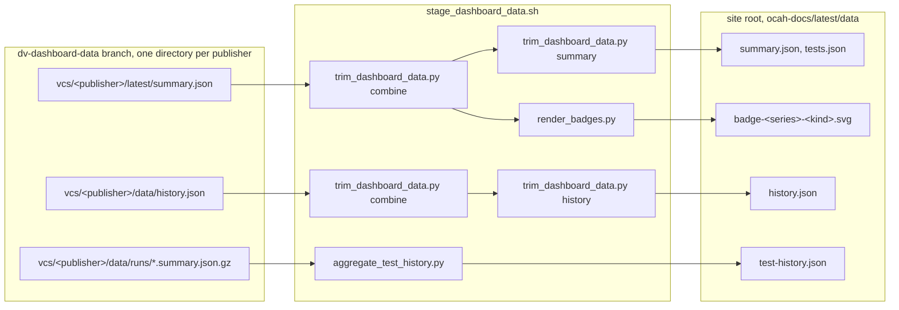

<!--
SPDX-License-Identifier: Apache-2.0
SPDX-FileCopyrightText: 2026 Tenstorrent USA, Inc.
-->

# Documentation tooling

Scripts the documentation build runs.

| Script | Purpose |
|---|---|
| [`stage_dashboard_data.sh`](stage_dashboard_data.sh) | Fetch published dashboard data and stage it into a built site |
| [`trim_dashboard_data.py`](trim_dashboard_data.py) | Reduce the published summary and history to the fields the pages plot |
| [`aggregate_test_history.py`](aggregate_test_history.py) | Aggregate per-run archives into the test-history grid |
| [`render_badges.py`](render_badges.py) | Fetch a shields.io status badge per block per metric |
| [`csvadoc.py`](csvadoc.py) | Convert a CSV file to an AsciiDoc table |
| [`packet_diagrams.py`](packet_diagrams.py) | Render 32-bit packet layouts as standalone SVGs |

## The verification dashboard

The regressions publish their results to the `dv-dashboard-data` branch. The
documentation build fetches that data, reduces it to what the pages plot, and
stages the result into the built site.

The branch carries one directory per **publisher** under `vcs/`, each holding the
same layout and reporting one **series**. A series is one block as run by one
framework on one simulator, named by `flow`, `framework` and `tool` together. A
block verified under both cocotb and UVM publishes a series for each, shown as
`dtp (cocotb, vcs)` and `dtp (uvm, vcs)`.



`stage_dashboard_data.sh` runs in two modes:

```bash
tools/doc/stage_dashboard_data.sh              # fetch only, into OCAH_DASHBOARD_DATA_DIR
tools/doc/stage_dashboard_data.sh <site-root>  # fetch if needed, then stage into the site
```

It is invoked from [`doc/doc.mk`](../../doc/doc.mk) as
`make ocah-doc-dashboard-data` (fetch only) and as
`$(call ocah_stage_dashboard_data,<site-root>)` from the HTML build targets.

### Command reference

`stage_dashboard_data.sh` calls the three below in turn. Each also runs on its
own, which is how staged output is reproduced without a site build.

```
trim_dashboard_data.py combine  <output> <source>...
trim_dashboard_data.py summary  <source> <output> [--tests-out FILE]
trim_dashboard_data.py history  <source> <output>
```

| Subcommand | Reads | Writes |
|---|---|---|
| `combine` | one published file per publisher | the sources collected into one file |
| `summary` | a combined summary | `summary.json`, and `tests.json` with `--tests-out` |
| `history` | a combined history | `history.json` |

```
aggregate_test_history.py <output> [--ref REF] [--runs-dir DIR]... [--limit N]
```

| Option | Default | Purpose |
|---|---|---|
| `--ref` | `origin/dv-dashboard-data` | Git ref to read archives from |
| `--runs-dir` | `data/runs/` | Directory of archives within the ref, repeated once per publisher |
| `--limit` | `0` (all) | Newest N archives from each runs directory |

```
render_badges.py <source> <outdir>
```

Reads a combined summary and writes one badge per series per metric into
`<outdir>`, removing badges for series the summary no longer carries.

### Configuration

All are read by `stage_dashboard_data.sh`. Each is also declared as an overridable
Make variable in `doc/doc.mk`.

| Variable | Default | Purpose |
|---|---|---|
| `OCAH_ROOT` | the script's repository | Repository root |
| `OCAH_DASHBOARD_DATA_DIR` | `doc/_build/dashboard-data` | Where the fetched data is kept between builds |
| `OCAH_DASHBOARD_DATA_REF` | `origin/dv-dashboard-data` | Git ref carrying the data branch |
| `OCAH_DASHBOARD_PUBLISHERS` | `vcs` | Directory within that ref holding one subdirectory per publisher |
| `OCAH_DASHBOARD_RUNS_LIMIT` | `0` (all) | Newest N archives to aggregate, per publisher |

Data is fetched only when `OCAH_DASHBOARD_DATA_DIR` holds no `summary.json`, which
lets a later build work offline. Delete the directory to pick up a newer
publication.

### The pages

[`doc/ui-supplemental/js/dashboard.js`](../../doc/ui-supplemental/js/dashboard.js)
renders the tables and charts on all five pages. It picks a renderer from the
element IDs the page declares. A page opts in by carrying the IDs that renderer
fills.

| Page | Selected by | Reads |
|---|---|---|
| [`dashboard.adoc`](../../doc/trm/src/dashboard.adoc) | `dashboard-chip-rows` + `dashboard-block-rows` | `summary.json` |
| [`dashboard-block.adoc`](../../doc/trm/src/dashboard-block.adoc) | `dashboard-block-row` | `summary.json`, `tests.json` |
| [`dashboard-trends.adoc`](../../doc/trm/src/dashboard-trends.adoc) | `dashboard-trends` + `dashboard-window-select` | `history.json` |
| [`dashboard-test-history.adoc`](../../doc/trm/src/dashboard-test-history.adoc) | `dashboard-history-chart` | `test-history.json` |
| [`dashboard-test-detail.adoc`](../../doc/trm/src/dashboard-test-detail.adoc) | `dashboard-detail-rows` | `test-history.json` |

Every page but the overview takes its subject from the `flow`, `framework` and
`tool` query parameters. The detail page also takes a `test`. Each parameter
narrows what the page shows: `?flow=dtp` covers every series of that block, and
`?flow=dtp&framework=uvm&tool=vcs` covers one.

### The staged files

`trim_dashboard_data.py` reduces the published data to these files, keeping only
the fields named in its key tuples. Every entry below carries the `flow`,
`framework` and `tool` naming its *series*. What each published field means is
documented in
[`run-dashboard.adoc`](../dv/doc/run-dashboard.adoc#dashboard-json-reference),
which these files carry a subset of.

```
summary.json       generated_at
                   dut_status[] series, tests_total, pass_rate,
                                coverage_total_percent
                   results[]    series, coverage.effective_metrics

tests.json         generated_at
                   results[]    series, tests[] name, status, category, seed,
                                duration_sec, stage

history.json       points[]     generated_at, test_pass_rate, flow_pass_rate,
                                failed_tests, flaky_tests
                   per_dut[]    series, coverage_status, effective_metrics

test-history.json  series[]     series
                   runs[]       date, id
                   tests{<test>}[] one cell per run in that series, in run order
                   cell         pass, total, seeds[] seed, reason
```

Note:

- `null` marks a test that did not run. It keeps each test's list the same length
  as its series' `runs`, so the columns stay aligned with the dates.
- A failed seed carries the `reason` it gave.
- The overview shows `coverage_total_percent` as the publisher reports it. The
  per-metric breakdown in `results[].coverage.effective_metrics` is shown on the
  block page.
- `id` names the CI run an archive came from, and is empty for a publisher that
  does not record one.

### Charts

Charts are drawn with [Apache ECharts](https://echarts.apache.org), vendored at
`doc/ui-supplemental/js/vendor/echarts/`.

The trends page draws a line chart per metric, each plotting one selected series.
The test-history page draws a heatmap per series, whose test names link to the
detail page.

### Badges

`render_badges.py` fetches one badge per series per metric from shields.io and
stores it beside the staged data, named
`badge-<flow>-<framework>-<tool>-<kind>.svg`. The label names the series as well,
so a row of badges says which of a block's series each reports.

As the badges come from an external service, one that cannot be fetched leaves
the previous copy in place rather than failing the build.

A run that completed no tests reports "no data" rather than a failure, whatever
status it carries, which keeps its badges consistent with the tables.

Embedding one, from a subsystem page:

```asciidoc
ifdef::backend-html5[]
++++
<p class="dashboard-badges">
  <a href="../dashboard-block.html?flow=dtp&amp;framework=uvm&amp;tool=vcs"></a>
</p>
++++
endif::[]
```

### Handling missing data

Missing data must not stop the documentation building. Every case below is
handled rather than treated as an error.

| Missing | The page shows |
|---|---|
| `summary.json` | "Dashboard data unavailable", with the reason |
| a block absent from `dut_status` | its row, with every metric `n/a` |
| a metric the run did not measure | `n/a` in that column, uncoloured |
| `tests.json` for a series | the block page's summary row, no test table |
| every publisher, with data already fetched | that data, and a warning that the per-test history was not rebuilt |
| a test absent from a run | a grey "did not run" cell in the grid |
| a badge file | a broken image, with no fallback |
| every archive | an empty grid and "no test results" |

## Extending

**Add a block to the dashboard tables.** `CHIP_ROWS` and `BLOCK_ROWS` in
`dashboard.js` declare which rows the overview renders. A block published but not
listed there does not appear. A block listed but not yet published reads as
unavailable until its data arrives.

**Add a field to a page.** The trimmed files carry only what the pages plot, so a
new field must be added to the relevant key tuple in `trim_dashboard_data.py`
(`DUT_KEYS`, `RESULT_KEYS`, `COVERAGE_KEYS`, `TEST_KEYS`, `HISTORY_POINT_KEYS`)
before a page can render it.

## Testing locally

Stage data into a site that is already built:

```bash
tools/doc/stage_dashboard_data.sh doc/_build/html_antora
```

Read a different branch:

```bash
OCAH_DASHBOARD_DATA_REF=origin/my-branch \
  tools/doc/stage_dashboard_data.sh doc/_build/html_antora
```

Render data of your own, from a directory holding a `summary.json` and a
`history.json`:

```bash
OCAH_DASHBOARD_DATA_DIR="$PWD/doc/_build/my-data" \
  tools/doc/stage_dashboard_data.sh doc/_build/html_antora
```

Staging reuses a directory that already holds data, so editing those files and
restaging is enough to iterate. Delete the directory to fetch the published data
again.
